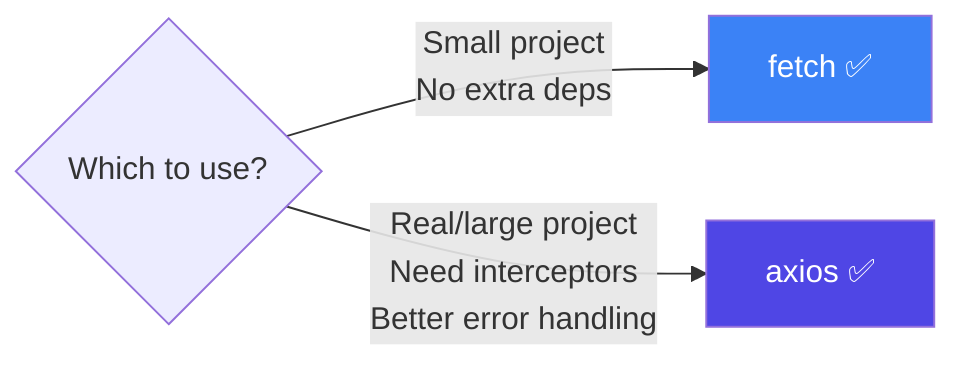
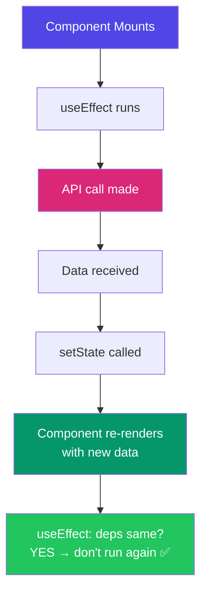
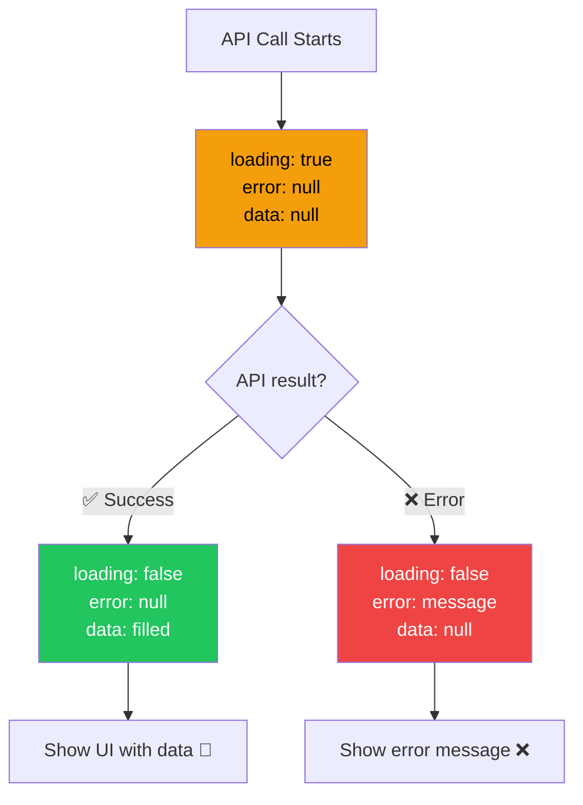
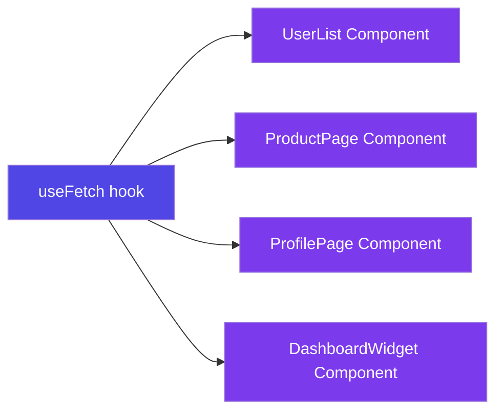
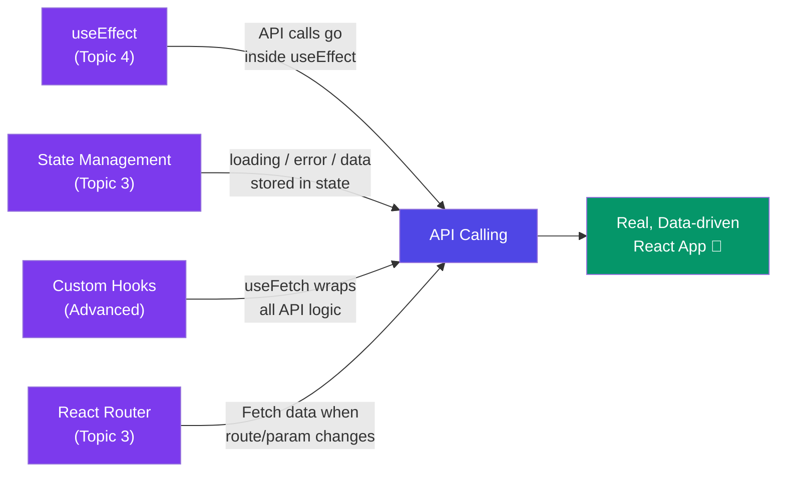

# 🌐 API Calling in React — fetch / axios Deep Dive

> **"React renders the UI — but APIs bring it to life with real data."**

---

## 📚 Table of Contents

1. [What is an API Call?](#-what-is-an-api-call)
2. [Real Life Analogy — The Waiter](#️-real-life-analogy--the-waiter)
3. [fetch — Built-in Browser API](#-fetch--built-in-browser-api)
4. [axios — The Popular Library](#-axios--the-popular-library)
5. [fetch vs axios — Full Comparison](#-fetch-vs-axios--full-comparison)
6. [API Calls in React — with useEffect](#-api-calls-in-react--with-useeffect)
7. [Loading, Error & Success States](#-loading-error--success-states)
8. [All HTTP Methods — GET, POST, PUT, DELETE](#-all-http-methods--get-post-put-delete)
9. [Custom Hook — useFetch](#-custom-hook--usefetch)
10. [Async/Await vs .then() — Which to Use](#-asyncawait-vs-then--which-to-use)
11. [Handling Common Real Scenarios](#-handling-common-real-scenarios)
12. [Common Mistakes](#-common-mistakes)
13. [Cheat Sheet](#-cheat-sheet)

---

## 🤔 What is an API Call?

Your React app lives in the browser. Data lives on a **server** (database, backend, third-party service).

An **API call** is how your app talks to that server:

```
React App (browser)  ──── request ────►  Server / API
React App (browser)  ◄─── response ────  Server / API
```

The response is usually **JSON** data — like a JavaScript object.

```json
{
  "id": 1,
  "name": "Vaishali",
  "email": "vaishali@example.com",
  "city": "Pune"
}
```

---

## 🍽️ Real Life Analogy — The Waiter

Think of an API call like ordering food at a restaurant:

```
YOU (React App)         → places an order (API Request)
WAITER (API)            → takes your order to the kitchen
KITCHEN (Server/DB)     → prepares the food (processes request)
WAITER (API)            → brings food back (API Response)
YOU (React App)         → receives food and displays it (renders data)
```

| Restaurant | API World |
|---|---|
| You (customer) | React App |
| Menu | API Documentation |
| Waiter | API / fetch / axios |
| Kitchen | Server + Database |
| Food served | JSON Response |
| "Sorry, out of stock" | Error Response (404 / 500) |
| Waiting for food | Loading State |

---

## 📡 fetch — Built-in Browser API

`fetch` is built into every modern browser — **no installation needed**.

### Basic GET Request

```js
fetch('https://api.example.com/users')
  .then(response => response.json())   // Step 1: parse JSON
  .then(data => console.log(data))     // Step 2: use data
  .catch(error => console.error(error)); // Step 3: handle error
```

### Using async/await (cleaner)

```js
async function getUsers() {
  try {
    const response = await fetch('https://api.example.com/users');

    // fetch does NOT throw on 4xx/5xx — check manually!
    if (!response.ok) {
      throw new Error(`HTTP error! Status: ${response.status}`);
    }

    const data = await response.json();
    console.log(data);
  } catch (error) {
    console.error('Fetch failed:', error);
  }
}
```

### fetch with Options (POST, headers, body)

```js
async function createUser(userData) {
  const response = await fetch('https://api.example.com/users', {
    method: 'POST',                        // HTTP method
    headers: {
      'Content-Type': 'application/json', // telling server: I'm sending JSON
      'Authorization': 'Bearer your-token-here'
    },
    body: JSON.stringify(userData)         // must stringify JS object!
  });

  const data = await response.json();
  return data;
}
```

### ⚠️ The Big fetch Gotcha

```js
// fetch does NOT reject on HTTP errors (404, 500)!
// It only rejects on network failure (no internet, DNS fail)

// ❌ This WON'T catch a 404 error:
fetch('/api/user/999')
  .then(res => res.json())       // still runs even on 404!
  .catch(err => console.log(err)); // NOT called for 404

// ✅ ALWAYS check response.ok:
fetch('/api/user/999')
  .then(res => {
    if (!res.ok) throw new Error('Not found!');  // manual check!
    return res.json();
  })
  .catch(err => console.log(err)); // NOW catches 404
```

---

## 📦 axios — The Popular Library

`axios` is a third-party library that makes API calls much more convenient.

### Installation

```bash
npm install axios
```

### Basic GET Request

```js
import axios from 'axios';

// Much cleaner than fetch — auto JSON parsing!
const response = await axios.get('https://api.example.com/users');
console.log(response.data);  // data is already parsed JSON
```

### POST Request

```js
const response = await axios.post('https://api.example.com/users', {
  name: 'Vaishali',
  email: 'vaishali@example.com'
  // No JSON.stringify needed — axios does it automatically!
});
console.log(response.data);
```

### axios Instance — Best Practice for Real Projects

Instead of typing the base URL every time, create an **axios instance**:

```js
// src/api/axiosInstance.js
import axios from 'axios';

const api = axios.create({
  baseURL: 'https://api.example.com',  // base URL set once
  timeout: 10000,                       // 10 second timeout
  headers: {
    'Content-Type': 'application/json',
    'Authorization': `Bearer ${localStorage.getItem('token')}`
  }
});

export default api;
```

```js
// Now use it anywhere — no need to repeat the base URL!
import api from '../api/axiosInstance';

const users    = await api.get('/users');       // GET  example.com/users
const newUser  = await api.post('/users', data);// POST example.com/users
const updated  = await api.put('/users/1', data);
const deleted  = await api.delete('/users/1');
```

### axios Interceptors — Global Error Handling

```js
// Add a response interceptor — runs on EVERY response
api.interceptors.response.use(
  response => response,  // success: just return it

  error => {
    // error: handle globally
    if (error.response?.status === 401) {
      // Token expired — redirect to login
      window.location.href = '/login';
    }
    if (error.response?.status === 500) {
      alert('Server error! Please try again.');
    }
    return Promise.reject(error);
  }
);
```

---

## ⚔️ fetch vs axios — Full Comparison

| Feature | `fetch` | `axios` |
|---|---|---|
| **Installation** | ✅ Built-in, none needed | ❌ `npm install axios` |
| **JSON parsing** | Manual (`res.json()`) | ✅ Automatic (`res.data`) |
| **Error on 4xx/5xx** | ❌ No — must check `res.ok` | ✅ Yes — throws automatically |
| **Request timeout** | ❌ Not built-in | ✅ Built-in (`timeout: 5000`) |
| **Interceptors** | ❌ Not supported | ✅ Yes — request & response |
| **Cancel request** | AbortController (complex) | ✅ Simple (`CancelToken`) |
| **Upload progress** | ❌ Not supported | ✅ `onUploadProgress` |
| **Base URL config** | ❌ Repeat every time | ✅ `axios.create({ baseURL })` |
| **Old browser support** | ❌ No IE support | ✅ Yes |
| **Bundle size** | 0kb (native) | ~14kb |



> 💡 **Recommendation:** Use `axios` for any real project. Use `fetch` for quick scripts or if bundle size is critical.

---

## ⚛️ API Calls in React — with useEffect

**Rule:** Never call APIs directly at the top level — always inside `useEffect`.

```jsx
// ❌ WRONG — runs on every render, infinite loop risk!
function UserList() {
  const [users, setUsers] = useState([]);
  fetchUsers().then(data => setUsers(data));  // called every render!
  return <div>...</div>;
}

// ✅ CORRECT — runs once on mount
function UserList() {
  const [users, setUsers] = useState([]);

  useEffect(() => {
    async function fetchUsers() {
      const response = await axios.get('/api/users');
      setUsers(response.data);
    }

    fetchUsers();
  }, []);  // empty array = run once on mount

  return <div>...</div>;
}
```

### Why inside useEffect?



---

## ⏳ Loading, Error & Success States

Every API call has **3 possible states**. Always handle all three:

```jsx
function UserProfile({ userId }) {
  const [user, setUser]       = useState(null);
  const [loading, setLoading] = useState(true);   // start as true!
  const [error, setError]     = useState(null);

  useEffect(() => {
    async function fetchUser() {
      try {
        setLoading(true);
        setError(null);                             // reset error on new fetch

        const response = await axios.get(`/api/users/${userId}`);
        setUser(response.data);

      } catch (err) {
        setError(err.message || 'Something went wrong');
      } finally {
        setLoading(false);                          // always runs!
      }
    }

    fetchUser();
  }, [userId]);  // re-fetch when userId changes

  // 1. Loading state
  if (loading) return <div>⏳ Loading user...</div>;

  // 2. Error state
  if (error)   return <div>❌ Error: {error}</div>;

  // 3. Success state
  return (
    <div>
      <h2>{user.name}</h2>
      <p>{user.email}</p>
      <p>{user.city}</p>
    </div>
  );
}
```



---

## 🔁 All HTTP Methods — GET, POST, PUT, DELETE

### GET — Fetch data

```jsx
// fetch all users
const response = await axios.get('/api/users');

// fetch one user
const response = await axios.get('/api/users/42');

// with query params: /api/users?page=1&limit=10
const response = await axios.get('/api/users', {
  params: { page: 1, limit: 10 }
});
```

### POST — Create new data

```jsx
const newUser = { name: 'Vaishali', email: 'v@example.com', city: 'Pune' };

const response = await axios.post('/api/users', newUser);
console.log(response.data);  // newly created user with ID
```

### PUT — Update entire record

```jsx
const updatedUser = { name: 'Vaishali C', email: 'v@example.com', city: 'Mumbai' };

const response = await axios.put('/api/users/42', updatedUser);
```

### PATCH — Update partial record

```jsx
// Only update the city — don't send everything
const response = await axios.patch('/api/users/42', { city: 'Mumbai' });
```

### DELETE — Remove data

```jsx
const response = await axios.delete('/api/users/42');
console.log(response.data);  // { message: "User deleted" }
```

### Full CRUD Example in React

```jsx
function UserManager() {
  const [users, setUsers] = useState([]);

  // READ
  useEffect(() => {
    axios.get('/api/users').then(res => setUsers(res.data));
  }, []);

  // CREATE
  const createUser = async (userData) => {
    const res = await axios.post('/api/users', userData);
    setUsers(prev => [...prev, res.data]);     // add to list
  };

  // UPDATE
  const updateUser = async (id, userData) => {
    const res = await axios.put(`/api/users/${id}`, userData);
    setUsers(prev => prev.map(u => u.id === id ? res.data : u));
  };

  // DELETE
  const deleteUser = async (id) => {
    await axios.delete(`/api/users/${id}`);
    setUsers(prev => prev.filter(u => u.id !== id));  // remove from list
  };

  return (
    <div>
      {users.map(user => (
        <div key={user.id}>
          <span>{user.name}</span>
          <button onClick={() => updateUser(user.id, { name: 'Updated' })}>
            Edit
          </button>
          <button onClick={() => deleteUser(user.id)}>
            Delete
          </button>
        </div>
      ))}
    </div>
  );
}
```

---

## 🎣 Custom Hook — useFetch

Avoid repeating loading/error/data logic in every component. Extract it into a **custom hook**:

```jsx
// src/hooks/useFetch.js
import { useState, useEffect } from 'react';
import axios from 'axios';

function useFetch(url) {
  const [data, setData]       = useState(null);
  const [loading, setLoading] = useState(true);
  const [error, setError]     = useState(null);

  useEffect(() => {
    if (!url) return;

    const controller = new AbortController();  // for cleanup

    async function fetchData() {
      try {
        setLoading(true);
        setError(null);

        const response = await axios.get(url, {
          signal: controller.signal
        });
        setData(response.data);

      } catch (err) {
        if (err.name !== 'CanceledError') {    // ignore cleanup cancels
          setError(err.message);
        }
      } finally {
        setLoading(false);
      }
    }

    fetchData();

    // Cleanup — cancel request if component unmounts
    return () => controller.abort();

  }, [url]);

  return { data, loading, error };
}

export default useFetch;
```

### Using useFetch — super clean!

```jsx
// Any component can now fetch with 1 line!
function UserList() {
  const { data: users, loading, error } = useFetch('/api/users');

  if (loading) return <p>Loading...</p>;
  if (error)   return <p>Error: {error}</p>;

  return (
    <ul>
      {users.map(user => <li key={user.id}>{user.name}</li>)}
    </ul>
  );
}

function ProductPage() {
  const { data: product, loading, error } = useFetch('/api/products/1');
  // same hook, different URL!
  ...
}
```



Write once → use everywhere. No repeated loading/error logic! 🎯

---

## 🔀 Async/Await vs .then() — Which to Use

Both do the same thing — different syntax:

```js
// .then() style — chaining
axios.get('/api/users')
  .then(response => {
    setUsers(response.data);
  })
  .catch(error => {
    setError(error.message);
  })
  .finally(() => {
    setLoading(false);
  });
```

```js
// async/await style — looks like synchronous code
async function fetchUsers() {
  try {
    const response = await axios.get('/api/users');
    setUsers(response.data);
  } catch (error) {
    setError(error.message);
  } finally {
    setLoading(false);
  }
}
```

| | `.then()` | `async/await` |
|---|---|---|
| **Readability** | Gets messy with nesting | Clean, reads top-to-bottom |
| **Error handling** | `.catch()` | `try/catch` |
| **Multiple calls** | Deeply nested | Easy to read sequentially |
| **Industry standard** | Old style | ✅ Modern, preferred |
| **Debugging** | Harder | Easier (clear stack traces) |

> 💡 **Use `async/await` always.** Only use `.then()` when you need to chain independently.

---

## 🌍 Handling Common Real Scenarios

### Scenario 1 — Search with API (debounced)

```jsx
function SearchUsers() {
  const [query, setQuery]   = useState('');
  const [users, setUsers]   = useState([]);
  const [loading, setLoading] = useState(false);

  useEffect(() => {
    if (!query.trim()) {
      setUsers([]);
      return;
    }

    // Debounce — wait 500ms after user stops typing
    const timer = setTimeout(async () => {
      setLoading(true);
      const res = await axios.get(`/api/users/search?q=${query}`);
      setUsers(res.data);
      setLoading(false);
    }, 500);

    return () => clearTimeout(timer);  // cleanup on each keystroke
  }, [query]);

  return (
    <div>
      <input
        value={query}
        onChange={e => setQuery(e.target.value)}
        placeholder="Search users..."
      />
      {loading && <p>Searching...</p>}
      {users.map(u => <div key={u.id}>{u.name}</div>)}
    </div>
  );
}
```

### Scenario 2 — POST on Form Submit

```jsx
function CreateUserForm() {
  const [form, setForm]       = useState({ name: '', email: '' });
  const [loading, setLoading] = useState(false);
  const [success, setSuccess] = useState(false);
  const [error, setError]     = useState(null);

  const handleSubmit = async (e) => {
    e.preventDefault();
    setLoading(true);
    setError(null);

    try {
      await axios.post('/api/users', form);
      setSuccess(true);
      setForm({ name: '', email: '' });  // reset form
    } catch (err) {
      setError(err.response?.data?.message || 'Failed to create user');
    } finally {
      setLoading(false);
    }
  };

  return (
    <form onSubmit={handleSubmit}>
      <input
        value={form.name}
        onChange={e => setForm({ ...form, name: e.target.value })}
        placeholder="Name"
      />
      <input
        value={form.email}
        onChange={e => setForm({ ...form, email: e.target.value })}
        placeholder="Email"
      />
      <button type="submit" disabled={loading}>
        {loading ? 'Creating...' : 'Create User'}
      </button>
      {success && <p>✅ User created!</p>}
      {error   && <p>❌ {error}</p>}
    </form>
  );
}
```

### Scenario 3 — Pagination

```jsx
function PaginatedList() {
  const [users, setUsers]   = useState([]);
  const [page, setPage]     = useState(1);
  const [loading, setLoading] = useState(false);
  const [hasMore, setHasMore] = useState(true);

  useEffect(() => {
    async function fetchPage() {
      setLoading(true);
      const res = await axios.get(`/api/users?page=${page}&limit=10`);
      setUsers(res.data.users);
      setHasMore(res.data.hasNextPage);
      setLoading(false);
    }
    fetchPage();
  }, [page]);  // re-fetch when page changes

  return (
    <div>
      {users.map(u => <div key={u.id}>{u.name}</div>)}
      <button disabled={page === 1} onClick={() => setPage(p => p - 1)}>
        ← Previous
      </button>
      <span>Page {page}</span>
      <button disabled={!hasMore} onClick={() => setPage(p => p + 1)}>
        Next →
      </button>
    </div>
  );
}
```

---

## ⚠️ Common Mistakes

### Mistake 1: API call outside useEffect

```jsx
// ❌ WRONG — called every render, causes infinite loop!
function App() {
  const [data, setData] = useState(null);
  axios.get('/api/data').then(res => setData(res.data));  // loops forever!
  return <div>{data}</div>;
}

// ✅ CORRECT
function App() {
  const [data, setData] = useState(null);
  useEffect(() => {
    axios.get('/api/data').then(res => setData(res.data));
  }, []);
  return <div>{data}</div>;
}
```

### Mistake 2: Not handling loading/error states

```jsx
// ❌ WRONG — crashes if data is null!
function UserCard() {
  const [user, setUser] = useState(null);
  useEffect(() => {
    axios.get('/api/user/1').then(res => setUser(res.data));
  }, []);

  return <h1>{user.name}</h1>;  // 💥 TypeError: Cannot read 'name' of null
}

// ✅ CORRECT
function UserCard() {
  const [user, setUser]       = useState(null);
  const [loading, setLoading] = useState(true);

  useEffect(() => {
    axios.get('/api/user/1')
      .then(res => setUser(res.data))
      .finally(() => setLoading(false));
  }, []);

  if (loading) return <p>Loading...</p>;
  return <h1>{user.name}</h1>;
}
```

### Mistake 3: Not cancelling requests on unmount

```jsx
// ❌ WRONG — sets state on unmounted component (memory leak warning!)
useEffect(() => {
  axios.get('/api/data').then(res => setData(res.data));
}, []);

// ✅ CORRECT — cancel on unmount
useEffect(() => {
  const controller = new AbortController();

  axios.get('/api/data', { signal: controller.signal })
    .then(res => setData(res.data))
    .catch(err => {
      if (err.name !== 'CanceledError') setError(err.message);
    });

  return () => controller.abort();  // cleanup!
}, []);
```

### Mistake 4: Forgetting to stringify body in fetch

```jsx
// ❌ WRONG — sends [object Object] as body
fetch('/api/users', {
  method: 'POST',
  body: { name: 'Vaishali' }  // not stringified!
});

// ✅ CORRECT
fetch('/api/users', {
  method: 'POST',
  headers: { 'Content-Type': 'application/json' },
  body: JSON.stringify({ name: 'Vaishali' })
});
// Note: axios does this automatically — one more reason to use it!
```

### Mistake 5: Not checking fetch's response.ok

```jsx
// ❌ WRONG — 404 errors are silently ignored
fetch('/api/users/999')
  .then(res => res.json())
  .then(data => setUser(data));  // data might be { error: "Not found" }

// ✅ CORRECT
fetch('/api/users/999')
  .then(res => {
    if (!res.ok) throw new Error(`Error: ${res.status}`);
    return res.json();
  })
  .then(data => setUser(data))
  .catch(err => setError(err.message));
```

---

## 📋 Cheat Sheet

### fetch Quick Reference

```js
// GET
const res  = await fetch('/api/users');
const data = await res.json();

// POST
const res = await fetch('/api/users', {
  method: 'POST',
  headers: { 'Content-Type': 'application/json' },
  body: JSON.stringify(payload)
});

// Always check:
if (!res.ok) throw new Error(`HTTP ${res.status}`);
```

### axios Quick Reference

```js
// GET
const { data } = await axios.get('/api/users');

// GET with params → /api/users?page=1&limit=10
const { data } = await axios.get('/api/users', { params: { page: 1, limit: 10 } });

// POST
const { data } = await axios.post('/api/users', payload);

// PUT
const { data } = await axios.put('/api/users/1', payload);

// PATCH
const { data } = await axios.patch('/api/users/1', { city: 'Mumbai' });

// DELETE
await axios.delete('/api/users/1');

// With auth token
const { data } = await axios.get('/api/users', {
  headers: { Authorization: `Bearer ${token}` }
});
```

### 3 States Pattern (Always Follow This)

```jsx
const [data, setData]       = useState(null);
const [loading, setLoading] = useState(true);
const [error, setError]     = useState(null);

// In useEffect:
try {
  setLoading(true);
  setError(null);
  const res = await axios.get(url);
  setData(res.data);
} catch (err) {
  setError(err.message);
} finally {
  setLoading(false);
}

// In JSX:
if (loading) return <Spinner />;
if (error)   return <Error message={error} />;
return <DataDisplay data={data} />;
```

### One-liner Comparison

| | fetch | axios |
|---|---|---|
| **Parse JSON** | `await res.json()` | auto (`res.data`) |
| **Error on 404** | ❌ manual | ✅ auto |
| **Send JSON body** | `JSON.stringify(data)` | auto |
| **Base URL** | repeat every time | `axios.create()` |
| **Timeout** | complex | `{ timeout: 5000 }` |

---

## 🔗 Connection to Previous Topics



---

## 🎯 Key Takeaways

> 1. **Always call APIs inside `useEffect`** — never at the top level of a component.
>
> 2. **Always handle 3 states** — loading, error, and success. Every single time.
>
> 3. **axios > fetch for real projects** — auto JSON, auto error throwing, interceptors, base URL.
>
> 4. **fetch doesn't throw on 404/500** — always check `response.ok` manually.
>
> 5. **Cancel requests on unmount** — use `AbortController` to avoid memory leaks.
>
> 6. **Build a `useFetch` custom hook** — don't repeat loading/error logic in every component.
>
> 7. **Use `async/await`** — cleaner than `.then()` chaining for complex calls.
>
> 8. **axios instance** — set `baseURL`, `headers`, and `timeout` once, use everywhere.

---

## 📖 Further Reading

- [MDN — fetch API](https://developer.mozilla.org/en-US/docs/Web/API/Fetch_API)
- [axios GitHub — Official Docs](https://github.com/axios/axios)
- [React Docs — Synchronizing with Effects](https://react.dev/learn/synchronizing-with-effects)
- [JSONPlaceholder](https://jsonplaceholder.typicode.com/) — Free fake API for practice

---

*Made with ❤️ for [React Revision Book](./README.md) | Topic: API Calling — fetch / axios*
