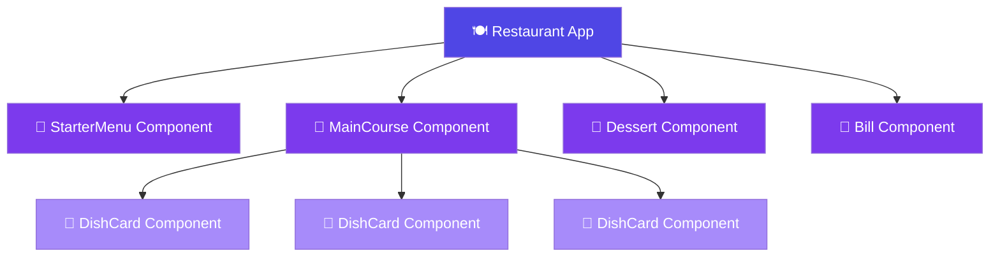
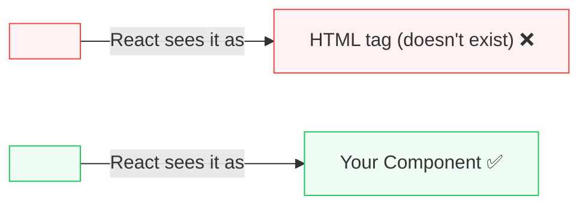
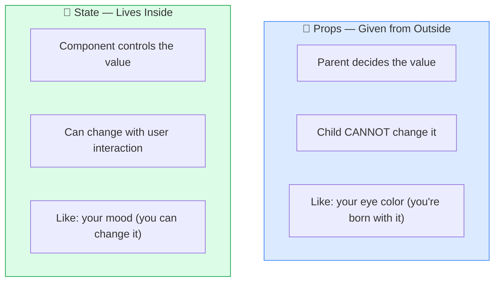
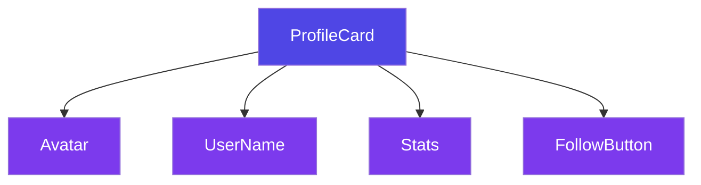
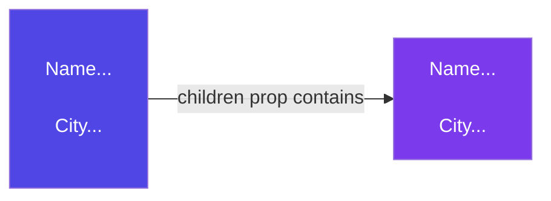
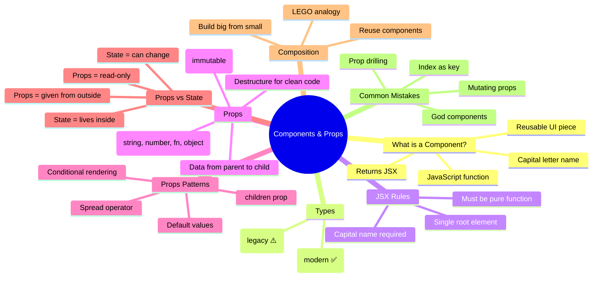

# React-revision-book

# ⚛️ React Components & Props — A Deep Dive with Real-Life Examples

> **"Components are the LEGO bricks of React — small, reusable pieces that snap together to build anything."**

---

## 📚 Table of Contents

1. [What is a Component? (The Simple Truth)](#-what-is-a-component-the-simple-truth)
2. [Real Life Analogy — The Restaurant Kitchen](#️-real-life-analogy--the-restaurant-kitchen)
3. [Functional vs Class Components](#-functional-vs-class-components)
4. [JSX Inside Components](#-jsx-inside-components)
5. [What are Props?](#-what-are-props)
6. [Props Deep Dive — Rules & Patterns](#-props-deep-dive--rules--patterns)
7. [Props vs State — The Key Difference](#-props-vs-state--the-key-difference)
8. [Component Composition — Building with Components](#️-component-composition--building-with-components)
9. [children Prop — Special & Powerful](#-children-prop--special--powerful)
10. [Common Mistakes & Best Practices](#-common-mistakes--best-practices)
11. [Cheat Sheet Summary](#-cheat-sheet-summary)

---

## 🤔 What is a Component?

**A Component is just a JavaScript function that returns JSX (UI).**

That's it. A component is a reusable piece of UI — like a button, a card, a navbar, a whole page.

```
// Simplest possible component:
function Hello() {
  return <h1>Hello, World!</h1>;
}
```

```
Your App
  ↓
Made of Components       ← reusable building blocks
  ↓
Each Component returns JSX  ← describes what to show
  ↓
React renders it to the screen  ← real DOM appears
```

---

## 🍽️ Real Life Analogy — The Restaurant Kitchen

Imagine a restaurant kitchen:

### ❌ Bad Approach — One Cook Does Everything

- One chef cooks the starter, main course, dessert, AND handles billing
- If one thing changes (new dessert menu), the whole process is disrupted
- Cannot scale — only one thing at a time
- Hard to fix bugs — where did the error happen?

### ✅ Smart Approach — Specialized Stations (Components!)

- 🥗 **Starter Station** → handles only starters
- 🍛 **Main Course Station** → handles only mains
- 🍰 **Dessert Station** → handles only desserts
- 🧾 **Billing Counter** → handles only billing

Each station (component) is:
- **Focused** — does one thing well
- **Reusable** — Dessert Station can make dessert for any table
- **Independent** — Starter Station can change without affecting Desserts



Notice how `DishCard` is **reused 3 times** with different data — that's the magic of components! 🎯

---

## ⚔️ Functional vs Class Components

React has two ways to write components. But in 2024+, **Functional Components** are the standard.

### Functional Component (✅ Modern — Use This Always)

```jsx
// Simple, clean, uses Hooks for state/lifecycle
function Greeting(props) {
  return <h1>Hello, {props.name}!</h1>;
}

// Arrow function syntax (also common)
const Greeting = (props) => {
  return <h1>Hello, {props.name}!</h1>;
};
```

### Class Component (⚠️ Old — Legacy Code Only)

```jsx
// Verbose, uses 'this', harder to read
import React, { Component } from 'react';

class Greeting extends Component {
  render() {
    return <h1>Hello, {this.props.name}!</h1>;
  }
}
```

### Comparison Table

| Feature | Functional Component | Class Component |
|---|---|---|
| **Syntax** | Simple function | ES6 class |
| **State** | `useState` hook | `this.state` |
| **Lifecycle** | `useEffect` hook | `componentDidMount` etc. |
| **`this` keyword** | ❌ Not needed | ✅ Required everywhere |
| **Code length** | Short & clean | Verbose |
| **Performance** | Slightly better | Slightly worse |
| **Industry standard** | ✅ YES | ❌ Avoid for new code |

> 💡 **Rule of thumb:** Always write Functional Components. You'll only see Class Components in old codebases.

---

## 🏗️ JSX Inside Components

Every component **must return JSX** — the UI it represents.

### Rules for JSX in Components

**Rule 1: Return a Single Root Element**

```jsx
// ❌ WRONG — two root elements
function Card() {
  return (
    <h1>Title</h1>
    <p>Description</p>
  );
}

// ✅ CORRECT — wrap in a single parent
function Card() {
  return (
    <div>
      <h1>Title</h1>
      <p>Description</p>
    </div>
  );
}

// ✅ ALSO CORRECT — use Fragment (no extra DOM node)
function Card() {
  return (
    <>
      <h1>Title</h1>
      <p>Description</p>
    </>
  );
}
```

**Rule 2: Component Names MUST Start with Capital Letter**

```jsx
// ❌ WRONG — React thinks this is an HTML tag
function myButton() {
  return <button>Click me</button>;
}

// ✅ CORRECT — Capital letter = React Component
function MyButton() {
  return <button>Click me</button>;
}
```



**Rule 3: Components Must Be Pure (Same Input → Same Output)**

```jsx
// ❌ WRONG — modifies external variable (impure!)
let count = 0;
function Counter() {
  count++;  // side effect outside the component!
  return <p>Count: {count}</p>;
}

// ✅ CORRECT — same input always gives same output
function Greeting({ name }) {
  return <p>Hello, {name}!</p>;  // pure, predictable
}
```

---

## 🎁 What are Props?

**Props (Properties)** are how you pass data **from a parent component to a child component**.

Think of props like **function arguments** — you pass data in, the component uses it.

```jsx
// Parent passes data via props:
function App() {
  return <UserCard name="Vaishali" age={22} city="Pune" />;
}

// Child receives and uses props:
function UserCard(props) {
  return (
    <div>
      <h2>{props.name}</h2>
      <p>Age: {props.age}</p>
      <p>City: {props.city}</p>
    </div>
  );
}
```


### 🏠 Real-Life Analogy: Ordering a Custom Cake

Props are like filling out a **cake order form**:

| Order Form (Props) | What the Bakery (Component) does |
|---|---|
| `flavor="chocolate"` | Makes a chocolate cake |
| `layers={3}` | Makes 3 layers |
| `message="Happy Birthday"` | Writes that message |
| `size="large"` | Makes a large cake |

Same bakery (component), different props = different cake every time! 🎂

---

## 🔬 Props Deep Dive — Rules & Patterns

### Pattern 1: Destructuring Props (Cleaner Code)

```jsx
// Instead of this (verbose):
function UserCard(props) {
  return <h2>{props.name} — {props.city}</h2>;
}

// Do this (clean destructuring):
function UserCard({ name, city }) {
  return <h2>{name} — {city}</h2>;
}
```

### Pattern 2: Default Props

```jsx
// If parent doesn't pass a prop, use a default value
function Button({ text = "Click Me", color = "blue" }) {
  return <button style={{ backgroundColor: color }}>{text}</button>;
}

// Usage:
<Button />                        // → "Click Me" in blue
<Button text="Submit" />          // → "Submit" in blue
<Button text="Delete" color="red" /> // → "Delete" in red
```

### Pattern 3: Passing Different Data Types

```jsx
function ProductCard({ 
  name,          // string
  price,         // number
  inStock,       // boolean
  tags,          // array
  details,       // object
  onClick        // function
}) {
  return (
    <div onClick={onClick}>
      <h3>{name}</h3>
      <p>₹{price}</p>
      <span>{inStock ? "✅ In Stock" : "❌ Out of Stock"}</span>
      <p>Tags: {tags.join(", ")}</p>
      <p>Brand: {details.brand}</p>
    </div>
  );
}

// How to pass them:
<ProductCard
  name="iPhone 15"
  price={79999}
  inStock={true}
  tags={["mobile", "apple", "5G"]}
  details={{ brand: "Apple", warranty: "1 year" }}
  onClick={() => alert("Added to cart!")}
/>
```

### Pattern 4: Spreading Props

```jsx
const buttonProps = {
  text: "Save",
  color: "green",
  size: "large"
};

// Instead of writing each prop manually:
<Button text={buttonProps.text} color={buttonProps.color} size={buttonProps.size} />

// Use spread operator (much cleaner!):
<Button {...buttonProps} />
```

### Pattern 5: Conditional Rendering with Props

```jsx
function Alert({ type, message }) {
  return (
    <div className={`alert alert-${type}`}>
      {type === "error" && <span>❌</span>}
      {type === "success" && <span>✅</span>}
      {type === "warning" && <span>⚠️</span>}
      <p>{message}</p>
    </div>
  );
}

// Usage:
<Alert type="error" message="Something went wrong!" />
<Alert type="success" message="Profile saved!" />
```

---

## 🆚 Props vs State — The Key Difference

This confuses almost every beginner. Let's make it crystal clear.

| | Props | State |
|---|---|---|
| **Comes from** | Parent component | Inside the component itself |
| **Can be changed by** | Only the parent | The component itself |
| **Mutable?** | ❌ Read-only (immutable) | ✅ Can be updated |
| **Analogy** | Genes you're born with | Your mood today |
| **When it changes** | Parent re-renders you | You call `setState` |



### Real Example: Props vs State

```jsx
function TemperatureCard({ city }) {         // city comes from PROPS (parent decides)
  const [unit, setUnit] = useState("°C");   // unit is STATE (this component controls it)

  return (
    <div>
      <h2>Weather in {city}</h2>             {/* props — can't change */}
      <p>Unit: {unit}</p>                    {/* state — can change */}
      <button onClick={() => setUnit(unit === "°C" ? "°F" : "°C")}>
        Switch Unit
      </button>
    </div>
  );
}
```

> ⚠️ **Golden Rule:** Never directly modify props inside a child component. It will break React's data flow!

```jsx
// ❌ NEVER do this:
function Child({ name }) {
  name = "someone else";  // WRONG! Props are read-only!
  return <h1>{name}</h1>;
}

// ✅ If you need to modify, use state:
function Child({ initialName }) {
  const [name, setName] = useState(initialName);
  return <h1>{name}</h1>;
}
```

---

## 🏗️ Component Composition — Building with Components

**Composition** means building big components from smaller ones — like LEGO!

### Building a Profile Page

```jsx
// Small, focused components:
function Avatar({ imageUrl, alt }) {
  return ;
}

function UserName({ name, username }) {
  return (
    <div>
      <h2>{name}</h2>
      <p>@{username}</p>
    </div>
  );
}

function FollowButton({ isFollowing, onClick }) {
  return (
    <button onClick={onClick}>
      {isFollowing ? "Unfollow" : "Follow"}
    </button>
  );
}

function Stats({ followers, following, posts }) {
  return (
    <div className="stats">
      <span>{posts} Posts</span>
      <span>{followers} Followers</span>
      <span>{following} Following</span>
    </div>
  );
}

// Big component composed from small ones:
function ProfileCard({ user }) {
  return (
    <div className="profile-card">
      <Avatar imageUrl={user.photo} alt={user.name} />
      <UserName name={user.name} username={user.username} />
      <Stats 
        followers={user.followers} 
        following={user.following} 
        posts={user.posts} 
      />
      <FollowButton isFollowing={user.isFollowing} onClick={handleFollow} />
    </div>
  );
}
```



Each component is:
- **Reusable** — `Avatar` can be used anywhere, not just in ProfileCard
- **Testable** — Test each component individually
- **Readable** — ProfileCard reads like plain English

---

## 👶 `children` Prop — Special & Powerful

The `children` prop is a **special built-in prop** that holds whatever you put *between* the opening and closing tags of a component.

```jsx
// Card component that wraps any content:
function Card({ children, title }) {
  return (
    <div className="card">
      <h3>{title}</h3>
      <div className="card-body">
        {children}   {/* Whatever is passed between <Card>...</Card> */}
      </div>
    </div>
  );
}

// Usage — pass any JSX as children:
<Card title="User Info">
  <p>Name: Vaishali</p>
  <p>City: Pune</p>
  <button>Edit Profile</button>
</Card>

<Card title="Latest News">
  
  <p>Breaking: React 20 released!</p>
</Card>
```



### 🏠 Real-Life Analogy: A Picture Frame

`children` is like a **picture frame**:
- The frame (Card component) is always the same
- What goes *inside* the frame (children) changes every time
- The frame doesn't need to know what picture it holds — it just displays it!

### More children Examples

```jsx
// Button with custom content:
function FancyButton({ children, onClick }) {
  return (
    <button className="fancy-btn" onClick={onClick}>
      {children}
    </button>
  );
}

// Usage:
<FancyButton onClick={handleSave}>
  💾 Save Changes
</FancyButton>

<FancyButton onClick={handleDelete}>
  🗑️ Delete Account
</FancyButton>

// Modal with children:
function Modal({ isOpen, onClose, children }) {
  if (!isOpen) return null;
  return (
    <div className="overlay">
      <div className="modal">
        <button onClick={onClose}>✕</button>
        {children}
      </div>
    </div>
  );
}
```

---

## ⚠️ Common Mistakes & Best Practices

### Mistake 1: Mutating Props

```jsx
// ❌ WRONG — never mutate props
function UserCard({ user }) {
  user.name = "Someone Else";  // NEVER DO THIS
  return <h2>{user.name}</h2>;
}

// ✅ CORRECT — create a copy if you need to transform
function UserCard({ user }) {
  const displayName = user.name.toUpperCase();  // new variable, not mutation
  return <h2>{displayName}</h2>;
}
```

### Mistake 2: One Giant Component (God Component)

```jsx
// ❌ WRONG — 300 line component doing everything
function App() {
  return (
    <div>
      {/* 300 lines of navbar, sidebar, content, footer... */}
    </div>
  );
}

// ✅ CORRECT — break it down
function App() {
  return (
    <div>
      <Navbar />
      <Sidebar />
      <MainContent />
      <Footer />
    </div>
  );
}
```

### Mistake 3: Prop Drilling Hell

```jsx
// ❌ PROBLEM — passing props through many layers
function App() {
  const user = { name: "Vaishali" };
  return <Level1 user={user} />;
}
function Level1({ user }) { return <Level2 user={user} />; }
function Level2({ user }) { return <Level3 user={user} />; }
function Level3({ user }) { return <h1>{user.name}</h1>; }
// Level1 and Level2 don't even USE user — they just pass it along!

// ✅ SOLUTION — Context API (covered in a later topic!)
```

### Mistake 4: Using Array Index as Key

```jsx
// ❌ WRONG — breaks when list reorders
items.map((item, index) => <Card key={index} data={item} />)

// ✅ CORRECT — use unique stable ID
items.map((item) => <Card key={item.id} data={item} />)
```

### Best Practices Summary

| Practice | Why |
|---|---|
| One component = one responsibility | Easy to test, debug, reuse |
| Keep components small | Under 100 lines is a good target |
| Name components clearly | `UserProfileCard` > `Card1` |
| Destructure props | Cleaner, more readable |
| Use default props | Prevents undefined errors |
| Never mutate props | Keeps data flow predictable |
| Use `key` for lists | Helps React's reconciliation |

---

## 📋 Cheat Sheet Summary



### Quick Reference Table

| Concept | Simple Explanation | Real-Life Analogy |
|---|---|---|
| **Component** | Function that returns UI | Restaurant cooking station |
| **Props** | Data passed from parent to child | Cake order form |
| **children** | JSX passed between tags | Picture frame content |
| **Composition** | Building big UI from small pieces | LEGO bricks |
| **Props immutability** | Child can't change props | You can't change your genes |
| **Destructuring** | Clean way to read props | Unpacking a bag item by item |
| **Default props** | Fallback value if prop missing | Default ringtone on a new phone |

---

## 🔗 Connection to Virtual DOM (Previous Topic)

Remember Virtual DOM from last time? Here's how it connects:


Every component you write → creates Virtual DOM nodes → React efficiently updates only what changed. Everything is connected! 🔗

---

## 🎯 Key Takeaways

> 1. **A Component is just a function** that takes props and returns JSX. That's it.
>
> 2. **Props flow one way** — Parent → Child. Never the other way.
>
> 3. **Props are read-only** — Never mutate them inside the child.
>
> 4. **Composition is the React way** — Build big from small, reusable pieces.
>
> 5. **children is a prop too** — Use it to build flexible wrapper components.
>
> 6. **Functional Components are the standard** — Class Components are legacy.
>
> 7. **One component, one job** — Keep them small, focused, and reusable.

---

## 📖 Further Reading

- [React Docs — Your First Component](https://react.dev/learn/your-first-component)
- [React Docs — Passing Props to a Component](https://react.dev/learn/passing-props-to-a-component)
- [React Docs — Composing Components](https://react.dev/learn/importing-and-exporting-components)
- [React Docs — Passing JSX as Children](https://react.dev/learn/passing-props-to-a-component#passing-jsx-as-children)

---

*Made with ❤️ for the React Revision Book | Topic 2: Components & Props*
