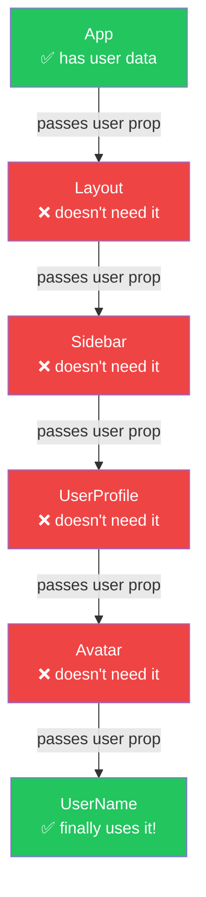
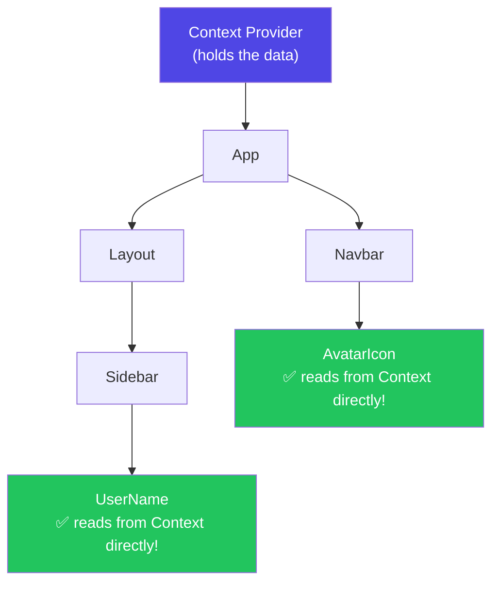
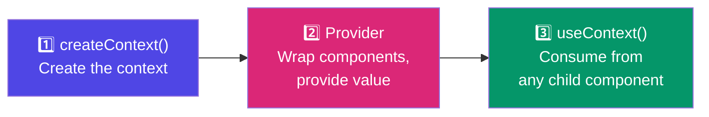
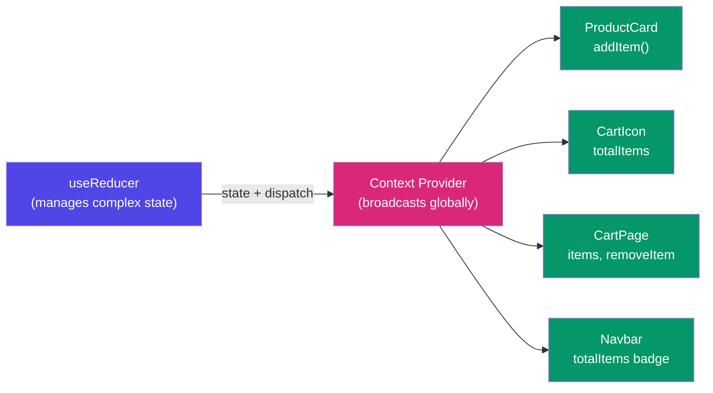
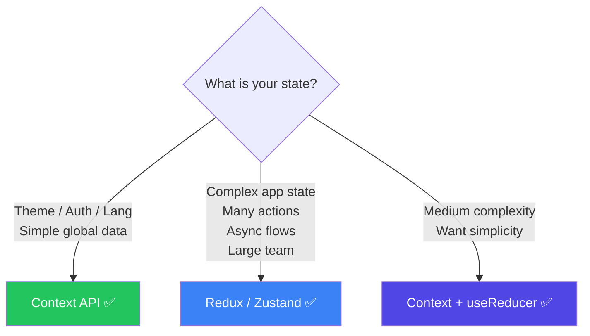
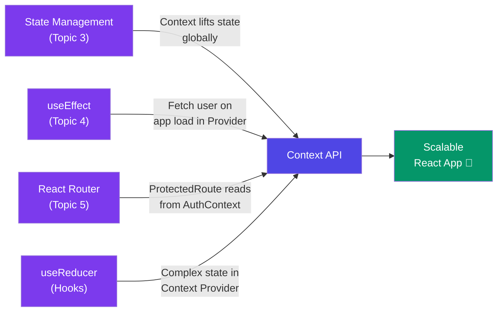

# 🌍 Context API in React — A Deep Dive

> **"Context API solves the problem of passing data through many component layers — without prop drilling."**

---

## 📚 Table of Contents

1. [The Problem — Prop Drilling](#-the-problem--prop-drilling)
2. [What is Context API?](#-what-is-context-api)
3. [Real Life Analogy — WiFi Router](#-real-life-analogy--wifi-router)
4. [Context API — 3 Steps to Use It](#-context-api--3-steps-to-use-it)
5. [Complete Example — Theme Switcher](#-complete-example--theme-switcher)
6. [Complete Example — Auth Context](#-complete-example--auth-context)
7. [useContext Hook](#-usecontext-hook)
8. [Custom Context Hook — Best Practice](#-custom-context-hook--best-practice)
9. [Multiple Contexts](#-multiple-contexts)
10. [Context + useReducer — Powerful Pattern](#-context--usereducer--powerful-pattern)
11. [Context API vs Redux — When to Use What](#-context-api-vs-redux--when-to-use-what)
12. [Performance — Context Re-renders](#-performance--context-re-renders)
13. [Common Mistakes](#-common-mistakes)
14. [Cheat Sheet](#-cheat-sheet)

---

## 😩 The Problem — Prop Drilling

Imagine your app tree looks like this:

```
App
 └── Layout
      └── Sidebar
           └── UserProfile
                └── Avatar
                     └── UserName   ← needs user data
```

Without Context, you'd have to pass `user` as a prop through **every single layer**:

```jsx
// ❌ PROP DRILLING HELL
function App() {
  const [user] = useState({ name: 'Vaishali', avatar: '...' });
  return <Layout user={user} />;         // Layout doesn't need user!
}

function Layout({ user }) {
  return <Sidebar user={user} />;        // Sidebar doesn't need user!
}

function Sidebar({ user }) {
  return <UserProfile user={user} />;    // UserProfile doesn't need user!
}

function UserProfile({ user }) {
  return <Avatar user={user} />;         // Avatar doesn't need user!
}

function Avatar({ user }) {
  return <UserName user={user} />;       // Avatar doesn't need user!
}

function UserName({ user }) {
  return <h2>{user.name}</h2>;           // ONLY THIS needs user!
}
```

`Layout`, `Sidebar`, `UserProfile`, `Avatar` — all receive `user` just to pass it down. They don't even use it! This is **prop drilling**.



**Problems with Prop Drilling:**
- Code is repetitive and noisy
- Refactoring is painful — change one prop = update 5 files
- Middle components become unnecessarily coupled to data they don't use
- Hard to read and maintain

---

## 🤔 What is Context API?

Context API is React's built-in solution to share data **globally** across components — without passing props manually at every level.

Think of it as a **global variable** — but the React way. Safe, reactive, and component-scoped.



Any component inside the Provider can **directly access** the context value — no matter how deep!

---

## 📡 Real Life Analogy — WiFi Router

```
Without Context (Prop Drilling):
  You need internet on your phone
  → Ask your laptop
  → Laptop asks the desktop
  → Desktop asks the modem
  → Modem gives internet
  Every device passes the request manually!

With Context (WiFi Router):
  WiFi Router broadcasts internet to EVERYONE in the house
  → Your phone connects directly
  → Your laptop connects directly
  → Your TV connects directly
  No one needs to ask anyone else!
```

**Context Provider = WiFi Router** — broadcasts data to any component that needs it.

---

## 🔢 Context API — 3 Steps to Use It

### Step 1 — Create the Context

```jsx
// src/context/ThemeContext.js
import { createContext } from 'react';

const ThemeContext = createContext(null);
// null = default value when no Provider is above in tree

export default ThemeContext;
```

### Step 2 — Provide the Context (wrap with Provider)

```jsx
// App.jsx or index.jsx
import ThemeContext from './context/ThemeContext';

function App() {
  const [theme, setTheme] = useState('light');

  return (
    // value = what every consumer can access
    <ThemeContext.Provider value={{ theme, setTheme }}>
      <Layout />
      <Navbar />
      <Footer />
    </ThemeContext.Provider>
  );
}
```

### Step 3 — Consume the Context (any component, any depth)

```jsx
// DeepChild.jsx — doesn't matter how deep it is!
import { useContext } from 'react';
import ThemeContext from '../context/ThemeContext';

function DeepChild() {
  const { theme, setTheme } = useContext(ThemeContext);

  return (
    <div className={theme}>
      <p>Current theme: {theme}</p>
      <button onClick={() => setTheme(theme === 'light' ? 'dark' : 'light')}>
        Toggle Theme
      </button>
    </div>
  );
}
```



---

## 🌙 Complete Example — Theme Switcher

```jsx
// src/context/ThemeContext.jsx
import { createContext, useContext, useState } from 'react';

// 1. Create
const ThemeContext = createContext(null);

// 2. Provider Component
export function ThemeProvider({ children }) {
  const [theme, setTheme] = useState('light');

  const toggleTheme = () => {
    setTheme(prev => prev === 'light' ? 'dark' : 'light');
  };

  return (
    <ThemeContext.Provider value={{ theme, toggleTheme }}>
      {children}
    </ThemeContext.Provider>
  );
}

// 3. Custom Hook (best practice — explained later)
export function useTheme() {
  return useContext(ThemeContext);
}
```

```jsx
// main.jsx — wrap entire app
import { ThemeProvider } from './context/ThemeContext';

ReactDOM.createRoot(document.getElementById('root')).render(
  <ThemeProvider>
    <App />
  </ThemeProvider>
);
```

```jsx
// Navbar.jsx — consumes theme
import { useTheme } from '../context/ThemeContext';

function Navbar() {
  const { theme, toggleTheme } = useTheme();

  return (
    <nav style={{
      background: theme === 'light' ? '#ffffff' : '#1a1a1a',
      color: theme === 'light' ? '#000000' : '#ffffff'
    }}>
      <h1>My App</h1>
      <button onClick={toggleTheme}>
        {theme === 'light' ? '🌙 Dark' : '☀️ Light'}
      </button>
    </nav>
  );
}
```

```jsx
// Article.jsx — also consumes theme (any depth, no props!)
import { useTheme } from '../context/ThemeContext';

function Article() {
  const { theme } = useTheme();

  return (
    <article className={`article ${theme}`}>
      <h2>React Context API</h2>
      <p>Context makes data sharing easy...</p>
    </article>
  );
}
```

---

## 🔐 Complete Example — Auth Context

This is the **most common real-world use case** for Context API.

```jsx
// src/context/AuthContext.jsx
import { createContext, useContext, useState, useEffect } from 'react';
import axios from 'axios';

const AuthContext = createContext(null);

export function AuthProvider({ children }) {
  const [user, setUser]       = useState(null);
  const [loading, setLoading] = useState(true);

  // Check if user is already logged in on app load
  useEffect(() => {
    const token = localStorage.getItem('token');
    if (token) {
      axios.get('/api/me', {
        headers: { Authorization: `Bearer ${token}` }
      })
      .then(res => setUser(res.data))
      .catch(() => localStorage.removeItem('token'))
      .finally(() => setLoading(false));
    } else {
      setLoading(false);
    }
  }, []);

  const login = async (email, password) => {
    const res = await axios.post('/api/login', { email, password });
    localStorage.setItem('token', res.data.token);
    setUser(res.data.user);
  };

  const logout = () => {
    localStorage.removeItem('token');
    setUser(null);
  };

  const value = {
    user,
    loading,
    login,
    logout,
    isLoggedIn: !!user  // boolean shorthand
  };

  return (
    <AuthContext.Provider value={value}>
      {!loading && children}  {/* Don't render until auth check is done */}
    </AuthContext.Provider>
  );
}

export function useAuth() {
  return useContext(AuthContext);
}
```

```jsx
// main.jsx
<AuthProvider>
  <App />
</AuthProvider>
```

```jsx
// LoginPage.jsx
import { useAuth } from '../context/AuthContext';

function LoginPage() {
  const { login } = useAuth();
  const [email, setEmail]       = useState('');
  const [password, setPassword] = useState('');

  const handleSubmit = async (e) => {
    e.preventDefault();
    await login(email, password);
    navigate('/dashboard');
  };

  return (
    <form onSubmit={handleSubmit}>
      <input value={email}    onChange={e => setEmail(e.target.value)} />
      <input value={password} onChange={e => setPassword(e.target.value)} type="password" />
      <button type="submit">Login</button>
    </form>
  );
}
```

```jsx
// Navbar.jsx — shows user info anywhere in the app
import { useAuth } from '../context/AuthContext';

function Navbar() {
  const { user, logout, isLoggedIn } = useAuth();

  return (
    <nav>
      {isLoggedIn ? (
        <>
          <span>Welcome, {user.name}!</span>
          <button onClick={logout}>Logout</button>
        </>
      ) : (
        <Link to="/login">Login</Link>
      )}
    </nav>
  );
}
```

```jsx
// ProtectedRoute.jsx — uses Auth Context for route guarding
import { useAuth } from '../context/AuthContext';

function ProtectedRoute({ children }) {
  const { isLoggedIn, loading } = useAuth();

  if (loading)     return <Spinner />;
  if (!isLoggedIn) return <Navigate to="/login" />;
  return children;
}
```

---

## 🎣 useContext Hook

`useContext` is the hook that **reads** the context value inside a functional component.

```jsx
import { useContext } from 'react';
import ThemeContext from '../context/ThemeContext';

function MyComponent() {
  // Returns whatever is passed to Provider's value prop
  const contextValue = useContext(ThemeContext);

  return <div>{contextValue.theme}</div>;
}
```

### Rules of useContext

```jsx
// ✅ Inside a functional component
function Good() {
  const ctx = useContext(MyContext);  // works!
}

// ✅ Inside a custom hook
function useMyHook() {
  const ctx = useContext(MyContext);  // works!
}

// ❌ Outside a component or hook
const ctx = useContext(MyContext);  // WRONG! Rules of Hooks violated
```

### Default Value — When No Provider

```jsx
// If component is outside a Provider, it gets the default value
const ThemeContext = createContext('light');  // 'light' is default

// Component outside any Provider:
function Orphan() {
  const theme = useContext(ThemeContext);
  return <div>{theme}</div>;  // renders 'light' (default)
}
```

---

## 🏆 Custom Context Hook — Best Practice

Instead of importing both `useContext` and `ThemeContext` everywhere, create a **custom hook**:

```jsx
// ❌ Without custom hook — verbose, two imports every time
import { useContext } from 'react';
import ThemeContext from '../context/ThemeContext';

function MyComponent() {
  const { theme } = useContext(ThemeContext);
}
```

```jsx
// ✅ With custom hook — one import, cleaner, with error protection

// In ThemeContext.jsx — add this:
export function useTheme() {
  const context = useContext(ThemeContext);

  // Guard: throw error if used outside Provider
  if (!context) {
    throw new Error('useTheme must be used inside a ThemeProvider');
  }

  return context;
}

// In any component — clean and simple:
import { useTheme } from '../context/ThemeContext';

function MyComponent() {
  const { theme, toggleTheme } = useTheme();
}
```

**Benefits of custom context hook:**
- One import instead of two
- Built-in error message if used outside Provider
- Hides implementation details
- Easy to refactor later

---

## 🔀 Multiple Contexts

Real apps have multiple contexts. You can nest them:

```jsx
// main.jsx — nest all providers
ReactDOM.createRoot(document.getElementById('root')).render(
  <AuthProvider>
    <ThemeProvider>
      <CartProvider>
        <NotificationProvider>
          <App />
        </NotificationProvider>
      </CartProvider>
    </ThemeProvider>
  </AuthProvider>
);
```

This gets messy — use a **combined provider** pattern:

```jsx
// src/context/AppProviders.jsx
import { AuthProvider }         from './AuthContext';
import { ThemeProvider }        from './ThemeContext';
import { CartProvider }         from './CartContext';
import { NotificationProvider } from './NotificationContext';

function AppProviders({ children }) {
  return (
    <AuthProvider>
      <ThemeProvider>
        <CartProvider>
          <NotificationProvider>
            {children}
          </NotificationProvider>
        </CartProvider>
      </ThemeProvider>
    </AuthProvider>
  );
}

export default AppProviders;
```

```jsx
// main.jsx — now clean!
import AppProviders from './context/AppProviders';

ReactDOM.createRoot(document.getElementById('root')).render(
  <AppProviders>
    <App />
  </AppProviders>
);
```

---

## ⚡ Context + useReducer — Powerful Pattern

For **complex state** (multiple actions, related state updates), combine Context with `useReducer`:

```jsx
// src/context/CartContext.jsx
import { createContext, useContext, useReducer } from 'react';

const CartContext = createContext(null);

// Reducer — all cart logic in one place
function cartReducer(state, action) {
  switch (action.type) {
    case 'ADD_ITEM':
      const exists = state.items.find(i => i.id === action.payload.id);
      if (exists) {
        return {
          ...state,
          items: state.items.map(i =>
            i.id === action.payload.id
              ? { ...i, quantity: i.quantity + 1 }
              : i
          )
        };
      }
      return {
        ...state,
        items: [...state.items, { ...action.payload, quantity: 1 }]
      };

    case 'REMOVE_ITEM':
      return {
        ...state,
        items: state.items.filter(i => i.id !== action.payload)
      };

    case 'CLEAR_CART':
      return { ...state, items: [] };

    case 'UPDATE_QUANTITY':
      return {
        ...state,
        items: state.items.map(i =>
          i.id === action.payload.id
            ? { ...i, quantity: action.payload.quantity }
            : i
        )
      };

    default:
      return state;
  }
}

const initialState = { items: [] };

export function CartProvider({ children }) {
  const [state, dispatch] = useReducer(cartReducer, initialState);

  // Derived state
  const totalItems = state.items.reduce((sum, i) => sum + i.quantity, 0);
  const totalPrice = state.items.reduce((sum, i) => sum + i.price * i.quantity, 0);

  // Action creators
  const addItem    = (item)           => dispatch({ type: 'ADD_ITEM',        payload: item });
  const removeItem = (id)             => dispatch({ type: 'REMOVE_ITEM',     payload: id });
  const clearCart  = ()               => dispatch({ type: 'CLEAR_CART' });
  const updateQty  = (id, quantity)   => dispatch({ type: 'UPDATE_QUANTITY', payload: { id, quantity } });

  return (
    <CartContext.Provider value={{
      items: state.items,
      totalItems,
      totalPrice,
      addItem,
      removeItem,
      clearCart,
      updateQty
    }}>
      {children}
    </CartContext.Provider>
  );
}

export function useCart() {
  const context = useContext(CartContext);
  if (!context) throw new Error('useCart must be used inside CartProvider');
  return context;
}
```

```jsx
// ProductCard.jsx
import { useCart } from '../context/CartContext';

function ProductCard({ product }) {
  const { addItem } = useCart();

  return (
    <div>
      <h3>{product.name}</h3>
      <p>₹{product.price}</p>
      <button onClick={() => addItem(product)}>Add to Cart</button>
    </div>
  );
}

// CartIcon.jsx — anywhere in the app
function CartIcon() {
  const { totalItems } = useCart();
  return <span>🛒 {totalItems}</span>;
}

// CartPage.jsx
function CartPage() {
  const { items, totalPrice, removeItem, clearCart } = useCart();

  return (
    <div>
      {items.map(item => (
        <div key={item.id}>
          <span>{item.name} × {item.quantity}</span>
          <button onClick={() => removeItem(item.id)}>Remove</button>
        </div>
      ))}
      <p>Total: ₹{totalPrice}</p>
      <button onClick={clearCart}>Clear Cart</button>
    </div>
  );
}
```



---

## 🆚 Context API vs Redux — When to Use What

| | Context API | Redux / Zustand |
|---|---|---|
| **Built-in** | ✅ Yes | ❌ Extra library |
| **Setup** | Simple | More boilerplate |
| **DevTools** | ❌ Limited | ✅ Excellent |
| **Performance** | ⚠️ Re-renders all consumers | ✅ Optimized selectors |
| **Async actions** | Manual | Built-in middleware |
| **Best for** | Theme, Auth, Language, small-medium apps | Large apps, complex state, team projects |
| **Learning curve** | Low | Medium-High |



**Use Context for:** theme, auth, language/locale, user preferences, cart (small apps)

**Use Redux/Zustand for:** large-scale apps, complex async state, when you need time-travel debugging, team of developers

---

## ⚡ Performance — Context Re-renders

### The Problem

When context value changes, **ALL consumers re-render** — even if they only use a part of the value.

```jsx
// ❌ PROBLEM — every consumer re-renders when ANY value changes
<UserContext.Provider value={{ user, theme, cart, notifications }}>
```

### Solution 1 — Split Contexts

```jsx
// ✅ Split into separate contexts — each consumer only subscribes to what it needs
<UserContext.Provider value={user}>
  <ThemeContext.Provider value={theme}>
    <CartContext.Provider value={cart}>
      <App />
    </CartContext.Provider>
  </ThemeContext.Provider>
</UserContext.Provider>
```

### Solution 2 — Memoize the Context Value

```jsx
// ✅ Memoize value object — prevents unnecessary re-renders
function ThemeProvider({ children }) {
  const [theme, setTheme] = useState('light');

  // Without useMemo: new object created every render
  // With useMemo: same object reference until theme changes
  const value = useMemo(
    () => ({ theme, setTheme }),
    [theme]
  );

  return (
    <ThemeContext.Provider value={value}>
      {children}
    </ThemeContext.Provider>
  );
}
```

### Solution 3 — Separate State and Dispatch

```jsx
// Advanced pattern: separate read (state) from write (dispatch)
// Components that only READ don't re-render when dispatch changes

const CartStateContext    = createContext(null);  // for reading state
const CartDispatchContext = createContext(null);  // for dispatching actions

function CartProvider({ children }) {
  const [state, dispatch] = useReducer(cartReducer, initialState);

  return (
    <CartStateContext.Provider value={state}>
      <CartDispatchContext.Provider value={dispatch}>
        {children}
      </CartDispatchContext.Provider>
    </CartStateContext.Provider>
  );
}

// Read-only components subscribe to state only
function CartBadge() {
  const state = useContext(CartStateContext);  // won't re-render on dispatch
  return <span>{state.items.length}</span>;
}

// Write-only components subscribe to dispatch only
function ClearButton() {
  const dispatch = useContext(CartDispatchContext);  // won't re-render on state change
  return <button onClick={() => dispatch({ type: 'CLEAR' })}>Clear</button>;
}
```

---

## ⚠️ Common Mistakes

### Mistake 1: Using Context for everything

```jsx
// ❌ WRONG — don't put ALL app state in one giant context
const AppContext = createContext();
// value={{ user, theme, cart, products, orders, notifications, settings, ... }}
// → Performance nightmare, everything re-renders on any change!

// ✅ CORRECT — split into focused contexts
// AuthContext, ThemeContext, CartContext, NotificationContext
```

### Mistake 2: Forgetting to wrap with Provider

```jsx
// ❌ WRONG — component is outside Provider
function App() {
  return <Navbar />;  // Navbar uses useAuth()
}

// But AuthProvider is missing! → context value will be null/default

// ✅ CORRECT
function App() {
  return (
    <AuthProvider>
      <Navbar />
    </AuthProvider>
  );
}
```

### Mistake 3: Not memoizing the value object

```jsx
// ❌ WRONG — new object every render = all consumers re-render
function Provider({ children }) {
  const [user, setUser] = useState(null);
  return (
    <UserContext.Provider value={{ user, setUser }}>  {/* new object! */}
      {children}
    </UserContext.Provider>
  );
}

// ✅ CORRECT
function Provider({ children }) {
  const [user, setUser] = useState(null);
  const value = useMemo(() => ({ user, setUser }), [user]);
  return (
    <UserContext.Provider value={value}>
      {children}
    </UserContext.Provider>
  );
}
```

### Mistake 4: useContext outside Provider with no default

```jsx
// ❌ WRONG — null default + no null check = crash
const ThemeContext = createContext(null);

function MyComponent() {
  const { theme } = useContext(ThemeContext);  // 💥 Cannot destructure null
}

// ✅ CORRECT — use custom hook with guard
export function useTheme() {
  const context = useContext(ThemeContext);
  if (!context) throw new Error('useTheme must be used inside ThemeProvider');
  return context;
}
```

### Mistake 5: Putting everything in Context instead of local state

```jsx
// ❌ WRONG — modal open state doesn't need to be global!
const AppContext = createContext();
// value={{ isModalOpen, setIsModalOpen, ... }}

// ✅ CORRECT — keep it local, only lift to context when truly needed
function MyPage() {
  const [isModalOpen, setIsModalOpen] = useState(false);  // local is fine!
}
```

---

## 📋 Cheat Sheet

### Context Setup Pattern (Copy-Paste Template)

```jsx
// context/MyContext.jsx
import { createContext, useContext, useState, useMemo } from 'react';

const MyContext = createContext(null);

export function MyProvider({ children }) {
  const [data, setData] = useState(null);

  const value = useMemo(() => ({ data, setData }), [data]);

  return (
    <MyContext.Provider value={value}>
      {children}
    </MyContext.Provider>
  );
}

export function useMyContext() {
  const context = useContext(MyContext);
  if (!context) throw new Error('useMyContext must be used inside MyProvider');
  return context;
}
```

### Quick Reference

| Step | Code |
|---|---|
| **Create** | `const MyCtx = createContext(null)` |
| **Provide** | `<MyCtx.Provider value={...}>` |
| **Consume** | `const val = useContext(MyCtx)` |
| **Custom hook** | `export function useMyCtx() { return useContext(MyCtx) }` |
| **Memoize value** | `useMemo(() => ({ ... }), [deps])` |
| **Guard hook** | `if (!context) throw new Error(...)` |

### What to put in Context vs Local State

```
✅ Context (global):        ❌ Keep Local:
  - Auth (user, login)        - Form input values
  - Theme (dark/light)        - Modal open/close
  - Language / locale         - Dropdown open state
  - Shopping cart             - Loading spinner
  - Notifications             - Hover state
  - User preferences          - Component-specific UI
```

---

## 🔗 Connection to Previous Topics



---

## 🎯 Key Takeaways

> 1. **Context API solves prop drilling** — share data globally without passing props through every layer.
>
> 2. **3 steps: createContext → Provider → useContext** — that's the entire API.
>
> 3. **Always create a custom hook** — `useTheme()`, `useAuth()`, `useCart()` — cleaner and safer.
>
> 4. **Split contexts by concern** — one for auth, one for theme, one for cart — don't put everything in one.
>
> 5. **Memoize your context value** — prevents unnecessary re-renders of all consumers.
>
> 6. **Context + useReducer** — the go-to pattern for complex global state without Redux.
>
> 7. **Don't overuse Context** — local state is fine for component-specific UI state.
>
> 8. **Context is NOT a replacement for Redux** in large, complex apps — know when to use each.

---

## 📖 Further Reading

- [React Docs — Passing Data Deeply with Context](https://react.dev/learn/passing-data-deeply-with-context)
- [React Docs — Scaling Up with Reducer and Context](https://react.dev/learn/scaling-up-with-reducer-and-context)
- [React Docs — createContext](https://react.dev/reference/react/createContext)
- [React Docs — useContext](https://react.dev/reference/react/useContext)

---

*Made with ❤️ for [React Revision Book](./README.md)| Topic: Context API Deep Dive*
a