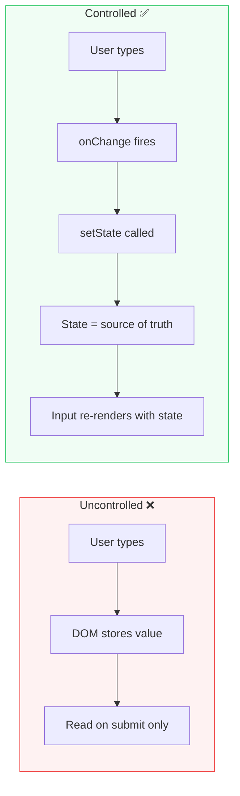
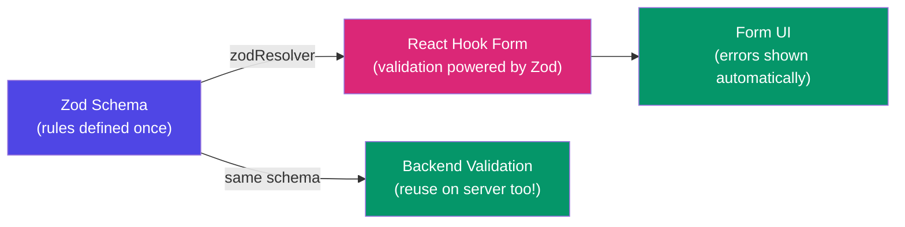
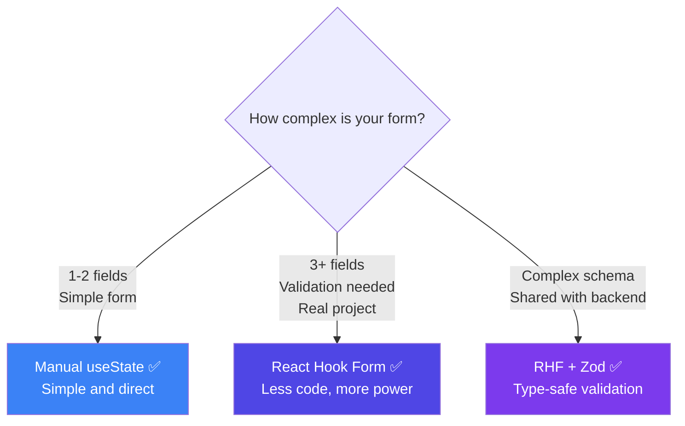
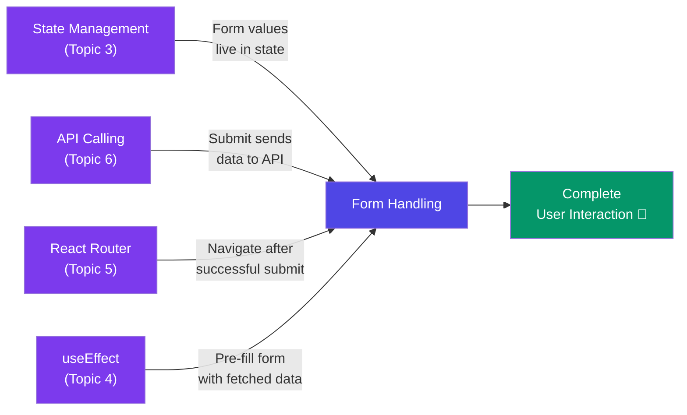

# 📝 Form Handling in React — A Deep Dive

> **"Forms are how users talk to your app — handling them well is the difference between a frustrating and a great user experience."**

---

## 📚 Table of Contents

1. [What is Form Handling?](#-what-is-form-handling)
2. [Real Life Analogy — The Job Application Form](#-real-life-analogy--the-job-application-form)
3. [Controlled vs Uncontrolled Components](#-controlled-vs-uncontrolled-components)
4. [Controlled Inputs — Every Input Type](#-controlled-inputs--every-input-type)
5. [Handling Form Submit](#-handling-form-submit)
6. [Form Validation — Manual](#-form-validation--manual)
7. [Multiple Fields — Single State Object](#-multiple-fields--single-state-object)
8. [React Hook Form — The Industry Standard](#-react-hook-form--the-industry-standard)
9. [Validation with Zod + React Hook Form](#-validation-with-zod--react-hook-form)
10. [Dynamic Forms — Add / Remove Fields](#-dynamic-forms--add--remove-fields)
11. [Common Mistakes](#-common-mistakes)
12. [Manual vs React Hook Form — Comparison](#-manual-vs-react-hook-form--comparison)
13. [Cheat Sheet](#-cheat-sheet)

---

## 🤔 What is Form Handling?

A form has inputs. When a user types, selects, or clicks — your React app needs to:

```
1. Track what the user typed      → State
2. Validate the input             → Validation
3. Show errors if invalid         → Error UI
4. Submit the data                → onSubmit handler
5. Send to API / do something     → API call / action
```

React gives you full control over this entire flow.

---

## 📋 Real Life Analogy — The Job Application Form

Imagine filling out a **job application form**:

| Form Concept | Job Application Analogy |
|---|---|
| Input field | Each blank (Name, Email, Experience) |
| State | What you've written so far |
| Validation | HR checks if all fields are filled correctly |
| Error message | "Phone number must be 10 digits" |
| Submit button | Handing over the completed form |
| onSubmit handler | HR receives and processes it |
| Reset | Getting a blank form to start over |

React is both the **form** and the **HR** — it tracks input AND validates it!

---

## ⚔️ Controlled vs Uncontrolled Components

This is the most fundamental concept in React forms.

### Uncontrolled Component — DOM controls the value

```jsx
// React does NOT track the value — DOM does
function UncontrolledForm() {
  const inputRef = useRef();

  const handleSubmit = (e) => {
    e.preventDefault();
    console.log(inputRef.current.value);  // read value only on submit
  };

  return (
    <form onSubmit={handleSubmit}>
      <input ref={inputRef} type="text" defaultValue="Initial" />
      <button type="submit">Submit</button>
    </form>
  );
}
```

### Controlled Component — React controls the value ✅

```jsx
// React state IS the source of truth
function ControlledForm() {
  const [name, setName] = useState('');

  const handleSubmit = (e) => {
    e.preventDefault();
    console.log(name);  // always available, not just on submit
  };

  return (
    <form onSubmit={handleSubmit}>
      <input
        type="text"
        value={name}              // state → input (controlled)
        onChange={e => setName(e.target.value)}  // input → state
      />
      <button type="submit">Submit</button>
    </form>
  );
}
```



### When to use which?

| | Controlled | Uncontrolled |
|---|---|---|
| **Real-time validation** | ✅ Easy | ❌ Hard |
| **Conditional rendering** | ✅ Easy | ❌ Hard |
| **Instant feedback** | ✅ Yes | ❌ Only on submit |
| **File inputs** | ❌ Not possible | ✅ Use ref |
| **Simple quick form** | ✅ Fine | ✅ Fine |
| **Industry standard** | ✅ Preferred | Avoid for complex forms |

> 💡 **Rule:** Always use **Controlled Components** in React. The only exception is `<input type="file">` — that must be uncontrolled.

---

## 🎛️ Controlled Inputs — Every Input Type

### Text, Email, Password, Number

```jsx
const [text, setText]         = useState('');
const [email, setEmail]       = useState('');
const [password, setPassword] = useState('');
const [age, setAge]           = useState('');

<input type="text"     value={text}     onChange={e => setText(e.target.value)} />
<input type="email"    value={email}    onChange={e => setEmail(e.target.value)} />
<input type="password" value={password} onChange={e => setPassword(e.target.value)} />
<input type="number"   value={age}      onChange={e => setAge(e.target.value)} />
```

### Textarea

```jsx
const [bio, setBio] = useState('');

<textarea
  value={bio}
  onChange={e => setBio(e.target.value)}
  rows={4}
  placeholder="Tell us about yourself..."
/>
```

### Checkbox

```jsx
const [agreed, setAgreed] = useState(false);

<input
  type="checkbox"
  checked={agreed}                            // checked, NOT value!
  onChange={e => setAgreed(e.target.checked)} // .checked, NOT .value!
/>
<label>I agree to terms and conditions</label>
```

### Multiple Checkboxes

```jsx
const [hobbies, setHobbies] = useState([]);

const handleHobbyChange = (hobby) => {
  setHobbies(prev =>
    prev.includes(hobby)
      ? prev.filter(h => h !== hobby)  // uncheck: remove
      : [...prev, hobby]               // check: add
  );
};

{['Reading', 'Coding', 'Gaming', 'Travelling'].map(hobby => (
  <label key={hobby}>
    <input
      type="checkbox"
      checked={hobbies.includes(hobby)}
      onChange={() => handleHobbyChange(hobby)}
    />
    {hobby}
  </label>
))}
```

### Radio Buttons

```jsx
const [gender, setGender] = useState('');

{['Male', 'Female', 'Other'].map(option => (
  <label key={option}>
    <input
      type="radio"
      value={option}
      checked={gender === option}
      onChange={e => setGender(e.target.value)}
    />
    {option}
  </label>
))}
```

### Select Dropdown

```jsx
const [city, setCity] = useState('');

<select value={city} onChange={e => setCity(e.target.value)}>
  <option value="">-- Select City --</option>
  <option value="pune">Pune</option>
  <option value="mumbai">Mumbai</option>
  <option value="delhi">Delhi</option>
  <option value="bangalore">Bangalore</option>
</select>
```

### Multi-Select

```jsx
const [skills, setSkills] = useState([]);

const handleSkillChange = (e) => {
  const selected = Array.from(e.target.selectedOptions, opt => opt.value);
  setSkills(selected);
};

<select multiple value={skills} onChange={handleSkillChange}>
  <option value="react">React</option>
  <option value="node">Node.js</option>
  <option value="python">Python</option>
</select>
```

### File Input (Uncontrolled — exception to the rule)

```jsx
const fileRef = useRef();

const handleUpload = () => {
  const file = fileRef.current.files[0];
  console.log(file.name, file.size);
};

// File input CANNOT be controlled — use ref
<input type="file" ref={fileRef} accept=".jpg,.png,.pdf" />
<button onClick={handleUpload}>Upload</button>
```

---

## 📤 Handling Form Submit

```jsx
function LoginForm() {
  const [email, setEmail]       = useState('');
  const [password, setPassword] = useState('');
  const [loading, setLoading]   = useState(false);

  const handleSubmit = async (e) => {
    e.preventDefault();  // ← ALWAYS prevent default! Stops page reload.

    setLoading(true);
    try {
      await axios.post('/api/login', { email, password });
      navigate('/dashboard');
    } catch (err) {
      alert('Login failed!');
    } finally {
      setLoading(false);
    }
  };

  return (
    <form onSubmit={handleSubmit}>
      <input
        type="email"
        value={email}
        onChange={e => setEmail(e.target.value)}
        placeholder="Email"
      />
      <input
        type="password"
        value={password}
        onChange={e => setPassword(e.target.value)}
        placeholder="Password"
      />
      <button type="submit" disabled={loading}>
        {loading ? 'Logging in...' : 'Login'}
      </button>
    </form>
  );
}
```

> ⚠️ `e.preventDefault()` is the **most important line** in any form submit handler. Without it, the page reloads and all state is lost!

---

## ✅ Form Validation — Manual

### Validate on Submit

```jsx
function RegisterForm() {
  const [form, setForm]     = useState({ name: '', email: '', password: '' });
  const [errors, setErrors] = useState({});

  const validate = () => {
    const newErrors = {};

    if (!form.name.trim()) {
      newErrors.name = 'Name is required';
    }

    if (!form.email.trim()) {
      newErrors.email = 'Email is required';
    } else if (!/\S+@\S+\.\S+/.test(form.email)) {
      newErrors.email = 'Enter a valid email address';
    }

    if (!form.password) {
      newErrors.password = 'Password is required';
    } else if (form.password.length < 6) {
      newErrors.password = 'Password must be at least 6 characters';
    }

    return newErrors;
  };

  const handleSubmit = (e) => {
    e.preventDefault();
    const validationErrors = validate();

    if (Object.keys(validationErrors).length > 0) {
      setErrors(validationErrors);  // show errors
      return;                        // stop submission
    }

    // No errors — proceed
    console.log('Form submitted:', form);
  };

  return (
    <form onSubmit={handleSubmit}>
      <div>
        <input
          type="text"
          value={form.name}
          onChange={e => setForm({ ...form, name: e.target.value })}
          placeholder="Full Name"
          style={{ borderColor: errors.name ? 'red' : '' }}
        />
        {errors.name && <span style={{ color: 'red' }}>{errors.name}</span>}
      </div>

      <div>
        <input
          type="email"
          value={form.email}
          onChange={e => setForm({ ...form, email: e.target.value })}
          placeholder="Email"
          style={{ borderColor: errors.email ? 'red' : '' }}
        />
        {errors.email && <span style={{ color: 'red' }}>{errors.email}</span>}
      </div>

      <div>
        <input
          type="password"
          value={form.password}
          onChange={e => setForm({ ...form, password: e.target.value })}
          placeholder="Password"
          style={{ borderColor: errors.password ? 'red' : '' }}
        />
        {errors.password && <span style={{ color: 'red' }}>{errors.password}</span>}
      </div>

      <button type="submit">Register</button>
    </form>
  );
}
```

### Real-time Validation (on blur)

```jsx
// Validate when user leaves the field (onBlur)
const [touched, setTouched] = useState({});

const handleBlur = (field) => {
  setTouched(prev => ({ ...prev, [field]: true }));
};

// Only show error if user has touched the field
{touched.email && errors.email && (
  <span style={{ color: 'red' }}>{errors.email}</span>
)}

<input
  type="email"
  value={form.email}
  onChange={e => setForm({ ...form, email: e.target.value })}
  onBlur={() => handleBlur('email')}   // mark as touched
/>
```

---

## 🗂️ Multiple Fields — Single State Object

Instead of a separate `useState` for every field, use one object:

```jsx
// ❌ MESSY — separate state for every field
const [firstName, setFirstName] = useState('');
const [lastName, setLastName]   = useState('');
const [email, setEmail]         = useState('');
const [phone, setPhone]         = useState('');
const [city, setCity]           = useState('');

// ✅ CLEAN — one state object for all fields
const [form, setForm] = useState({
  firstName: '',
  lastName:  '',
  email:     '',
  phone:     '',
  city:      ''
});

// One handler for ALL fields using computed property name
const handleChange = (e) => {
  const { name, value } = e.target;
  setForm(prev => ({
    ...prev,
    [name]: value    // [name] = dynamic key!
  }));
};

// Each input uses name attribute matching the state key
<input name="firstName" value={form.firstName} onChange={handleChange} />
<input name="lastName"  value={form.lastName}  onChange={handleChange} />
<input name="email"     value={form.email}     onChange={handleChange} />
<input name="phone"     value={form.phone}     onChange={handleChange} />
<input name="city"      value={form.city}      onChange={handleChange} />
```

The `name` attribute on the input **must match** the key in your state object. One `handleChange` handles everything! 🎯

---

## 🎣 React Hook Form — The Industry Standard

Manual form handling gets complex fast. **React Hook Form (RHF)** is the most popular form library — used in almost every professional React project.

### Why React Hook Form?

- ✅ Much less boilerplate code
- ✅ Better performance (uncontrolled under the hood)
- ✅ Built-in validation
- ✅ Easy integration with UI libraries
- ✅ Great error handling

### Installation

```bash
npm install react-hook-form
```

### Basic Usage

```jsx
import { useForm } from 'react-hook-form';

function RegisterForm() {
  const {
    register,       // connects input to RHF
    handleSubmit,   // wraps your submit handler
    formState: { errors, isSubmitting }  // form state
  } = useForm();

  const onSubmit = async (data) => {
    // data = { name: "Vaishali", email: "...", password: "..." }
    console.log(data);
    await axios.post('/api/register', data);
  };

  return (
    <form onSubmit={handleSubmit(onSubmit)}>

      {/* Name field */}
      <input
        {...register('name', {
          required: 'Name is required',
          minLength: { value: 2, message: 'Minimum 2 characters' }
        })}
        placeholder="Full Name"
      />
      {errors.name && <span>{errors.name.message}</span>}

      {/* Email field */}
      <input
        {...register('email', {
          required: 'Email is required',
          pattern: {
            value: /\S+@\S+\.\S+/,
            message: 'Enter a valid email'
          }
        })}
        placeholder="Email"
      />
      {errors.email && <span>{errors.email.message}</span>}

      {/* Password field */}
      <input
        type="password"
        {...register('password', {
          required: 'Password is required',
          minLength: { value: 6, message: 'Minimum 6 characters' }
        })}
        placeholder="Password"
      />
      {errors.password && <span>{errors.password.message}</span>}

      <button type="submit" disabled={isSubmitting}>
        {isSubmitting ? 'Registering...' : 'Register'}
      </button>

    </form>
  );
}
```

### All Built-in Validation Rules

```jsx
{...register('fieldName', {
  required: 'This field is required',
  minLength: { value: 3,    message: 'Min 3 characters' },
  maxLength: { value: 50,   message: 'Max 50 characters' },
  min:       { value: 18,   message: 'Must be at least 18' },
  max:       { value: 100,  message: 'Must be under 100' },
  pattern:   { value: /regex/, message: 'Invalid format' },
  validate:  value => value !== 'admin' || 'Username "admin" not allowed'
})}
```

### Watch — Live Field Values

```jsx
const { register, watch } = useForm();
const password = watch('password');  // live value of password field

// Confirm password must match password
{...register('confirmPassword', {
  validate: value => value === password || 'Passwords do not match'
})}
```

### Reset Form

```jsx
const { register, handleSubmit, reset } = useForm();

const onSubmit = (data) => {
  console.log(data);
  reset();  // clear all fields after submit
};
```

### Default Values

```jsx
// Pre-fill form (e.g., edit profile)
const { register } = useForm({
  defaultValues: {
    name:  'Vaishali',
    email: 'vaishali@example.com',
    city:  'Pune'
  }
});
```

---

## 🛡️ Validation with Zod + React Hook Form

**Zod** is a schema validation library — it lets you define the shape and rules of your data in one place, then reuse it everywhere (frontend + backend).

### Installation

```bash
npm install zod @hookform/resolvers
```

### Define Schema with Zod

```js
// schemas/registerSchema.js
import { z } from 'zod';

export const registerSchema = z.object({
  name: z
    .string()
    .min(2, 'Name must be at least 2 characters')
    .max(50, 'Name too long'),

  email: z
    .string()
    .email('Enter a valid email address'),

  password: z
    .string()
    .min(6, 'Password must be at least 6 characters')
    .regex(/[A-Z]/, 'Must contain at least one uppercase letter')
    .regex(/[0-9]/, 'Must contain at least one number'),

  confirmPassword: z.string(),

  age: z
    .number()
    .min(18, 'Must be 18 or older')
    .max(100, 'Invalid age'),

}).refine(
  data => data.password === data.confirmPassword,
  {
    message: 'Passwords do not match',
    path: ['confirmPassword']
  }
);
```

### Use Schema with React Hook Form

```jsx
import { useForm } from 'react-hook-form';
import { zodResolver } from '@hookform/resolvers/zod';
import { registerSchema } from '../schemas/registerSchema';

function RegisterForm() {
  const {
    register,
    handleSubmit,
    formState: { errors, isSubmitting }
  } = useForm({
    resolver: zodResolver(registerSchema)  // 🔌 plug in Zod schema
  });

  const onSubmit = async (data) => {
    // data is already validated and typed!
    await axios.post('/api/register', data);
  };

  return (
    <form onSubmit={handleSubmit(onSubmit)}>
      <input {...register('name')} placeholder="Full Name" />
      {errors.name && <span>{errors.name.message}</span>}

      <input {...register('email')} placeholder="Email" />
      {errors.email && <span>{errors.email.message}</span>}

      <input type="password" {...register('password')} placeholder="Password" />
      {errors.password && <span>{errors.password.message}</span>}

      <input type="password" {...register('confirmPassword')} placeholder="Confirm Password" />
      {errors.confirmPassword && <span>{errors.confirmPassword.message}</span>}

      <button type="submit" disabled={isSubmitting}>
        {isSubmitting ? 'Submitting...' : 'Register'}
      </button>
    </form>
  );
}
```



---

## ➕ Dynamic Forms — Add / Remove Fields

```jsx
function SkillsForm() {
  const [skills, setSkills] = useState(['']);

  const addSkill = () => {
    setSkills(prev => [...prev, '']);  // add empty field
  };

  const removeSkill = (index) => {
    setSkills(prev => prev.filter((_, i) => i !== index));
  };

  const updateSkill = (index, value) => {
    setSkills(prev => prev.map((skill, i) => i === index ? value : skill));
  };

  const handleSubmit = (e) => {
    e.preventDefault();
    const filledSkills = skills.filter(s => s.trim());
    console.log('Skills:', filledSkills);
  };

  return (
    <form onSubmit={handleSubmit}>
      <h3>Your Skills</h3>

      {skills.map((skill, index) => (
        <div key={index} style={{ display: 'flex', gap: '8px' }}>
          <input
            value={skill}
            onChange={e => updateSkill(index, e.target.value)}
            placeholder={`Skill ${index + 1}`}
          />
          {skills.length > 1 && (
            <button type="button" onClick={() => removeSkill(index)}>
              ✕ Remove
            </button>
          )}
        </div>
      ))}

      <button type="button" onClick={addSkill}>
        + Add Skill
      </button>

      <button type="submit">Save Skills</button>
    </form>
  );
}
```

> 💡 **`type="button"`** on Add/Remove buttons is critical — without it they trigger form submit!

---

## ⚠️ Common Mistakes

### Mistake 1: Forgetting e.preventDefault()

```jsx
// ❌ WRONG — page reloads, state lost!
const handleSubmit = (e) => {
  console.log(formData);
};

// ✅ CORRECT
const handleSubmit = (e) => {
  e.preventDefault();   // always first line!
  console.log(formData);
};
```

### Mistake 2: Using value without onChange (read-only input warning)

```jsx
// ❌ WRONG — React warns: "read-only field"
<input value={name} />

// ✅ CORRECT — always pair value with onChange
<input value={name} onChange={e => setName(e.target.value)} />
```

### Mistake 3: Checkbox using value instead of checked

```jsx
// ❌ WRONG — checkbox doesn't work with value
<input type="checkbox" value={agreed} onChange={e => setAgreed(e.target.value)} />

// ✅ CORRECT — checkbox uses checked and e.target.checked
<input type="checkbox" checked={agreed} onChange={e => setAgreed(e.target.checked)} />
```

### Mistake 4: Mutating state directly

```jsx
// ❌ WRONG — direct mutation, React won't re-render!
const handleChange = (e) => {
  form.name = e.target.value;   // NEVER mutate state!
  setForm(form);
};

// ✅ CORRECT — create new object with spread
const handleChange = (e) => {
  setForm({ ...form, [e.target.name]: e.target.value });
};
```

### Mistake 5: Not disabling submit button while loading

```jsx
// ❌ WRONG — user can click multiple times, multiple API calls!
<button type="submit">Submit</button>

// ✅ CORRECT — disable while submitting
<button type="submit" disabled={loading}>
  {loading ? 'Submitting...' : 'Submit'}
</button>
```

### Mistake 6: Validating only on submit (bad UX)

```jsx
// ❌ BAD UX — user fills entire form then sees errors
// ✅ BETTER UX — validate on blur (when user leaves field)
<input
  onBlur={() => validateField('email')}
/>
// Or use React Hook Form — it handles this automatically!
```

---

## 📊 Manual vs React Hook Form — Comparison

| Feature | Manual useState | React Hook Form |
|---|---|---|
| **Boilerplate** | A lot | Minimal |
| **Performance** | Re-renders on every keystroke | Optimized (uncontrolled) |
| **Validation** | Write yourself | Built-in + Zod |
| **Error handling** | Manual state | `formState.errors` |
| **Touch tracking** | Manual | Built-in |
| **Watch values** | `useState` | `watch()` |
| **Reset form** | Manually set state | `reset()` |
| **Learning curve** | Low | Low-Medium |
| **Real project use** | Small forms only | ✅ Industry standard |



---

## 📋 Cheat Sheet

### Controlled Input Pattern

```jsx
// Every controlled input follows this pattern:
const [value, setValue] = useState('');
<input value={value} onChange={e => setValue(e.target.value)} />

// Checkbox is different:
const [checked, setChecked] = useState(false);
<input type="checkbox" checked={checked} onChange={e => setChecked(e.target.checked)} />
```

### Single handleChange for Multiple Fields

```jsx
const [form, setForm] = useState({ name: '', email: '', phone: '' });

const handleChange = (e) => {
  setForm(prev => ({ ...prev, [e.target.name]: e.target.value }));
};

// Each input MUST have a name matching the state key
<input name="name"  value={form.name}  onChange={handleChange} />
<input name="email" value={form.email} onChange={handleChange} />
<input name="phone" value={form.phone} onChange={handleChange} />
```

### React Hook Form Quick Setup

```jsx
const { register, handleSubmit, formState: { errors } } = useForm();

<form onSubmit={handleSubmit(onSubmit)}>
  <input {...register('fieldName', { required: 'Field is required' })} />
  {errors.fieldName && <span>{errors.fieldName.message}</span>}
</form>
```

### Validation Rules Quick Reference

```jsx
// Manual
if (!value.trim())              → 'Field required'
if (value.length < 6)           → 'Too short'
if (!/regex/.test(value))       → 'Invalid format'

// React Hook Form
{ required: 'message' }
{ minLength: { value: 6, message: 'message' } }
{ pattern:   { value: /regex/, message: 'message' } }
{ validate:  value => condition || 'message' }

// Zod
z.string().min(2).max(50).email().regex(/pattern/)
z.number().min(18).max(100)
z.object({}).refine(data => check, { message, path })
```

---

## 🔗 Connection to Previous Topics



---

## 🎯 Key Takeaways

> 1. **Always use Controlled Components** — React state is the source of truth for inputs.
>
> 2. **`e.preventDefault()`** — first line in every submit handler, no exceptions.
>
> 3. **One state object for multiple fields** — use `[e.target.name]` computed key pattern.
>
> 4. **Checkbox uses `checked` + `e.target.checked`** — NOT `value` + `e.target.value`.
>
> 5. **Always handle 3 UI states** — loading, error, success after submit.
>
> 6. **React Hook Form** is the industry standard — use it for any real project.
>
> 7. **Zod + RHF** = type-safe validation with minimal code — the best combo.
>
> 8. **Disable submit button while loading** — prevent duplicate API calls.

---

## 📖 Further Reading

- [React Docs — Forms](https://react.dev/learn/reacting-to-input-with-state)
- [React Hook Form — Official Docs](https://react-hook-form.com/)
- [Zod — Official Docs](https://zod.dev/)
- [@hookform/resolvers](https://github.com/react-hook-form/resolvers)

---

*Made with ❤️ for [React Revision Book](./README.md) | Topic: Form Handling*
