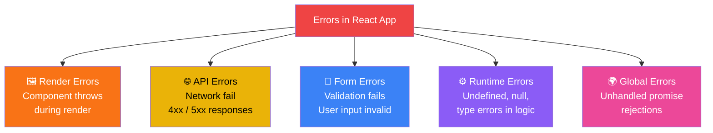
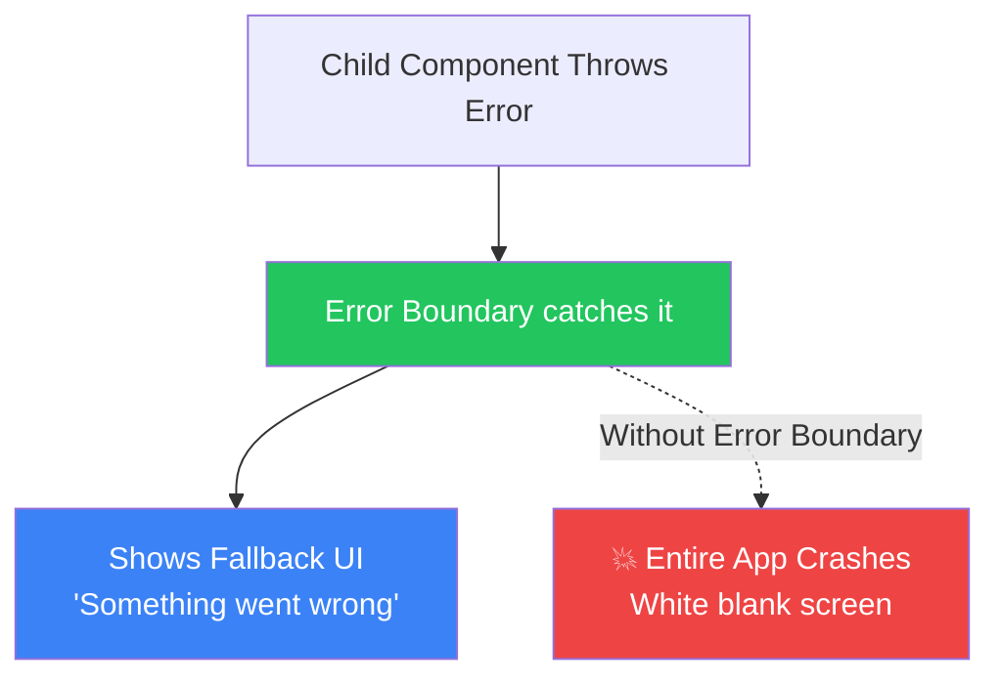
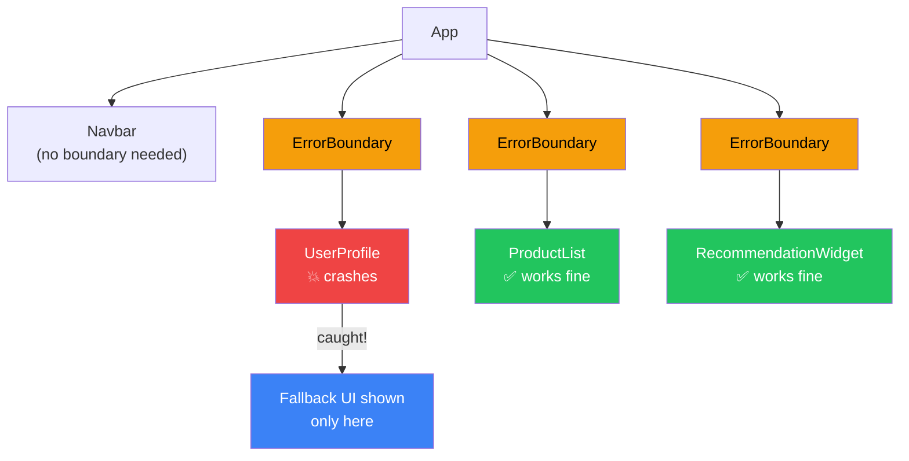
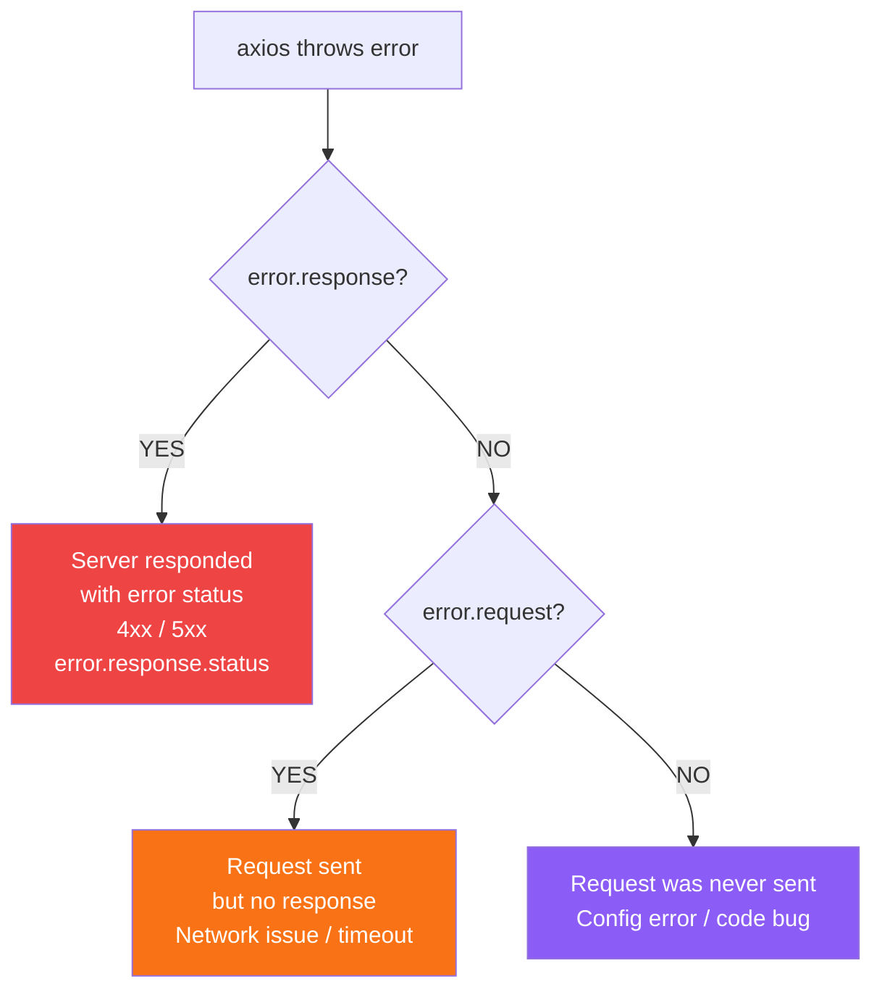
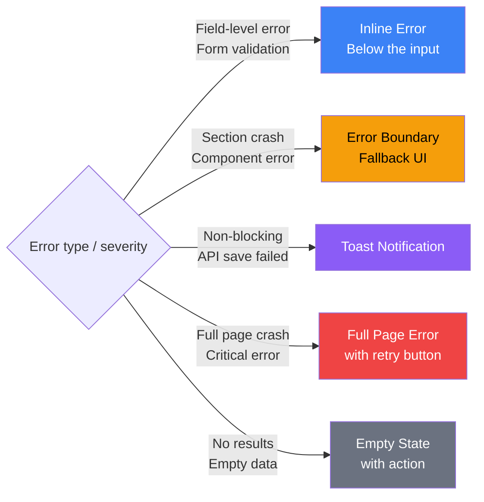
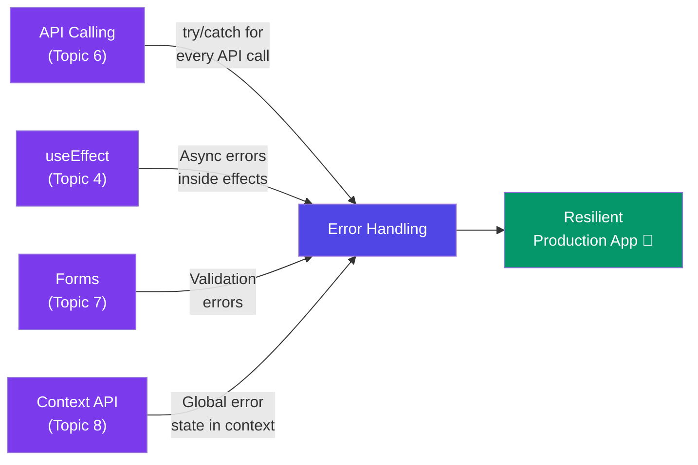

# 🛡️ Error Handling in React — A Deep Dive

> **"Errors are inevitable — how your app handles them is what separates a professional app from an amateur one."**

---

## 📚 Table of Contents

1. [Types of Errors in React](#-types-of-errors-in-react)
2. [Real Life Analogy — The Safety Net](#-real-life-analogy--the-safety-net)
3. [Error Boundaries — Catch UI Errors](#-error-boundaries--catch-ui-errors)
4. [react-error-boundary — Modern Approach](#-react-error-boundary--modern-approach)
5. [API Error Handling](#-api-error-handling)
6. [Global Error Handling](#-global-error-handling)
7. [Form Validation Errors](#-form-validation-errors)
8. [Error UI Patterns](#-error-ui-patterns)
9. [try / catch / finally — Quick Recap](#-try--catch--finally--quick-recap)
10. [Async Error Handling Patterns](#-async-error-handling-patterns)
11. [Error Logging — Sentry](#-error-logging--sentry)
12. [Common Mistakes](#-common-mistakes)
13. [Cheat Sheet](#-cheat-sheet)

---

## 🔴 Types of Errors in React

React apps can have errors in different places — each needs a different strategy:



| Error Type | Where it happens | Solution |
|---|---|---|
| **Render Error** | Inside component JSX | Error Boundary |
| **API Error** | fetch / axios calls | try/catch + error state |
| **Form Error** | User input validation | Validation logic / Zod |
| **Runtime Error** | JS logic (null, undefined) | Optional chaining, guards |
| **Global Error** | Unhandled promises | window.onerror / Sentry |

---

## 🎪 Real Life Analogy — The Safety Net

Think of error handling like **safety systems in a building**:

```
🏢 Your React App = A multi-floor building

🧯 Fire Extinguisher (try/catch)
   → Handles small, expected fires locally
   → You know where fire might start, you prepare

🚒 Fire Department (Error Boundary)
   → Catches big fires before they spread to whole building
   → Contains damage to one floor (one component tree)

📹 CCTV / Alarm System (Sentry / Error Logging)
   → Records what happened, when, where
   → Alerts you even when you're not watching

🚪 Emergency Exit (Fallback UI)
   → When a floor is on fire, show users a safe alternative
   → Don't leave them in a burning room (blank/crashed screen)
```

---

## 🧱 Error Boundaries — Catch UI Errors

### What is an Error Boundary?

An **Error Boundary** is a React component that catches JavaScript errors anywhere in its **child component tree** and displays a fallback UI instead of crashing the whole app.



### Class-based Error Boundary (only way in pure React)

```jsx
// src/components/ErrorBoundary.jsx
import { Component } from 'react';

class ErrorBoundary extends Component {
  constructor(props) {
    super(props);
    this.state = {
      hasError: false,
      error: null,
      errorInfo: null
    };
  }

  // Called when a child throws — update state to show fallback
  static getDerivedStateFromError(error) {
    return { hasError: true, error };
  }

  // Called after error — good place to log errors
  componentDidCatch(error, errorInfo) {
    console.error('Error caught by boundary:', error);
    console.error('Component stack:', errorInfo.componentStack);

    // Send to error logging service (e.g. Sentry)
    // logErrorToService(error, errorInfo);
  }

  render() {
    if (this.state.hasError) {
      // Fallback UI
      return (
        <div style={{ padding: '20px', textAlign: 'center' }}>
          <h2>😵 Oops! Something went wrong.</h2>
          <p>{this.state.error?.message}</p>
          <button onClick={() => this.setState({ hasError: false, error: null })}>
            Try Again
          </button>
        </div>
      );
    }

    return this.props.children;
  }
}

export default ErrorBoundary;
```

### Using Error Boundary

```jsx
// Wrap any part of your app — be strategic about placement!
function App() {
  return (
    <div>
      <Navbar />   {/* Outside boundary — Navbar is stable */}

      {/* Each section has its own boundary */}
      <ErrorBoundary>
        <UserProfile />
      </ErrorBoundary>

      <ErrorBoundary>
        <ProductList />
      </ErrorBoundary>

      <ErrorBoundary>
        <RecommendationWidget />
      </ErrorBoundary>
    </div>
  );
}
```



### ⚠️ What Error Boundaries do NOT catch

```jsx
// Error Boundaries catch:
✅ Errors in render methods
✅ Errors in lifecycle methods
✅ Errors in constructors of child components

// Error Boundaries do NOT catch:
❌ Errors in event handlers       → use try/catch
❌ Async errors (setTimeout, API) → use try/catch + error state
❌ Errors in the boundary itself  → use a parent boundary
❌ Server-side rendering errors   → handle separately
```

---

## 📦 react-error-boundary — Modern Approach

The `react-error-boundary` library gives you a **functional component** approach — much cleaner than writing class components.

### Installation

```bash
npm install react-error-boundary
```

### Basic Usage

```jsx
import { ErrorBoundary } from 'react-error-boundary';

// Fallback component — receives error and reset function
function ErrorFallback({ error, resetErrorBoundary }) {
  return (
    <div role="alert" style={{ padding: '20px', border: '1px solid red' }}>
      <h2>😵 Something went wrong!</h2>
      <pre style={{ color: 'red' }}>{error.message}</pre>
      <button onClick={resetErrorBoundary}>Try Again</button>
    </div>
  );
}

// Usage
function App() {
  return (
    <ErrorBoundary
      FallbackComponent={ErrorFallback}
      onError={(error, info) => console.error(error, info)}  // logging
      onReset={() => console.log('Reset!')}                   // on retry
    >
      <MyComponent />
    </ErrorBoundary>
  );
}
```

### useErrorBoundary Hook — Trigger from Event Handlers

```jsx
import { useErrorBoundary } from 'react-error-boundary';

// Error boundaries normally don't catch event handler errors
// useErrorBoundary lets you manually trigger the boundary!

function DataFetcher() {
  const { showBoundary } = useErrorBoundary();

  const fetchData = async () => {
    try {
      const data = await api.get('/data');
      setData(data);
    } catch (error) {
      showBoundary(error);  // manually trigger the boundary!
    }
  };

  return <button onClick={fetchData}>Load Data</button>;
}
```

### withErrorBoundary HOC

```jsx
import { withErrorBoundary } from 'react-error-boundary';

// Wrap a component with an error boundary in one line
const SafeUserProfile = withErrorBoundary(UserProfile, {
  FallbackComponent: ErrorFallback,
  onError: (error) => logToSentry(error)
});

// Use it like a normal component — boundary is built in!
function App() {
  return <SafeUserProfile userId={42} />;
}
```

---

## 🌐 API Error Handling

API errors are the most common errors in real apps. Always handle these 3 scenarios:

### Pattern — Loading / Error / Success

```jsx
function UserList() {
  const [users, setUsers]     = useState([]);
  const [loading, setLoading] = useState(true);
  const [error, setError]     = useState(null);

  useEffect(() => {
    const controller = new AbortController();

    async function fetchUsers() {
      try {
        setLoading(true);
        setError(null);

        const res = await axios.get('/api/users', {
          signal: controller.signal
        });
        setUsers(res.data);

      } catch (err) {
        if (err.name === 'CanceledError') return; // ignore unmount cancel

        // Different errors need different messages
        if (err.response) {
          // Server responded with error status (4xx, 5xx)
          switch (err.response.status) {
            case 401: setError('Please login to continue.');        break;
            case 403: setError('You do not have permission.');      break;
            case 404: setError('Users not found.');                 break;
            case 500: setError('Server error. Please try again.');  break;
            default:  setError(`Error: ${err.response.status}`);
          }
        } else if (err.request) {
          // Request made but no response — network issue
          setError('No internet connection. Check your network.');
        } else {
          // Something else went wrong
          setError('An unexpected error occurred.');
        }
      } finally {
        setLoading(false);
      }
    }

    fetchUsers();
    return () => controller.abort();
  }, []);

  if (loading) return <LoadingSpinner />;
  if (error)   return <ErrorMessage message={error} onRetry={() => setError(null)} />;
  return <ul>{users.map(u => <li key={u.id}>{u.name}</li>)}</ul>;
}
```

### Axios Error Types



### Retry Logic

```jsx
function useFetchWithRetry(url, maxRetries = 3) {
  const [data, setData]       = useState(null);
  const [error, setError]     = useState(null);
  const [loading, setLoading] = useState(true);
  const [retryCount, setRetryCount] = useState(0);

  useEffect(() => {
    async function fetchWithRetry() {
      for (let attempt = 1; attempt <= maxRetries; attempt++) {
        try {
          setLoading(true);
          const res = await axios.get(url);
          setData(res.data);
          setError(null);
          return; // success — stop retrying
        } catch (err) {
          console.warn(`Attempt ${attempt} failed`);

          if (attempt === maxRetries) {
            setError('Failed after multiple attempts. Please try again.');
          } else {
            // Wait before retrying: 1s, 2s, 4s (exponential backoff)
            await new Promise(r => setTimeout(r, 1000 * attempt));
          }
        } finally {
          setLoading(false);
        }
      }
    }

    fetchWithRetry();
  }, [url, retryCount]);

  const retry = () => setRetryCount(c => c + 1);

  return { data, error, loading, retry };
}
```

---

## 🌍 Global Error Handling

Catch errors that slip past all your local handlers.

### Window Error Handlers

```jsx
// main.jsx or App.jsx — set up once
useEffect(() => {
  // Catches synchronous runtime errors
  const handleError = (event) => {
    console.error('Global error:', event.error);
    // logToSentry(event.error);
  };

  // Catches unhandled promise rejections
  const handleUnhandledRejection = (event) => {
    console.error('Unhandled promise rejection:', event.reason);
    // logToSentry(event.reason);
    event.preventDefault(); // prevents console error in browser
  };

  window.addEventListener('error', handleError);
  window.addEventListener('unhandledrejection', handleUnhandledRejection);

  return () => {
    window.removeEventListener('error', handleError);
    window.removeEventListener('unhandledrejection', handleUnhandledRejection);
  };
}, []);
```

### Axios Global Interceptor

```jsx
// src/api/axiosInstance.js
import axios from 'axios';

const api = axios.create({ baseURL: '/api' });

// Global response error handler
api.interceptors.response.use(
  response => response,  // pass through success

  error => {
    const status = error.response?.status;

    if (status === 401) {
      // Token expired globally — redirect to login
      localStorage.removeItem('token');
      window.location.href = '/login';
    }

    if (status === 403) {
      window.location.href = '/forbidden';
    }

    if (status >= 500) {
      // Show global toast notification
      showToast('Server error. Our team has been notified.', 'error');
    }

    return Promise.reject(error);  // still pass error to local handlers
  }
);

export default api;
```

---

## 📝 Form Validation Errors

Covered in detail in the Form Handling topic — quick recap here:

```jsx
// Inline field-level errors
function FieldError({ message }) {
  if (!message) return null;
  return (
    <span role="alert" style={{ color: '#ef4444', fontSize: '12px' }}>
      ⚠️ {message}
    </span>
  );
}

// Usage
<div>
  <input
    value={email}
    onChange={e => setEmail(e.target.value)}
    style={{ borderColor: errors.email ? '#ef4444' : '#d1d5db' }}
    aria-invalid={!!errors.email}
    aria-describedby="email-error"
  />
  <FieldError message={errors.email} />
</div>
```

---

## 🎨 Error UI Patterns

### 1. Inline Error Message

```jsx
// For small, contained errors
function InlineError({ message, onRetry }) {
  return (
    <div style={{
      padding: '12px',
      background: '#fef2f2',
      border: '1px solid #fecaca',
      borderRadius: '8px',
      color: '#dc2626'
    }}>
      <span>❌ {message}</span>
      {onRetry && (
        <button onClick={onRetry} style={{ marginLeft: '8px' }}>
          Retry
        </button>
      )}
    </div>
  );
}
```

### 2. Full Page Error

```jsx
// For critical page-level errors
function ErrorPage({ error, resetErrorBoundary }) {
  return (
    <div style={{ textAlign: 'center', padding: '60px 20px' }}>
      <div style={{ fontSize: '64px' }}>😵</div>
      <h1>Oops! Something went wrong</h1>
      <p style={{ color: '#6b7280' }}>
        {error?.message || 'An unexpected error occurred.'}
      </p>
      <div style={{ display: 'flex', gap: '12px', justifyContent: 'center' }}>
        <button onClick={resetErrorBoundary}>Try Again</button>
        <button onClick={() => window.location.href = '/'}>Go Home</button>
      </div>
    </div>
  );
}
```

### 3. Toast Notification

```jsx
// Non-blocking error notifications
// Using react-hot-toast (npm install react-hot-toast)
import toast from 'react-hot-toast';

// Show error toast anywhere
toast.error('Failed to save changes. Please try again.');
toast.success('Profile updated successfully!');
toast.loading('Saving changes...');

// In main.jsx — add Toaster once
import { Toaster } from 'react-hot-toast';
<Toaster position="top-right" />
```

### 4. Empty State (not really an error but feels like one)

```jsx
function EmptyState({ message = 'No data found', onAction, actionLabel }) {
  return (
    <div style={{ textAlign: 'center', padding: '40px' }}>
      <div style={{ fontSize: '48px' }}>📭</div>
      <p>{message}</p>
      {onAction && (
        <button onClick={onAction}>{actionLabel || 'Try again'}</button>
      )}
    </div>
  );
}

// Usage:
if (!loading && users.length === 0) {
  return <EmptyState message="No users found" />;
}
```



---

## 🔄 try / catch / finally — Quick Recap

```jsx
async function riskyOperation() {
  try {
    // Code that might throw
    const result = await someApiCall();
    return result;

  } catch (error) {
    // Runs if try block throws
    console.error(error);
    // Handle or re-throw
    throw error;  // re-throw if caller should handle it

  } finally {
    // ALWAYS runs — whether try succeeded or catch ran
    setLoading(false);  // perfect for cleanup!
    hideSpinner();
  }
}
```

### Error Types in catch

```jsx
try {
  const data = JSON.parse(invalidJson);
  const user = await fetchUser(id);
} catch (error) {
  if (error instanceof SyntaxError) {
    console.error('Invalid JSON');
  } else if (error instanceof TypeError) {
    console.error('Type error — maybe null/undefined?');
  } else if (error.response) {
    console.error('API error:', error.response.status);
  } else {
    console.error('Unknown error:', error.message);
  }
}
```

---

## ⚡ Async Error Handling Patterns

### Pattern 1 — Error State in Component

```jsx
// Standard pattern — most common
const [error, setError] = useState(null);

try {
  const data = await fetchData();
  setData(data);
} catch (err) {
  setError(err.message);
}

if (error) return <ErrorMessage message={error} />;
```

### Pattern 2 — Error + Retry

```jsx
function DataCard({ url }) {
  const [data, setData]     = useState(null);
  const [error, setError]   = useState(null);
  const [loading, setLoading] = useState(false);

  const fetchData = async () => {
    setLoading(true);
    setError(null);
    try {
      const res = await axios.get(url);
      setData(res.data);
    } catch (err) {
      setError(err.message);
    } finally {
      setLoading(false);
    }
  };

  useEffect(() => { fetchData(); }, [url]);

  if (loading) return <Spinner />;
  if (error)   return <InlineError message={error} onRetry={fetchData} />;
  return <DisplayData data={data} />;
}
```

### Pattern 3 — Optional Chaining to Prevent Crashes

```jsx
// ❌ CRASHES if user is null
const city = user.address.city;

// ✅ Safe — returns undefined instead of crashing
const city = user?.address?.city;

// ✅ With fallback
const city = user?.address?.city ?? 'Unknown city';

// ✅ Safe array access
const firstItem = items?.[0]?.name ?? 'No items';

// ✅ Safe function call
user?.greet?.();
```

### Pattern 4 — Nullish Coalescing for Defaults

```jsx
// ?? returns right side only when left is null or undefined
const name     = user?.name     ?? 'Anonymous';
const count    = data?.count    ?? 0;
const items    = response?.items ?? [];
const settings = config?.settings ?? defaultSettings;
```

---

## 📊 Error Logging — Sentry

In production, you need to know about errors users encounter. **Sentry** is the industry standard.

### Setup

```bash
npm install @sentry/react
```

```jsx
// main.jsx
import * as Sentry from '@sentry/react';

Sentry.init({
  dsn: 'YOUR_SENTRY_DSN',
  environment: import.meta.env.MODE,       // 'development' or 'production'
  tracesSampleRate: 1.0,                   // 100% of transactions traced
  replaysSessionSampleRate: 0.1,           // 10% of sessions recorded
});
```

### Sentry Error Boundary

```jsx
import * as Sentry from '@sentry/react';

// Sentry's own Error Boundary — auto-captures errors
function App() {
  return (
    <Sentry.ErrorBoundary
      fallback={({ error, resetError }) => (
        <ErrorPage error={error} resetErrorBoundary={resetError} />
      )}
      onError={(error, errorInfo) => {
        // Sentry auto-captures, but you can add extra context
        Sentry.setContext('componentStack', errorInfo);
      }}
    >
      <YourApp />
    </Sentry.ErrorBoundary>
  );
}
```

### Manual Error Capture

```jsx
import * as Sentry from '@sentry/react';

async function handlePayment(paymentData) {
  try {
    await processPayment(paymentData);
  } catch (error) {
    // Capture with extra context
    Sentry.captureException(error, {
      tags:  { section: 'payment' },
      extra: { paymentData: paymentData.id },
      user:  { id: currentUser.id, email: currentUser.email }
    });
    setError('Payment failed. Our team has been notified.');
  }
}
```

---

## ⚠️ Common Mistakes

### Mistake 1: Empty catch block — silently swallowing errors

```jsx
// ❌ WORST practice — error disappears silently!
try {
  const data = await fetchData();
  setData(data);
} catch (error) {
  // nothing here — you'll never know what went wrong!
}

// ✅ CORRECT — always handle or at minimum log
} catch (error) {
  console.error(error);
  setError('Failed to load data.');
}
```

### Mistake 2: Using Error Boundary for async errors

```jsx
// ❌ WRONG — Error Boundaries don't catch async errors!
function Component() {
  useEffect(() => {
    fetch('/api/data')
      .then(r => r.json())
      .then(d => setData(d));
      // .catch is missing — error is NOT caught by boundary
  }, []);
}

// ✅ CORRECT — handle async errors with state
} catch (error) {
  setError(error.message);  // local error state
  // OR use showBoundary() from react-error-boundary
}
```

### Mistake 3: Not showing user-friendly messages

```jsx
// ❌ BAD UX — showing raw technical error
setError(error.message);  // "Request failed with status code 500"

// ✅ GOOD UX — human-readable message
if (error.response?.status === 500) {
  setError('Our server is having issues. Please try again in a moment.');
}
```

### Mistake 4: Not having a retry mechanism

```jsx
// ❌ WRONG — user is stuck with no way to recover
if (error) return <p>Error: {error}</p>;

// ✅ CORRECT — always give users a way out
if (error) return (
  <InlineError
    message={error}
    onRetry={fetchData}     // retry button
  />
);
```

### Mistake 5: One global Error Boundary for entire app

```jsx
// ❌ WRONG — one crash takes down everything
<ErrorBoundary>
  <EntireApp />   // if Sidebar crashes, Navbar disappears too!
</ErrorBoundary>

// ✅ CORRECT — granular boundaries
<>
  <Navbar />           {/* stable — no boundary needed */}
  <ErrorBoundary>
    <Sidebar />        {/* isolated */}
  </ErrorBoundary>
  <ErrorBoundary>
    <MainContent />    {/* isolated */}
  </ErrorBoundary>
</>
```

### Mistake 6: Not cleaning up on error

```jsx
// ❌ WRONG — loading stays true on error
async function fetchData() {
  setLoading(true);
  const data = await api.get('/data'); // throws!
  setData(data);
  setLoading(false); // never reached!
}

// ✅ CORRECT — finally always runs
async function fetchData() {
  setLoading(true);
  try {
    const data = await api.get('/data');
    setData(data);
  } catch (err) {
    setError(err.message);
  } finally {
    setLoading(false);  // always runs — even on error
  }
}
```

---

## 📋 Cheat Sheet

### Error Boundary Quick Setup

```jsx
// Install
npm install react-error-boundary

// Fallback component
function ErrorFallback({ error, resetErrorBoundary }) {
  return (
    <div>
      <p>❌ {error.message}</p>
      <button onClick={resetErrorBoundary}>Retry</button>
    </div>
  );
}

// Usage
<ErrorBoundary FallbackComponent={ErrorFallback} onError={logToSentry}>
  <YourComponent />
</ErrorBoundary>
```

### API Error Handling Template

```jsx
const [data, setData]     = useState(null);
const [loading, setLoading] = useState(true);
const [error, setError]   = useState(null);

try {
  setLoading(true);
  setError(null);
  const res = await axios.get(url);
  setData(res.data);
} catch (err) {
  setError(
    err.response?.status === 404 ? 'Not found.' :
    err.response?.status === 401 ? 'Please login.' :
    err.request            ? 'No internet connection.' :
    'Something went wrong.'
  );
} finally {
  setLoading(false);
}
```

### Safe Access Patterns

```jsx
user?.name                    // optional chaining
user?.name ?? 'Anonymous'     // with fallback
items?.[0]?.title             // safe array access
user?.greet?.()               // safe function call
```

### Error UI Decision Guide

```
Field validation error?    → Inline error below input
Component render crash?    → Error Boundary fallback
API call failed?           → Inline error + retry button
Non-blocking action fail?  → Toast notification
Critical full page crash?  → Full page error with retry
No results from API?       → Empty state component
```

---

## 🔗 Connection to Previous Topics



---

## 🎯 Key Takeaways

> 1. **Error Boundaries** catch render errors — wrap sections of your app, not the whole thing.
>
> 2. **Error Boundaries don't catch async errors** — use try/catch + error state for API calls.
>
> 3. **Always use `finally`** — guarantees `setLoading(false)` runs even when errors occur.
>
> 4. **Never leave a catch block empty** — always log or show something to the user.
>
> 5. **Show user-friendly messages** — not raw technical error strings.
>
> 6. **Always provide a retry mechanism** — give users a way to recover.
>
> 7. **Use `react-error-boundary`** — simpler than writing class-based boundaries.
>
> 8. **Use Sentry in production** — you need to know about errors users encounter.
>
> 9. **Optional chaining (`?.`)** — prevents crashes from null/undefined access.
>
> 10. **Global axios interceptors** — handle 401/500 errors in one place.

---

## 📖 Further Reading

- [React Docs — Error Boundaries](https://react.dev/reference/react/Component#catching-rendering-errors-with-an-error-boundary)
- [react-error-boundary — GitHub](https://github.com/bvaughn/react-error-boundary)
- [Sentry for React — Official Docs](https://docs.sentry.io/platforms/javascript/guides/react/)
- [MDN — try...catch](https://developer.mozilla.org/en-US/docs/Web/JavaScript/Reference/Statements/try...catch)
- [MDN — Optional Chaining](https://developer.mozilla.org/en-US/docs/Web/JavaScript/Reference/Operators/Optional_chaining)

---

*Made with ❤️ for [React Revision Book](./README.md)| Topic: Error Handling*
