# ⚛️ React Hooks — Deep Dive

> **"Syntax yaad karna junior ka kaam hai. 'Why' samajhna senior ka."**

This document explains **why each hook exists**, what problem it solves, and how it maps to real-world applications — with diagrams, analogies, and senior-level insights.

---

## 📌 Table of Contents

1. [Why Hooks Exist?](#-why-hooks-exist)
2. [`useState` — UI ko Zinda Rakho](#-usestate--ui-ko-zinda-rakho)
3. [`useEffect` — Outside World se Connect](#-useeffect--outside-world-se-connect)
4. [`useContext` — Global Data Sharing](#-usecontext--global-data-sharing)
5. [`useReducer` — Complex State Machine](#-usereducer--complex-state-machine)
6. [`useRef` — Silent Background Worker](#-useref--silent-background-worker)
7. [Custom Hooks — Reusable Logic](#-custom-hooks--reusable-logic)
8. [Performance Hooks](#-performance-hooks-memo-usememo-usecallback)
9. [Senior Engineer Mental Model](#-senior-engineer-mental-model)
10. [The Big Picture](#-the-big-picture)

---

## 🤔 Why Hooks Exist?

### React se pehle (Class Components era)

```jsx
class Counter extends React.Component {
  constructor(props) {
    super(props);
    this.state = { count: 0 };           // state
    this.handleClick = this.handleClick.bind(this); // binding hell
  }

  componentDidMount() { /* API call */ }  // lifecycle methods
  componentDidUpdate() { /* on update */ }
  componentWillUnmount() { /* cleanup */ }

  handleClick() {
    this.setState({ count: this.state.count + 1 });
  }

  render() {
    return <button onClick={this.handleClick}>{this.state.count}</button>;
  }
}
```

**Problems:**
- `this` binding confusion
- Related logic split across 3 lifecycle methods
- Logic reuse was nearly impossible — HOCs & render props were complex hacks
- Verbose boilerplate for every component

### Hooks ne kya solve kiya?

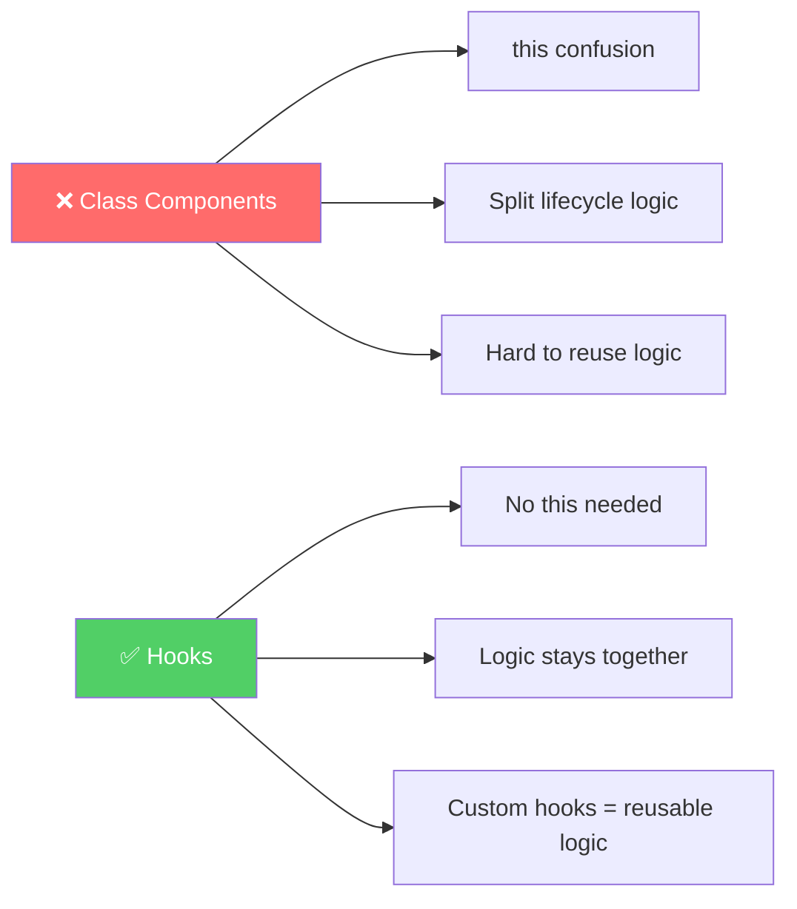

> **One Line Answer:** Hooks let you use React features (state, lifecycle, context) in **function components** — making code simpler, more reusable, and easier to understand.

---

## 🔥 `useState` — UI ko Zinda Rakho

### Why does it exist?

Without state, your UI is a **static photograph**.
With state, your UI is a **live video**.

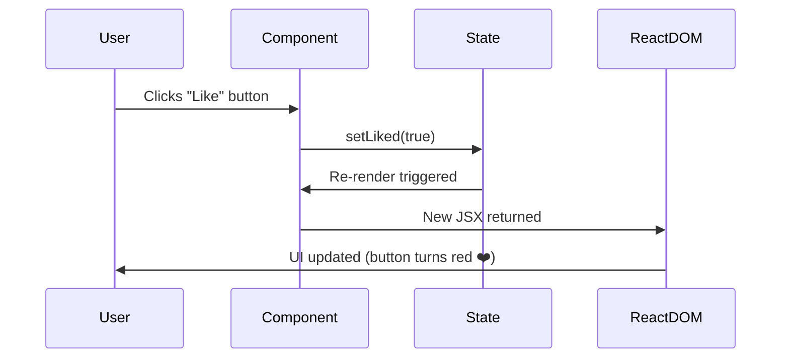

### Purana JS Way (The Problem)

```js
// Manually find the element, manually update it
document.getElementById("count").innerText = count + 1;
document.getElementById("likeBtn").style.color = "red";
document.getElementById("navbar-count").innerText = cart.length;
// ... 50 more manual updates across the page
```

**Real problem in large apps:** 100 places update krne hote. Ek chhoot jaata → bug.

### React Way (The Solution)

```jsx
const [liked, setLiked] = useState(false);

// React automatically re-renders everything that depends on `liked`
<button onClick={() => setLiked(true)} style={{ color: liked ? "red" : "gray" }}>
  ❤️ Like
</button>
```

### Real World Examples

#### 🛒 E-Commerce Cart

```jsx
const [cartItems, setCartItems] = useState([]);

function addToCart(product) {
  setCartItems(prev => [...prev, product]);
}

// Automatically updates:
// - Cart icon count in navbar
// - Cart page total
// - "Added to cart" button state
```

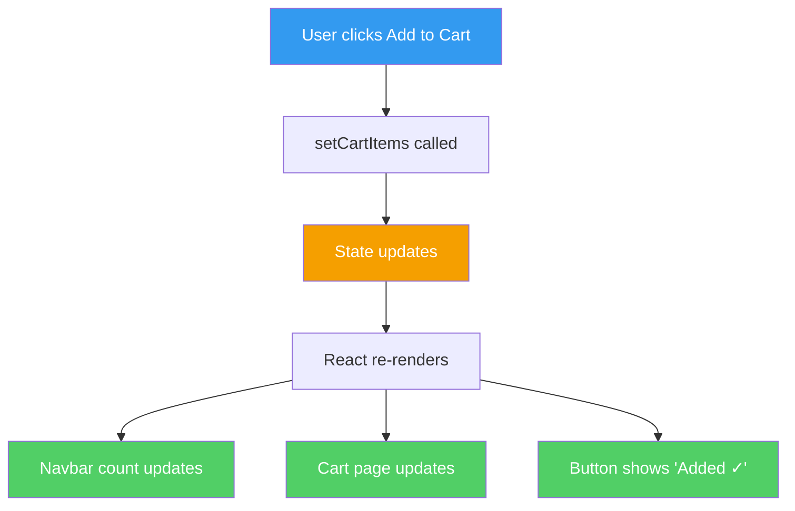

#### 📝 Login Form with Validation

```jsx
const [email, setEmail] = useState("");
const [password, setPassword] = useState("");
const [error, setError] = useState(null);

function handleSubmit() {
  if (!email.includes("@")) {
    setError("Invalid email");   // UI shows error instantly
    return;
  }
  login(email, password);
}
```

### 🧠 Senior Engineer Insight — What Should Be State?

**Ask yourself 3 questions:**

| Question | If YES → |
|---|---|
| Does it change over time? | Could be state |
| Does changing it need a UI update? | Should be state |
| Can it be derived from existing state/props? | **DON'T make it state** |

```jsx
// ❌ BAD — Derived data as state
const [fullName, setFullName] = useState(firstName + " " + lastName);

// ✅ GOOD — Compute it on the fly
const fullName = `${firstName} ${lastName}`;
```

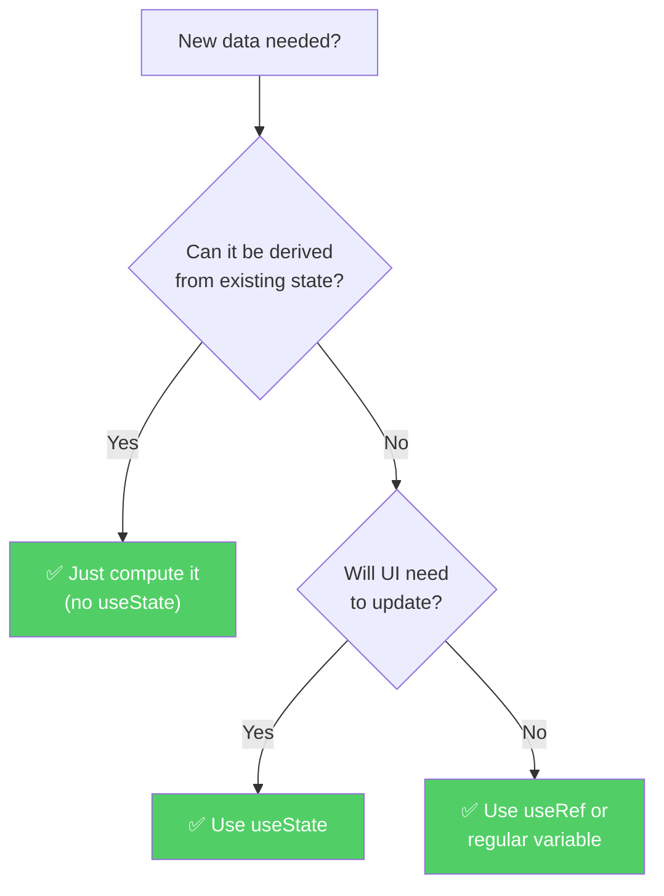

> **Golden Rule:** State = minimum source of truth. Everything else = derived.

---

## 🌍 `useEffect` — Outside World se Connect

### Why does it exist?

React's job is rendering. But real apps need to talk to the **outside world**:
- Servers (APIs)
- Browser (localStorage, timers, window events)
- Third-party services (sockets, analytics)

React can't do this during render — it would cause chaos.

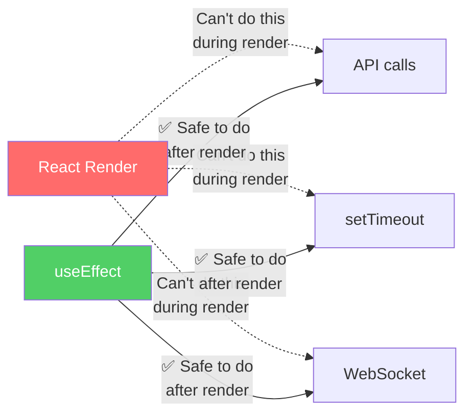

### The Lifecycle — Visually


### Dependency Array — The Real Logic

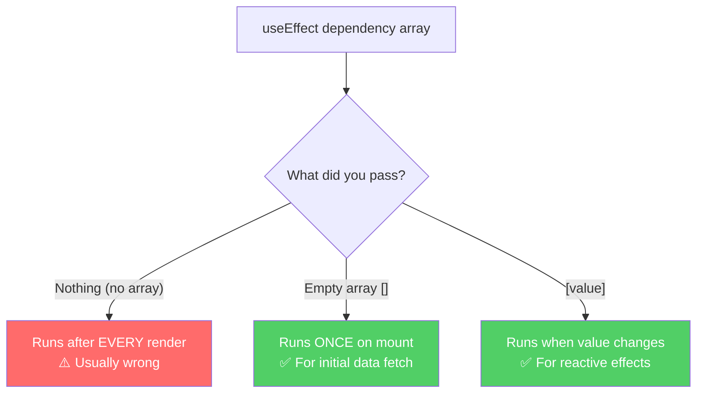

### Real World Examples

#### 🎬 Netflix — Movie List on Load

```jsx
function MovieList() {
  const [movies, setMovies] = useState([]);
  const [loading, setLoading] = useState(true);

  useEffect(() => {
    async function fetchMovies() {
      setLoading(true);
      const data = await api.getMovies();
      setMovies(data);
      setLoading(false);
    }

    fetchMovies();
  }, []); // [] = run once on mount

  if (loading) return <Spinner />;
  return <MovieGrid movies={movies} />;
}
```

#### 🔍 Google Search — Reactive Fetch

```jsx
function SearchResults({ query }) {
  const [results, setResults] = useState([]);

  useEffect(() => {
    if (!query) return;
    fetchResults(query).then(setResults);
  }, [query]); // Re-runs every time `query` changes

  return <ResultList data={results} />;
}
```

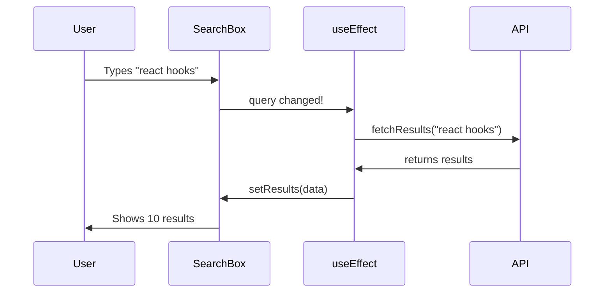

#### 💬 Chat App — Cleanup is CRITICAL

```jsx
function ChatRoom({ roomId }) {
  const [messages, setMessages] = useState([]);

  useEffect(() => {
    const socket = io(`/room/${roomId}`);

    socket.on("message", (msg) => {
      setMessages(prev => [...prev, msg]);
    });

    // ⚠️ Without this: duplicate messages, memory leaks!
    return () => {
      socket.disconnect(); // Cleanup on unmount or roomId change
    };
  }, [roomId]);
}
```

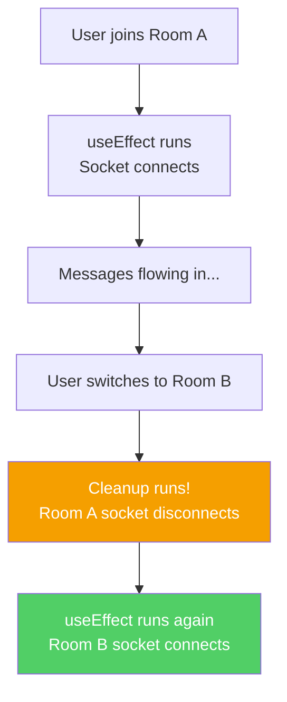

### 🧠 Senior Engineer Insight

> Most beginners think: `useEffect` = API call
>
> Senior engineers think: `useEffect` = **"synchronize React with the outside world"**

```
Outside World includes:
├── 🌐 APIs (fetch, axios)
├── ⏱️  Timers (setTimeout, setInterval)
├── 🔌 WebSockets
├── 💾 localStorage / sessionStorage
├── 📐 Window resize / scroll events
└── 📊 Analytics / tracking
```

---

## 🏢 `useContext` — Global Data Sharing

### Why does it exist?

The problem it solves has a name: **Prop Drilling**.

### Prop Drilling — The Problem

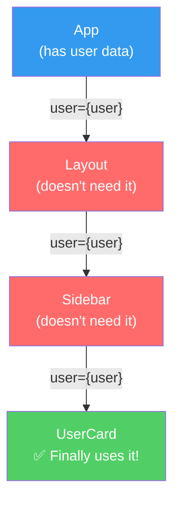

> Layout and Sidebar don't need `user` — they're just **passing it through**. This is prop drilling. In large apps with 8-10 levels? Nightmare.

### Context — The Solution

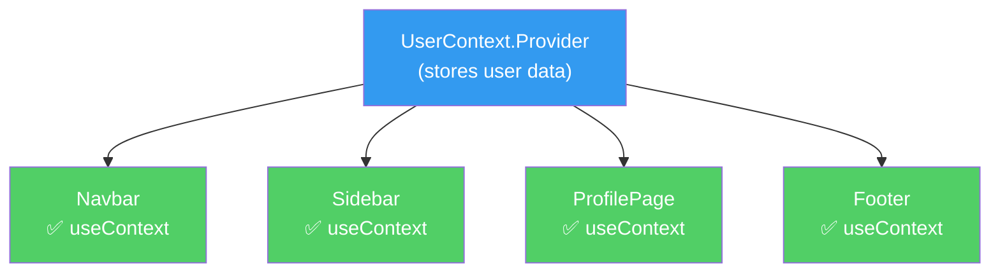

### Real World Example — Auth System

```jsx
// 1. Create Context
const AuthContext = createContext(null);

// 2. Create Provider (wrap your app)
function AuthProvider({ children }) {
  const [user, setUser] = useState(null);

  async function login(email, password) {
    const userData = await api.login(email, password);
    setUser(userData);
  }

  function logout() {
    setUser(null);
  }

  return (
    <AuthContext.Provider value={{ user, login, logout }}>
      {children}
    </AuthContext.Provider>
  );
}

// 3. Use anywhere — no prop drilling!
function Navbar() {
  const { user, logout } = useContext(AuthContext);
  return (
    <nav>
      <span>Hello, {user.name}!</span>
      <button onClick={logout}>Logout</button>
    </nav>
  );
}
```

### Real Use Cases

| Context | What it stores | Where it's used |
|---|---|---|
| `AuthContext` | logged-in user | Navbar, Profile, PrivateRoutes |
| `ThemeContext` | dark/light mode | Every component |
| `LanguageContext` | Hindi / English | All text in app |
| `CartContext` | cart items | Navbar, CartPage, Checkout |

### 🧠 Senior Engineer Insight — Context is NOT always the answer

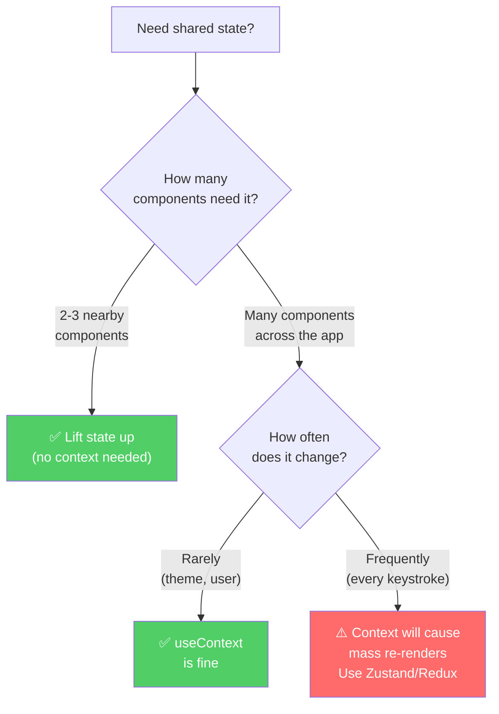

> **Rule:** Context re-render karta hai **every consumer** jab value change ho. High-frequency updates ke liye Zustand ya Redux Toolkit better hai.

---

## ⚙️ `useReducer` — Complex State Machine

### Why does it exist?

When state has **multiple related pieces** that change together based on **named actions**, `useState` becomes unmanageable.

### The Problem — Multiple `useState` calls

```jsx
// ❌ For a shopping cart — spaghetti
const [items, setItems] = useState([]);
const [total, setTotal] = useState(0);
const [discount, setDiscount] = useState(0);
const [couponApplied, setCouponApplied] = useState(false);
const [isCheckingOut, setIsCheckingOut] = useState(false);

// Adding an item requires updating 3 states manually, every time
```

### The Solution — One State, Named Actions

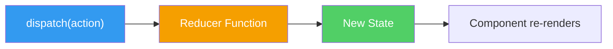

### Real World Example — Food Delivery Cart

```jsx
// Reducer — the manager who processes all orders
function cartReducer(state, action) {
  switch (action.type) {
    case "ADD_ITEM":
      return {
        ...state,
        items: [...state.items, action.payload],
        total: state.total + action.payload.price,
      };

    case "REMOVE_ITEM":
      const removed = state.items.find(i => i.id === action.payload);
      return {
        ...state,
        items: state.items.filter(i => i.id !== action.payload),
        total: state.total - removed.price,
      };

    case "APPLY_COUPON":
      return {
        ...state,
        discount: action.payload.discount,
        couponCode: action.payload.code,
      };

    case "CLEAR_CART":
      return { items: [], total: 0, discount: 0, couponCode: null };

    default:
      return state;
  }
}

// Component — just dispatches actions
function Cart() {
  const [cart, dispatch] = useReducer(cartReducer, {
    items: [],
    total: 0,
    discount: 0,
    couponCode: null,
  });

  return (
    <div>
      {cart.items.map(item => (
        <CartItem
          key={item.id}
          item={item}
          onRemove={() => dispatch({ type: "REMOVE_ITEM", payload: item.id })}
        />
      ))}
      <button onClick={() => dispatch({ type: "CLEAR_CART" })}>
        Clear Cart
      </button>
    </div>
  );
}
```

### Analogy — Restaurant Manager

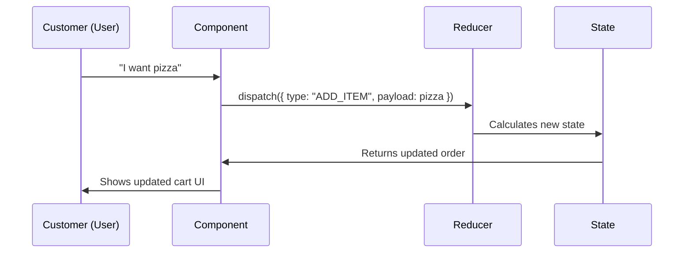

### `useState` vs `useReducer` — When to use what?

| Scenario | useState | useReducer |
|---|:---:|:---:|
| Simple toggle (open/close) | ✅ | ❌ Overkill |
| Single independent value | ✅ | ❌ Overkill |
| Multiple related values | ⚠️ Gets messy | ✅ |
| Complex update logic | ❌ | ✅ |
| Actions have names (ADD, REMOVE) | ❌ | ✅ |
| Need easy debugging | ❌ | ✅ |

### 🧠 Senior Engineer Insight

> `useReducer` is **the foundation of Redux**. Redux = useReducer + Context + middleware. Once you master useReducer, Redux Toolkit becomes easy to pick up.

Real senior-level use cases:
- ✅ Multi-step checkout flow
- ✅ Form with complex validation states
- ✅ Authentication flow (idle → loading → success → error)
- ✅ Notification system
- ✅ Dashboard with multiple data sources

---

## 🕵️ `useRef` — Silent Background Worker

### Why does it exist?

Sometimes you need to:
1. **Access a DOM element directly** (focus, scroll, play video)
2. **Store a value that persists across renders but DOESN'T cause re-renders**

### `useState` vs `useRef` — The Core Difference

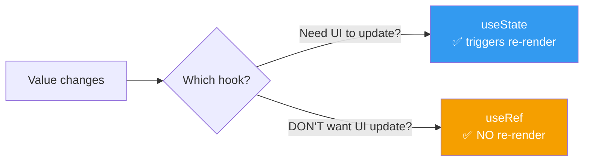

### Real World Examples

#### ⏱️ Stopwatch — Storing timer ID

```jsx
function Stopwatch() {
  const [time, setTime] = useState(0);
  const intervalRef = useRef(null); // Stores timer ID — no UI needed for this

  function start() {
    intervalRef.current = setInterval(() => {
      setTime(t => t + 1);
    }, 1000);
  }

  function stop() {
    clearInterval(intervalRef.current); // Access timer ID to clear it
  }
}
```

> Why not `useState` for `intervalRef`? Because storing an interval ID doesn't need a UI update — and calling `setState` would cause an unnecessary re-render.

#### 📱 OTP Screen — Auto Focus

```jsx
function OtpInput() {
  const input1 = useRef(null);
  const input2 = useRef(null);
  const input3 = useRef(null);

  function handleInput1(e) {
    if (e.target.value.length === 1) {
      input2.current.focus(); // Auto-jump to next input
    }
  }

  return (
    <>
      <input ref={input1} onChange={handleInput1} maxLength={1} />
      <input ref={input2} maxLength={1} />
      <input ref={input3} maxLength={1} />
    </>
  );
}
```

#### 🎥 Video Player — Direct Control

```jsx
function VideoPlayer({ src }) {
  const videoRef = useRef(null);

  return (
    <div>
      <video ref={videoRef} src={src} />
      <button onClick={() => videoRef.current.play()}>▶ Play</button>
      <button onClick={() => videoRef.current.pause()}>⏸ Pause</button>
    </div>
  );
}
```

#### 📜 Tracking Previous Value

```jsx
function PriceTracker({ price }) {
  const prevPrice = useRef(price);

  useEffect(() => {
    prevPrice.current = price; // Update silently after render
  });

  return (
    <div>
      <p>Current: ₹{price}</p>
      <p>Previous: ₹{prevPrice.current}</p>
      <p>{price > prevPrice.current ? "📈 Up" : "📉 Down"}</p>
    </div>
  );
}
```

### The `useRef` Mental Model

```
useRef = a box with a .current property

{
  current: <whatever you stored>
}

- The box NEVER changes (same reference)
- What's INSIDE the box can change
- React doesn't watch inside the box
```

### 🧠 Senior Engineer Insight

> `useRef` is your escape hatch from React's control. Use it when you need to:
> - **Imperatively control DOM** (video, canvas, input focus)
> - **Store mutable data** that shouldn't trigger re-renders (timers, socket refs, previous values)

---

## 🚀 Custom Hooks — Reusable Logic

### Why do they exist?

Code duplication is the enemy of maintainable software. Custom hooks let you extract and reuse **stateful logic** across components.

### The Problem — Repeated Logic

```jsx
// Component A
function ProductPage() {
  const [data, setData] = useState(null);
  const [loading, setLoading] = useState(true);
  const [error, setError] = useState(null);

  useEffect(() => {
    fetch("/api/products")
      .then(r => r.json())
      .then(setData)
      .catch(setError)
      .finally(() => setLoading(false));
  }, []);
  // ... same 15 lines in 10 different components
}
```

### The Solution — Extract into a Custom Hook

```jsx
// hooks/useFetch.js
function useFetch(url) {
  const [data, setData] = useState(null);
  const [loading, setLoading] = useState(true);
  const [error, setError] = useState(null);

  useEffect(() => {
    setLoading(true);
    fetch(url)
      .then(r => r.json())
      .then(setData)
      .catch(setError)
      .finally(() => setLoading(false));
  }, [url]);

  return { data, loading, error };
}

// Now use it anywhere in 1 line
function ProductPage() {
  const { data, loading, error } = useFetch("/api/products");
  // ...
}

function UserProfile() {
  const { data: user, loading } = useFetch("/api/me");
  // ...
}
```

### Architecture — Before vs After

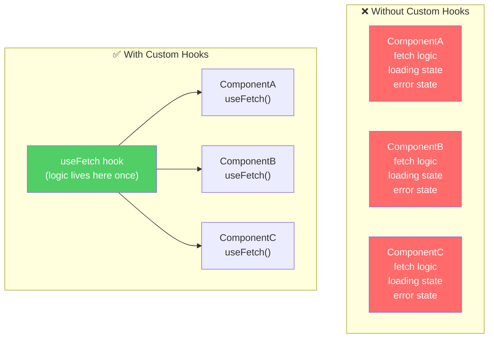

### Real-World Custom Hooks Companies Build

#### `useOnlineStatus` — Network Detection

```jsx
function useOnlineStatus() {
  const [isOnline, setIsOnline] = useState(navigator.onLine);

  useEffect(() => {
    const goOnline = () => setIsOnline(true);
    const goOffline = () => setIsOnline(false);

    window.addEventListener("online", goOnline);
    window.addEventListener("offline", goOffline);

    return () => {
      window.removeEventListener("online", goOnline);
      window.removeEventListener("offline", goOffline);
    };
  }, []);

  return isOnline;
}

// Usage everywhere
function App() {
  const isOnline = useOnlineStatus();
  return isOnline ? <MainApp /> : <OfflineBanner />;
}
```

#### `useDebounce` — Search Optimization

```jsx
function useDebounce(value, delay = 500) {
  const [debouncedValue, setDebouncedValue] = useState(value);

  useEffect(() => {
    const timer = setTimeout(() => setDebouncedValue(value), delay);
    return () => clearTimeout(timer); // Cancel if value changes again
  }, [value, delay]);

  return debouncedValue;
}

// Usage — prevents API call on every keystroke
function SearchBox() {
  const [query, setQuery] = useState("");
  const debouncedQuery = useDebounce(query, 400);

  useEffect(() => {
    if (debouncedQuery) fetchResults(debouncedQuery);
  }, [debouncedQuery]); // Only fires 400ms after user STOPS typing
}
```

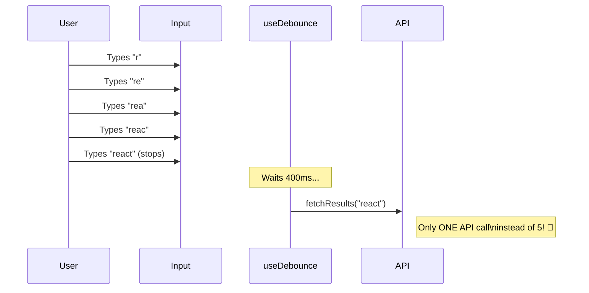

#### Common Custom Hooks in Production Apps

```
hooks/
├── useAuth.js          → current user, login, logout
├── useFetch.js         → generic data fetching
├── useDebounce.js      → debounce any value
├── useLocalStorage.js  → persist state in localStorage
├── useOnlineStatus.js  → network detection
├── useWindowSize.js    → responsive logic in JS
├── useSocket.js        → WebSocket connection
└── useTheme.js         → dark/light mode toggle
```

### 🧠 Senior Engineer Insight

> **Junior:** Writes components
> **Senior:** Writes reusable systems

Custom hooks are the senior engineer's superpower. They let you:
- ✅ **Test logic** independently from UI
- ✅ **Share logic** across teams and projects
- ✅ **Version and update** logic in one place
- ✅ **Hide complexity** behind a clean interface

---

## ⚡ Performance Hooks (`memo`, `useMemo`, `useCallback`)

### Why do they exist?

React re-renders components when state/props change. But sometimes:
- A **child component** re-renders even when its props didn't change
- A **heavy calculation** runs on every render unnecessarily
- A **function** is recreated every render, causing child re-renders

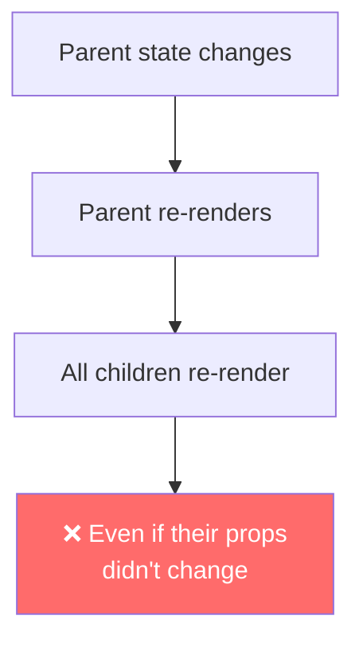

### `React.memo` — Skip unnecessary child renders

```jsx
// Without memo: re-renders every time Parent renders
function ExpensiveChild({ data }) {
  return <HeavyChart data={data} />;
}

// With memo: only re-renders if `data` prop actually changed
const ExpensiveChild = React.memo(function({ data }) {
  return <HeavyChart data={data} />;
});
```

### `useMemo` — Cache expensive calculations

```jsx
function Dashboard({ transactions }) {
  // ❌ Without useMemo: runs on EVERY render
  const analytics = computeComplexAnalytics(transactions); // 200ms calculation

  // ✅ With useMemo: only recalculates when transactions changes
  const analytics = useMemo(
    () => computeComplexAnalytics(transactions),
    [transactions]
  );
}
```

### `useCallback` — Stable function references

```jsx
function SearchPage() {
  const [query, setQuery] = useState("");

  // ❌ Without useCallback: new function every render → child re-renders
  const handleSearch = (term) => fetchResults(term);

  // ✅ With useCallback: same function reference → child doesn't re-render
  const handleSearch = useCallback(
    (term) => fetchResults(term),
    [] // recreate only when these deps change
  );

  return <SearchInput onSearch={handleSearch} />;
}
```

### Performance Decision Tree

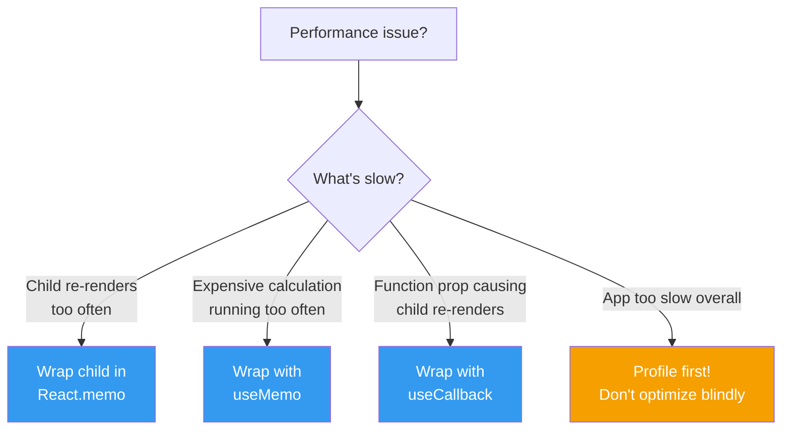

> ⚠️ **Don't over-optimize!** Add `memo`/`useMemo`/`useCallback` only when you've measured a real performance problem. Premature optimization adds complexity without benefit.

---

## 🧠 Senior Engineer Mental Model

### How React Actually Works

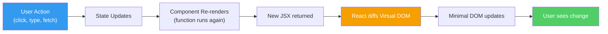

### What Senior Engineers Know

| Topic | Junior Thinks | Senior Knows |
|---|---|---|
| `useState` | "Set value, re-render" | "Source of truth, minimize state" |
| `useEffect` | "For API calls" | "Synchronize with outside world" |
| `useContext` | "Global state solution" | "Good for slow-changing data, not high-frequency" |
| `useReducer` | "Complex useState" | "State machine, foundation of Redux" |
| `useRef` | "To get DOM element" | "Escape hatch — mutable, non-reactive storage" |
| Custom Hooks | "Reusable code" | "Extract logic, improve testability, build systems" |
| Re-renders | "More = bad" | "Understand what triggers them, optimize intentionally" |

### The 5 Questions Senior Engineers Ask

1. **What is the minimum state needed?** (Don't store derived data)
2. **Where should state live?** (As close to consumers as possible)
3. **What triggers re-renders?** (Know before you optimize)
4. **What needs cleanup?** (Every listener, socket, timer)
5. **Can this logic be extracted?** (If used 2+ times → custom hook)

---

## 🔭 The Big Picture

### React App = Restaurant Analogy

```mermaid
graph TD
    subgraph "React App = Restaurant"
        A["👨‍🍳 State\n(Kitchen Data)"] --> B["🍽️ UI\n(Food Served)"]
        C["📞 useEffect\n(External Calls)"]
        D["🗄️ Context\n(Shared Storage)"]
        E["📋 useReducer\n(Manager's Rules)"]
        F["🗝️ useRef\n(Hidden Drawer)"]
        G["📖 Custom Hook\n(Reusable Recipe)"]
    end

    style A fill:#ff6b6b,color:#fff
    style B fill:#51cf66,color:#fff
    style C fill:#339af0,color:#fff
    style D fill:#f59f00,color:#000
    style E fill:#cc5de8,color:#fff
    style F fill:#20c997,color:#fff
    style G fill:#ff922b,color:#fff
```

### Hooks at a Glance

| Hook | One-Line Purpose | Real World Example |
|---|---|---|
| `useState` | Track changing data that affects UI | Cart count, form inputs, liked/unliked |
| `useEffect` | Do side effects after render | API fetch, socket connect, analytics |
| `useContext` | Share data without prop drilling | Auth user, theme, language |
| `useReducer` | Manage complex state with actions | Shopping cart, multi-step form |
| `useRef` | Access DOM or store non-reactive data | Focus input, store timer ID |
| `useMemo` | Cache expensive calculation | Analytics computation, filtered lists |
| `useCallback` | Stable function reference | Passed to memoized children |
| Custom Hook | Reuse stateful logic | `useAuth`, `useFetch`, `useDebounce` |

---

> ## 💡 The Core Insight
>
> **React ≠ Hooks**
>
> React is a **rendering engine** and **state synchronization system**.
> Hooks are just the tools React gives you to plug into that system.
>
> When you understand *why* each hook exists — what problem it solves —
> you can write React apps even if you forget the syntax.
>
> **That's the difference between a developer who uses React and one who understands it.**

---

*Part of the [React Revision Book](./README.md) — a senior engineer's guide to understanding React deeply.*
