# ⚛️ React Hooks — A Deep Dive into Code Optimization

> **"Remembering syntax is a junior engineer's job. Understanding *why* is a senior engineer's mindset."**

This document explains **why each hook exists**, what problem it solves, and how it translates to real-world production applications — with diagrams, analogies, and senior-level optimization patterns.

---

## 📌 Table of Contents

1. [Why Hooks Exist](#-why-hooks-exist)
2. [`useState` — Keeping the UI Alive](#-usestate--keeping-the-ui-alive)
3. [`useEffect` — Connecting to the Outside World](#-useeffect--connecting-to-the-outside-world)
4. [`useContext` — Application-Wide Data Sharing](#-usecontext--application-wide-data-sharing)
5. [`useReducer` — Predictable State Machines](#-usereducer--predictable-state-machines)
6. [`useRef` — Mutable, Non-Reactive Storage](#-useref--mutable-non-reactive-storage)
7. [Custom Hooks — Reusable Logic Architecture](#-custom-hooks--reusable-logic-architecture)
8. [Performance Optimization Hooks](#-performance-optimization-hooks)
9. [Senior Engineer Mental Model](#-senior-engineer-mental-model)
10. [The Big Picture](#-the-big-picture)

---

## 🤔 Why Hooks Exist

### Before Hooks — The Class Component Era

```jsx
class Counter extends React.Component {
  constructor(props) {
    super(props);
    this.state = { count: 0 };
    this.handleClick = this.handleClick.bind(this); // manual binding
  }

  componentDidMount()    { /* initial data fetch */ }
  componentDidUpdate()   { /* runs on every update */ }
  componentWillUnmount() { /* cleanup */ }

  handleClick() {
    this.setState({ count: this.state.count + 1 });
  }

  render() {
    return <button onClick={this.handleClick}>{this.state.count}</button>;
  }
}
```

**Pain Points:**
- `this` binding was a constant source of bugs
- Related logic was split across three lifecycle methods
- Sharing stateful logic between components required complex HOC or render prop patterns
- Verbose boilerplate on every component

### What Hooks Solved

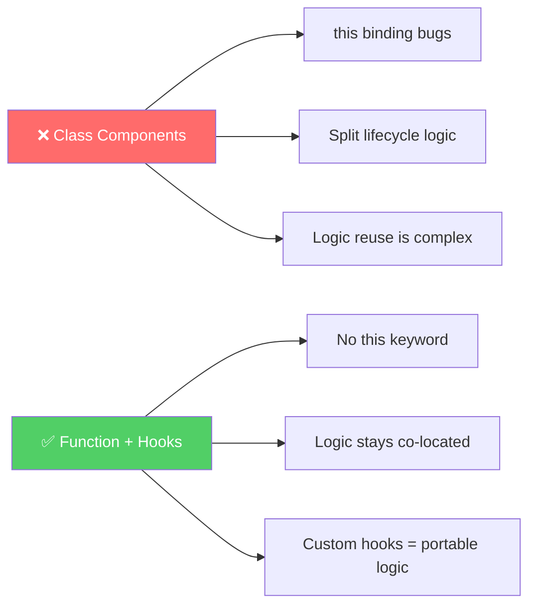

> **Core Principle:** Hooks let you use React features — state, side effects, context — directly inside **function components**, resulting in simpler, more testable, and more reusable code.

---

## 🔥 `useState` — Keeping the UI Alive

### The Problem It Solves

Without state, a UI component is a **static snapshot**.
With state, it becomes a **reactive, live interface**.

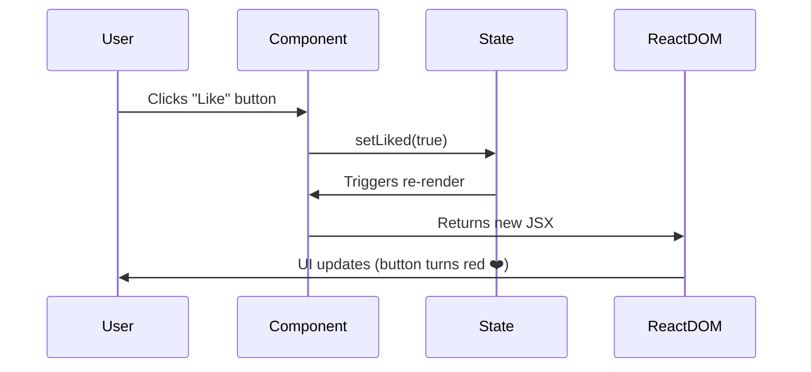

### The Imperative Approach (Before React)

```js
// Every change requires manual DOM targeting
document.getElementById("count").innerText = count + 1;
document.getElementById("likeBtn").style.color = "red";
document.getElementById("navbar-count").innerText = cart.length;
// ...multiply this across 50 interdependent elements
```

**Problem at scale:** In a large application, you would need to manually update dozens of elements on a single user action. One missed update creates a bug.

### The Declarative Approach (React)

```jsx
const [liked, setLiked] = useState(false);

// React automatically re-renders all dependent UI
<button
  onClick={() => setLiked(true)}
  style={{ color: liked ? "red" : "gray" }}
>
  ❤️ Like
</button>
```

### Real-World Examples

#### 🛒 E-Commerce — Cart Management

```jsx
const [cartItems, setCartItems] = useState([]);

function addToCart(product) {
  setCartItems(prev => [...prev, product]);
}

// One state update automatically propagates to:
// - Cart icon count in the navbar
// - Cart page total price
// - "Added to cart" button confirmation state
```

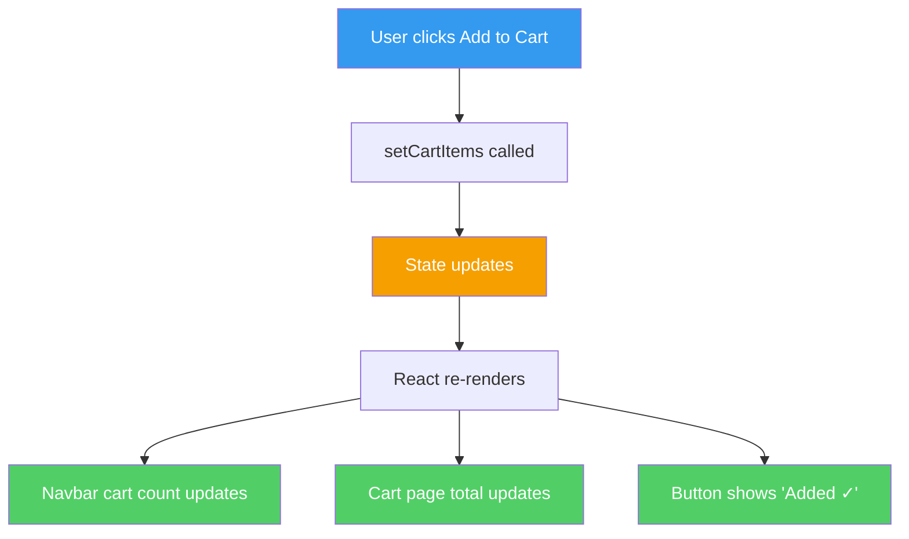

#### 📝 Login Form — Controlled Inputs with Validation

```jsx
const [email, setEmail]       = useState("");
const [password, setPassword] = useState("");
const [error, setError]       = useState(null);

function handleSubmit() {
  if (!email.includes("@")) {
    setError("Please enter a valid email address.");
    return;
  }
  login(email, password);
}
```

### 🧠 Optimization Insight — What Should Actually Be State?

Ask three questions before reaching for `useState`:

| Question | If YES → |
|---|---|
| Does this value change over time? | Might be state |
| Does a change need to update the UI? | Should be state |
| Can it be calculated from existing state or props? | **Do not make it state** |

```jsx
// ❌ Redundant state — stores derived data
const [fullName, setFullName] = useState(firstName + " " + lastName);

// ✅ Computed value — no state needed, no extra re-render
const fullName = `${firstName} ${lastName}`;
```

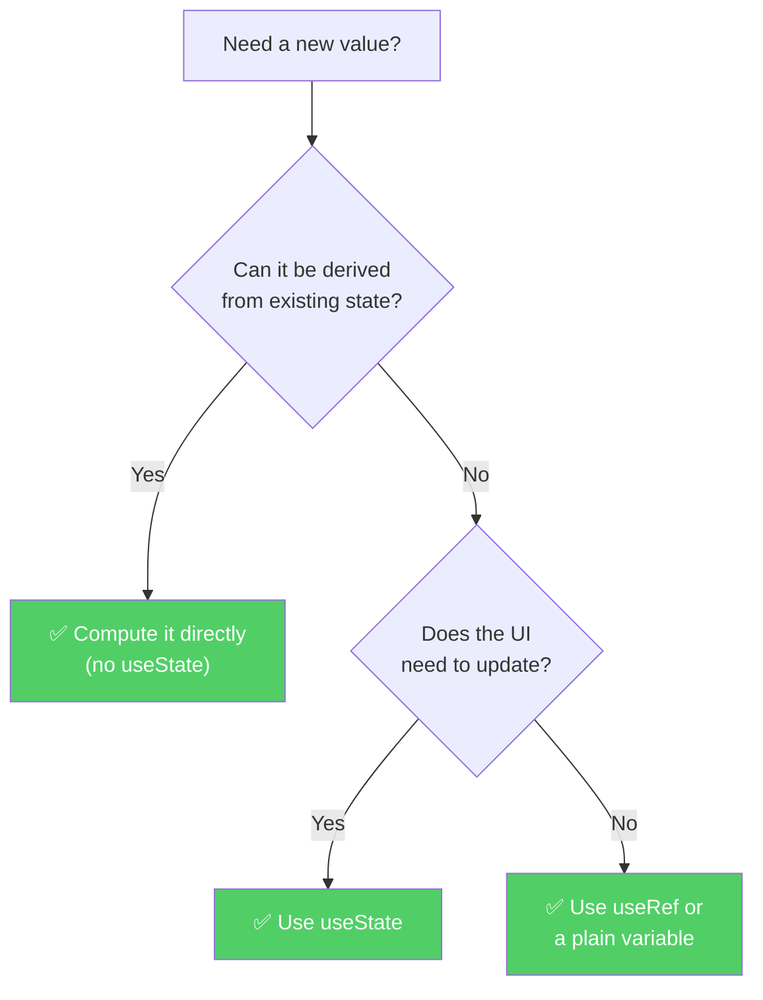

> **Rule of thumb:** State should be the minimum source of truth. Everything else should be derived from it.

---

## 🌍 `useEffect` — Connecting to the Outside World

### The Problem It Solves

React's rendering engine is pure and synchronous. However, real applications constantly need to interact with the **outside world** — servers, the browser, timers, and third-party services. Performing these operations during render would cause React to loop infinitely.

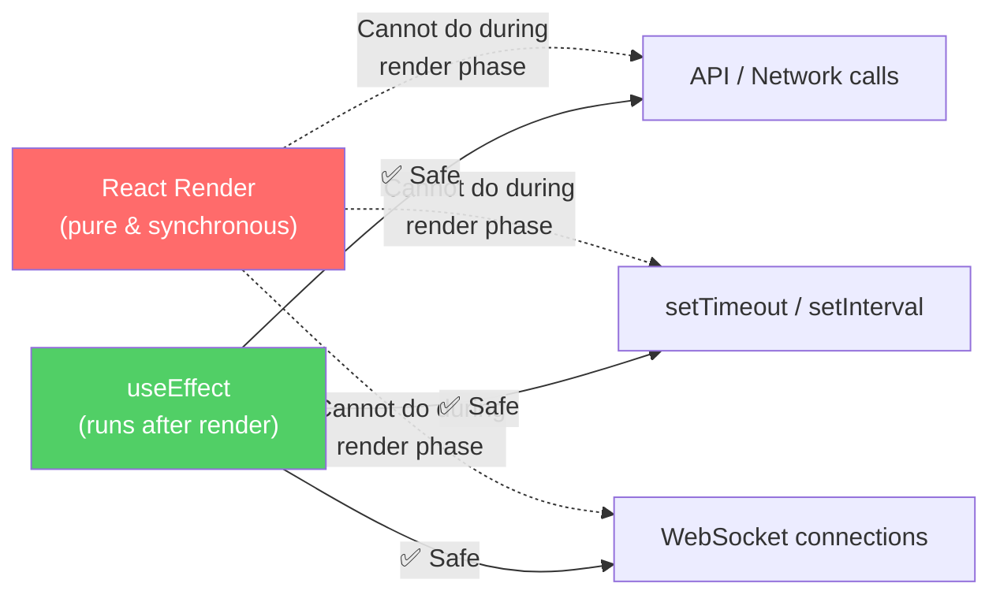

### The Effect Lifecycle

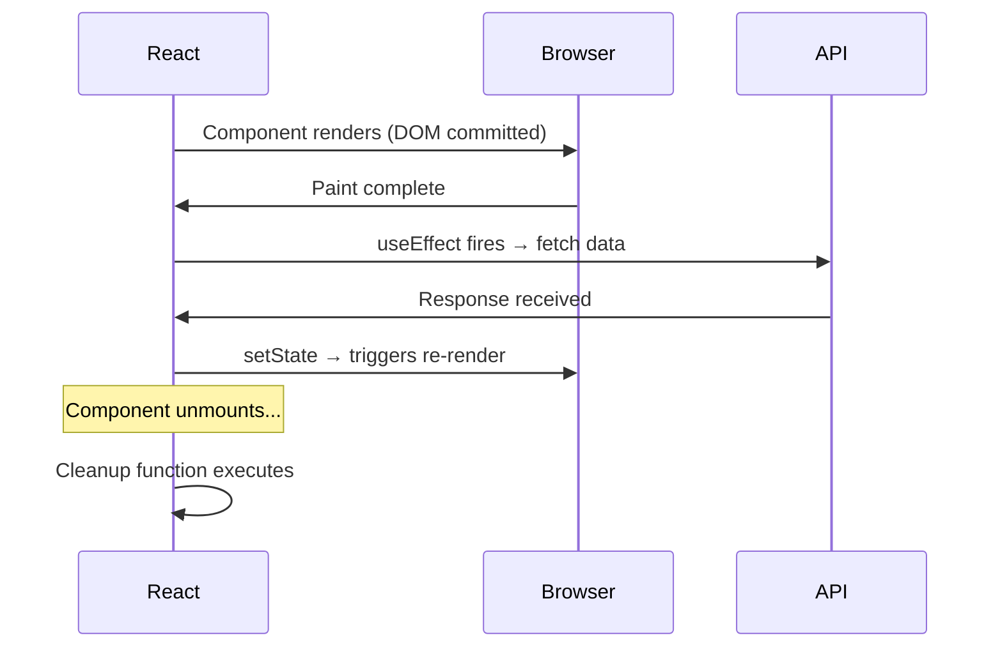

### Dependency Array — The Control Mechanism

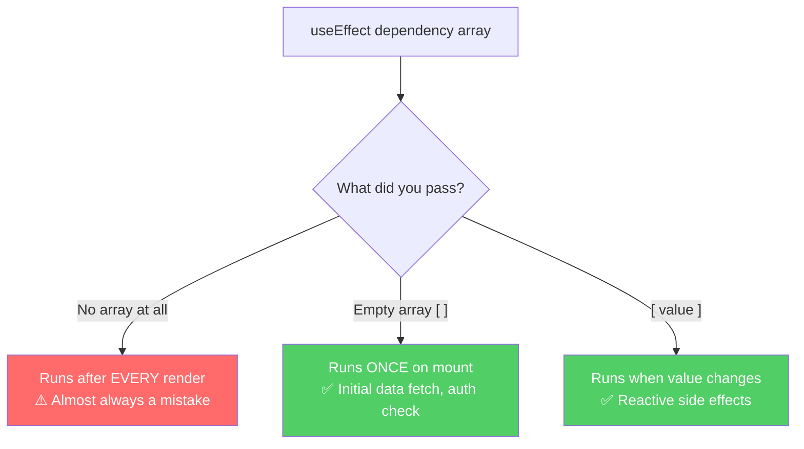

### Real-World Examples

#### 🎬 Netflix-style App — Data Fetch on Mount

```jsx
function MovieList() {
  const [movies, setMovies]   = useState([]);
  const [loading, setLoading] = useState(true);

  useEffect(() => {
    async function fetchMovies() {
      setLoading(true);
      const data = await api.getMovies();
      setMovies(data);
      setLoading(false);
    }

    fetchMovies();
  }, []); // Empty array — runs once when the component mounts

  if (loading) return <Spinner />;
  return <MovieGrid movies={movies} />;
}
```

#### 🔍 Search — Reactive API Calls

```jsx
function SearchResults({ query }) {
  const [results, setResults] = useState([]);

  useEffect(() => {
    if (!query) return;
    fetchResults(query).then(setResults);
  }, [query]); // Re-runs every time `query` changes

  return <ResultList data={results} />;
}
```

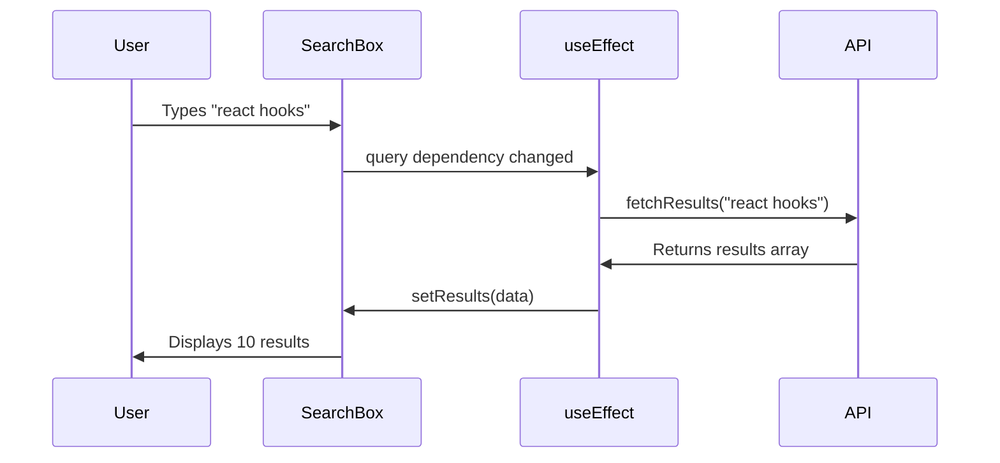

#### 💬 Real-Time Chat — Why Cleanup Is Critical

```jsx
function ChatRoom({ roomId }) {
  const [messages, setMessages] = useState([]);

  useEffect(() => {
    const socket = io(`/room/${roomId}`);

    socket.on("message", (msg) => {
      setMessages(prev => [...prev, msg]);
    });

    // Without this cleanup:
    // - Duplicate messages on every re-render
    // - Memory leaks as sockets accumulate
    // - App becomes progressively slower
    return () => {
      socket.disconnect();
    };
  }, [roomId]); // Re-runs when the user switches rooms
}
```

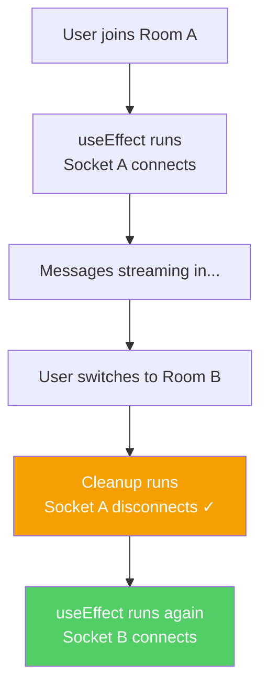

### 🧠 Optimization Insight

> Most beginners treat `useEffect` as "the place for API calls."
>
> The accurate mental model is: **`useEffect` synchronizes React state with an external system.**

```
External systems include:
├── 🌐  Network / APIs
├── ⏱️   Timers (setTimeout, setInterval)
├── 🔌  WebSockets / Server-Sent Events
├── 💾  localStorage / sessionStorage
├── 📐  Browser events (resize, scroll, visibility)
└── 📊  Analytics / third-party SDKs
```

---

## 🏢 `useContext` — Application-Wide Data Sharing

### The Problem It Solves

The problem has a well-known name: **Prop Drilling** — passing data through intermediate components that do not need it.

### Prop Drilling Illustrated

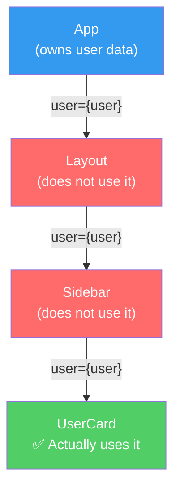

At 8–10 component levels deep, this pattern becomes unmaintainable and creates tight coupling between unrelated components.

### Context as the Solution

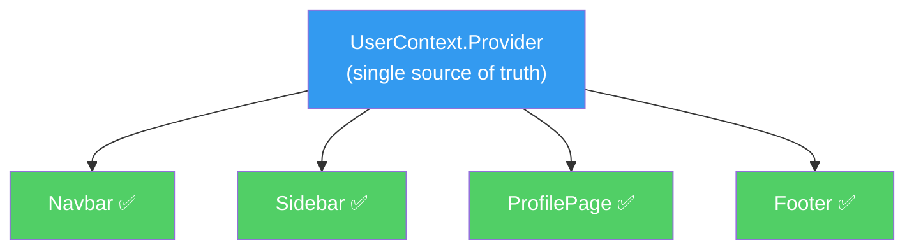

### Real-World Example — Authentication System

```jsx
// Step 1: Create the context
const AuthContext = createContext(null);

// Step 2: Create the provider
function AuthProvider({ children }) {
  const [user, setUser] = useState(null);

  async function login(email, password) {
    const userData = await api.login(email, password);
    setUser(userData);
  }

  function logout() {
    setUser(null);
  }

  return (
    <AuthContext.Provider value={{ user, login, logout }}>
      {children}
    </AuthContext.Provider>
  );
}

// Step 3: Consume anywhere — zero prop drilling
function Navbar() {
  const { user, logout } = useContext(AuthContext);
  return (
    <nav>
      <span>Welcome, {user.name}</span>
      <button onClick={logout}>Sign Out</button>
    </nav>
  );
}
```

### Common Production Use Cases

| Context | Data It Manages | Consumed By |
|---|---|---|
| `AuthContext` | Current user, login, logout | Navbar, PrivateRoutes, Profile |
| `ThemeContext` | dark / light preference | Every styled component |
| `LanguageContext` | Active locale | All text content |
| `CartContext` | Cart items and totals | Navbar, CartPage, Checkout |

### 🧠 Optimization Insight — Context Is Not Always the Right Tool

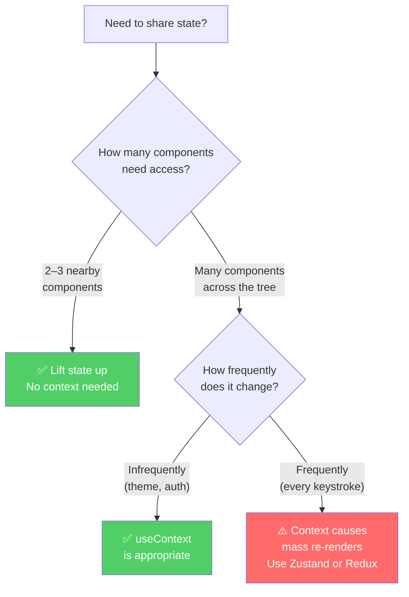

> **Critical rule:** Every time a Context value changes, **all consumers re-render**. For high-frequency updates, Zustand or Redux Toolkit provides superior performance through selective subscriptions.

---

## ⚙️ `useReducer` — Predictable State Machines

### The Problem It Solves

When multiple pieces of state are **tightly related** and updated together based on **distinct, named actions**, `useState` produces fragile and hard-to-debug code.

### The Problem — Scattered State

```jsx
// ❌ Managing a shopping cart with multiple useState calls
const [items, setItems]               = useState([]);
const [total, setTotal]               = useState(0);
const [discount, setDiscount]         = useState(0);
const [couponApplied, setCoupon]      = useState(false);
const [isCheckingOut, setCheckingOut] = useState(false);

// Adding one item requires coordinating 3 setState calls — error-prone
```

### The Solution — Centralized State Machine

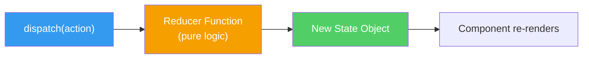

### Real-World Example — Food Delivery Cart

```jsx
const initialState = {
  items: [],
  total: 0,
  discount: 0,
  couponCode: null,
};

function cartReducer(state, action) {
  switch (action.type) {
    case "ADD_ITEM":
      return {
        ...state,
        items: [...state.items, action.payload],
        total: state.total + action.payload.price,
      };

    case "REMOVE_ITEM": {
      const removed = state.items.find(i => i.id === action.payload);
      return {
        ...state,
        items: state.items.filter(i => i.id !== action.payload),
        total: state.total - removed.price,
      };
    }

    case "APPLY_COUPON":
      return {
        ...state,
        discount: action.payload.discount,
        couponCode: action.payload.code,
      };

    case "CLEAR_CART":
      return initialState;

    default:
      return state;
  }
}

function Cart() {
  const [cart, dispatch] = useReducer(cartReducer, initialState);

  return (
    <div>
      {cart.items.map(item => (
        <CartItem
          key={item.id}
          item={item}
          onRemove={() =>
            dispatch({ type: "REMOVE_ITEM", payload: item.id })
          }
        />
      ))}
      <button onClick={() => dispatch({ type: "CLEAR_CART" })}>
        Clear Cart
      </button>
    </div>
  );
}
```

### The Dispatch Flow

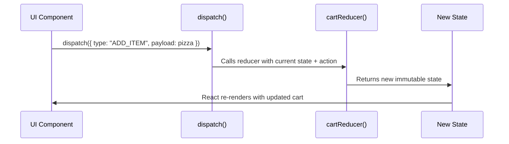

### `useState` vs `useReducer` — Decision Guide

| Scenario | useState | useReducer |
|---|:---:|:---:|
| Single independent boolean / string | ✅ | ❌ Overkill |
| Form with one or two fields | ✅ | ❌ Overkill |
| Multiple interdependent values | ⚠️ Gets messy | ✅ |
| Updates have distinct names (ADD, REMOVE) | ❌ | ✅ |
| Logic needs unit testing | ❌ | ✅ |
| Building toward Redux later | ❌ | ✅ |

### 🧠 Optimization Insight

> `useReducer` is the **conceptual foundation of Redux**. Redux = `useReducer` + Context + middleware. Mastering `useReducer` makes Redux Toolkit intuitive to learn.

**Production use cases:**
- Multi-step checkout flows
- Complex forms with conditional validation
- Authentication state machines (idle → loading → authenticated → error)
- Notification and alert queue systems
- Data dashboard with multiple independent data streams

---

## 🕵️ `useRef` — Mutable, Non-Reactive Storage

### The Problem It Solves

Two distinct scenarios call for `useRef`:

1. **Imperative DOM access** — focusing an input, playing a video, reading scroll position
2. **Storing a mutable value that persists across renders without triggering a re-render**

### `useState` vs `useRef` — The Core Distinction

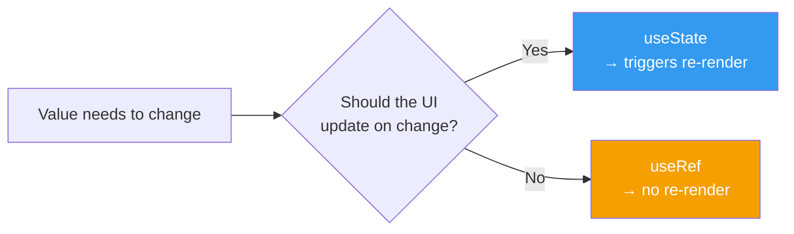

### Real-World Examples

#### ⏱️ Stopwatch — Storing the Interval Reference

```jsx
function Stopwatch() {
  const [elapsed, setElapsed]  = useState(0);
  const intervalRef            = useRef(null); // Stores the timer ID

  function start() {
    intervalRef.current = setInterval(() => {
      setElapsed(t => t + 1);
    }, 1000);
  }

  function stop() {
    clearInterval(intervalRef.current); // Access the stored timer ID
  }
}
```

> Storing the interval ID in `useState` would cause an unnecessary re-render every time the timer starts or stops. `useRef` stores it silently.

#### 📱 OTP Input — Automatic Focus Management

```jsx
function OtpInput() {
  const refs = [useRef(null), useRef(null), useRef(null), useRef(null)];

  function handleChange(index, e) {
    if (e.target.value.length === 1 && index < refs.length - 1) {
      refs[index + 1].current.focus(); // Imperatively jump to next field
    }
  }

  return (
    <div>
      {refs.map((ref, i) => (
        <input key={i} ref={ref} onChange={e => handleChange(i, e)} maxLength={1} />
      ))}
    </div>
  );
}
```

#### 🎥 Video Player — Imperative DOM Control

```jsx
function VideoPlayer({ src }) {
  const videoRef = useRef(null);

  return (
    <div>
      <video ref={videoRef} src={src} />
      <button onClick={() => videoRef.current.play()}>▶ Play</button>
      <button onClick={() => videoRef.current.pause()}>⏸ Pause</button>
    </div>
  );
}
```

#### 📉 Tracking Previous Value for Comparison

```jsx
function PriceTracker({ currentPrice }) {
  const prevPriceRef = useRef(currentPrice);

  useEffect(() => {
    prevPriceRef.current = currentPrice; // Silent update after render
  });

  const previousPrice = prevPriceRef.current;

  return (
    <div>
      <p>Current Price: ₹{currentPrice}</p>
      <p>Previous Price: ₹{previousPrice}</p>
      <p>{currentPrice > previousPrice ? "📈 Increased" : "📉 Decreased"}</p>
    </div>
  );
}
```

### The `useRef` Mental Model

```
useRef returns an object: { current: <your value> }

Key properties:
- The object reference is STABLE (same object across renders)
- The .current property is MUTABLE (can change freely)
- React does NOT observe changes to .current
- Changing .current does NOT trigger a re-render
```

### 🧠 Optimization Insight

> `useRef` is React's **escape hatch** from the reactive system. Use it when you need to:
> - **Imperatively control DOM elements** (video, canvas, focus management)
> - **Store values that change but should not trigger re-renders** (timers, socket references, animation frame IDs, previous values)

---

## 🚀 Custom Hooks — Reusable Logic Architecture

### The Problem It Solves

When the same stateful logic appears in multiple components, it needs a home. Custom hooks allow you to extract that logic into a shareable, testable unit — without changing the component hierarchy.

### Before — Duplicated Logic

```jsx
// The same 15 lines appear in ProductPage, UserProfile, OrderHistory...
function ProductPage() {
  const [data, setData]       = useState(null);
  const [loading, setLoading] = useState(true);
  const [error, setError]     = useState(null);

  useEffect(() => {
    fetch("/api/products")
      .then(r => r.json())
      .then(setData)
      .catch(setError)
      .finally(() => setLoading(false));
  }, []);
}
```

### After — Extracted into a Custom Hook

```jsx
// hooks/useFetch.js  — defined once, used everywhere
function useFetch(url) {
  const [data, setData]       = useState(null);
  const [loading, setLoading] = useState(true);
  const [error, setError]     = useState(null);

  useEffect(() => {
    let cancelled = false; // Prevents state update on unmounted component

    setLoading(true);
    fetch(url)
      .then(r => r.json())
      .then(data  => { if (!cancelled) setData(data); })
      .catch(err  => { if (!cancelled) setError(err); })
      .finally(() => { if (!cancelled) setLoading(false); });

    return () => { cancelled = true; };
  }, [url]);

  return { data, loading, error };
}

// Any component consumes it in one line
function ProductPage() {
  const { data: products, loading, error } = useFetch("/api/products");
}

function UserProfile() {
  const { data: user, loading } = useFetch("/api/me");
}
```

### Architecture Comparison

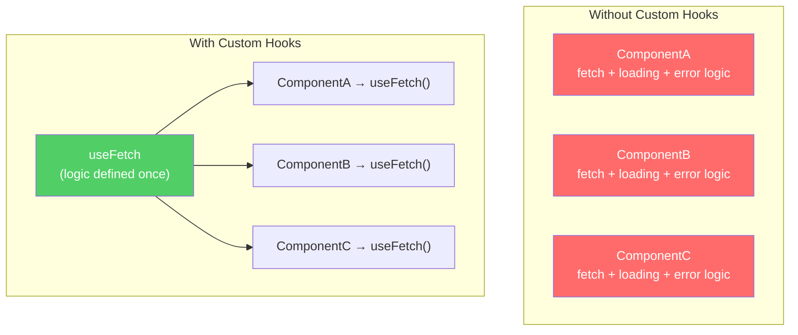

### Production Custom Hooks

#### `useOnlineStatus` — Network State Detection

```jsx
function useOnlineStatus() {
  const [isOnline, setIsOnline] = useState(navigator.onLine);

  useEffect(() => {
    const handleOnline  = () => setIsOnline(true);
    const handleOffline = () => setIsOnline(false);

    window.addEventListener("online", handleOnline);
    window.addEventListener("offline", handleOffline);

    return () => {
      window.removeEventListener("online", handleOnline);
      window.removeEventListener("offline", handleOffline);
    };
  }, []);

  return isOnline;
}

// Usage
function App() {
  const isOnline = useOnlineStatus();
  return isOnline ? <MainApp /> : <OfflineBanner />;
}
```

#### `useDebounce` — API Call Optimization

```jsx
function useDebounce(value, delay = 500) {
  const [debouncedValue, setDebouncedValue] = useState(value);

  useEffect(() => {
    const timer = setTimeout(() => setDebouncedValue(value), delay);
    return () => clearTimeout(timer); // Cancel if value changes before delay
  }, [value, delay]);

  return debouncedValue;
}

// Prevents an API call on every single keystroke
function SearchBox() {
  const [query, setQuery]     = useState("");
  const debouncedQuery        = useDebounce(query, 400);

  useEffect(() => {
    if (debouncedQuery) fetchResults(debouncedQuery);
  }, [debouncedQuery]); // Fires only 400ms after the user stops typing
}
```

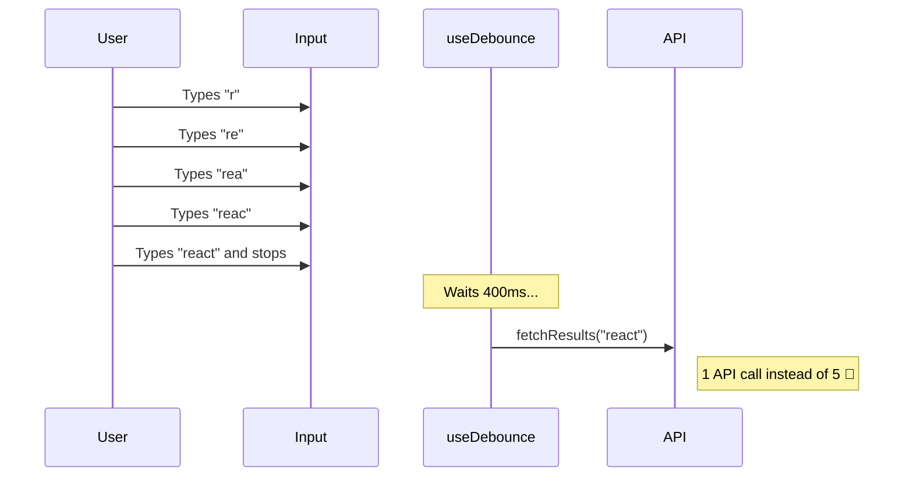

### Standard Custom Hook Library Structure

```
src/hooks/
├── useAuth.js          → current user, login, logout, token refresh
├── useFetch.js         → generic data fetching with loading/error states
├── useDebounce.js      → debounce any rapidly changing value
├── useLocalStorage.js  → useState that persists to localStorage
├── useOnlineStatus.js  → real-time network connection status
├── useWindowSize.js    → responsive breakpoints in JavaScript
├── useSocket.js        → WebSocket lifecycle management
└── useTheme.js         → dark/light mode with system preference
```

### 🧠 Optimization Insight

> **Junior engineers** build components.
> **Senior engineers** build reusable systems.

Custom hooks provide:
- ✅ **Isolated testability** — logic can be unit tested without rendering a component
- ✅ **Single source of truth** — update logic in one place, all consumers benefit
- ✅ **Clean component code** — components describe *what* to render, not *how* to fetch
- ✅ **Team scalability** — shared hook libraries across features and repositories

---

## ⚡ Performance Optimization Hooks

### Why They Exist

React re-renders a component whenever its state or props change. By default, this also re-renders **all child components**, even if their inputs did not change.

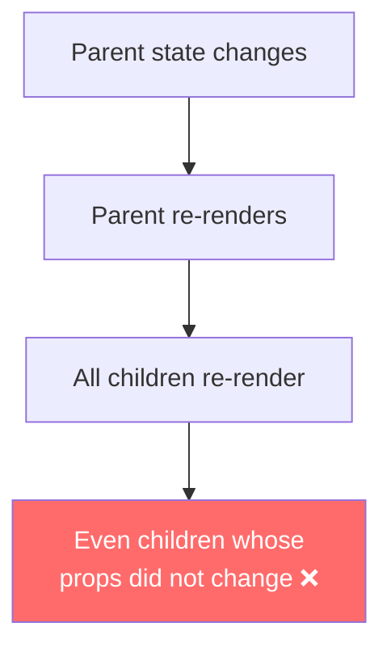

### `React.memo` — Prevent Unnecessary Child Renders

```jsx
// Without memo: re-renders every time the parent renders
function ExpensiveChart({ data }) {
  return <HeavyVisualization data={data} />;
}

// With memo: only re-renders when the `data` prop reference changes
const ExpensiveChart = React.memo(function ({ data }) {
  return <HeavyVisualization data={data} />;
});
```

### `useMemo` — Cache Expensive Calculations

```jsx
function AnalyticsDashboard({ transactions }) {
  // ❌ Without useMemo: recalculates on every render (~200ms each time)
  const report = computeComplexReport(transactions);

  // ✅ With useMemo: recalculates only when `transactions` changes
  const report = useMemo(
    () => computeComplexReport(transactions),
    [transactions]
  );
}
```

### `useCallback` — Stable Function References

```jsx
function SearchPage() {
  const [query, setQuery] = useState("");

  // ❌ Without useCallback: a new function is created on every render,
  //    causing memoized child components to re-render unnecessarily
  const handleSearch = (term) => fetchResults(term);

  // ✅ With useCallback: the same function reference is reused
  //    until its dependencies change
  const handleSearch = useCallback(
    (term) => fetchResults(term),
    [] // recreate only when dependencies listed here change
  );

  return <SearchInput onSearch={handleSearch} />;
}
```

### Performance Optimization Decision Tree

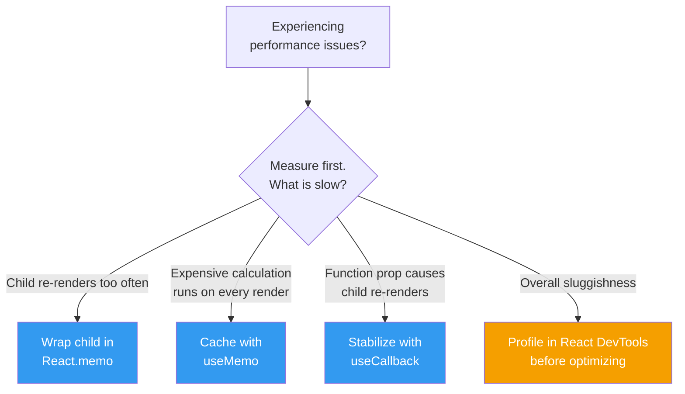

> ⚠️ **Do not over-optimize.** Apply `memo`, `useMemo`, and `useCallback` only after measuring a real performance problem. Premature optimization adds complexity and can actually hurt performance in small component trees.

---

## 🧠 Senior Engineer Mental Model

### How React Actually Works

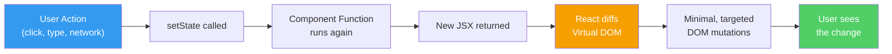

### Junior vs. Senior Thinking

| Hook | Junior's Mental Model | Senior's Mental Model |
|---|---|---|
| `useState` | "Store a value, trigger re-render" | "Minimum source of truth; derive everything else" |
| `useEffect` | "The place to put API calls" | "Synchronize React with an external system" |
| `useContext` | "Global state problem solved" | "Good for slow-changing data; use a store for high-frequency updates" |
| `useReducer` | "A more complex useState" | "A predictable state machine and the conceptual base of Redux" |
| `useRef` | "How to get a DOM element" | "Escape hatch for mutable, non-reactive storage" |
| Custom Hooks | "Reusable code" | "Extract logic to improve testability, maintainability, and team scalability" |
| Re-renders | "More re-renders = bad" | "Understand what triggers them; measure before optimizing" |

### Five Questions Senior Engineers Ask

1. **What is the absolute minimum state required?** — Avoid storing derived data.
2. **Where should this state live?** — As close to its consumers as possible.
3. **What triggers a re-render here?** — Know before you optimize.
4. **What needs cleanup?** — Every event listener, socket, and timer.
5. **Can this logic be extracted?** — If used in two or more places, make it a custom hook.

---

## 🔭 The Big Picture

### React Application Analogy — A Restaurant

```mermaid
graph TD
    subgraph "React Application = Restaurant"
        A["👨‍🍳 State\n(Kitchen inventory)"]
        B["🍽️ UI\n(Food delivered to table)"]
        C["📞 useEffect\n(External supplier calls)"]
        D["🗄️ Context\n(Shared staff knowledge)"]
        E["📋 useReducer\n(Manager's order rules)"]
        F["🗝️ useRef\n(Private back-office drawer)"]
        G["📖 Custom Hook\n(Standardized recipe)"]
    end

    style A fill:#ff6b6b,color:#fff
    style B fill:#51cf66,color:#fff
    style C fill:#339af0,color:#fff
    style D fill:#f59f00,color:#000
    style E fill:#cc5de8,color:#fff
    style F fill:#20c997,color:#fff
    style G fill:#ff922b,color:#fff
```

### All Hooks at a Glance

| Hook | Core Purpose | Canonical Production Example |
|---|---|---|
| `useState` | Track UI-affecting data | Cart count, form inputs, toggle states |
| `useEffect` | Synchronize with external systems | API fetch on mount, socket connection |
| `useContext` | Share data without prop drilling | Auth user, app theme, locale |
| `useReducer` | Manage complex, action-driven state | Shopping cart, multi-step form, auth machine |
| `useRef` | DOM access or non-reactive mutable storage | Video player controls, interval IDs |
| `useMemo` | Cache expensive computations | Analytics reports, filtered/sorted lists |
| `useCallback` | Stabilize function references | Callbacks passed to memoized children |
| Custom Hook | Package and reuse stateful logic | `useAuth`, `useFetch`, `useDebounce` |

---

> ## 💡 The Core Insight
>
> **React is not Hooks.**
>
> React is a **rendering engine** and a **state synchronization system**.
> Hooks are the tools React provides to integrate with that system from within function components.
>
> When you understand *why* each hook exists — the specific problem it was designed to solve —
> you can write correct, optimized React code even when you don't remember the exact API.
>
> **That is the difference between using React and understanding it.**

---

*Part of the [React Revision Book](./README.md)*
