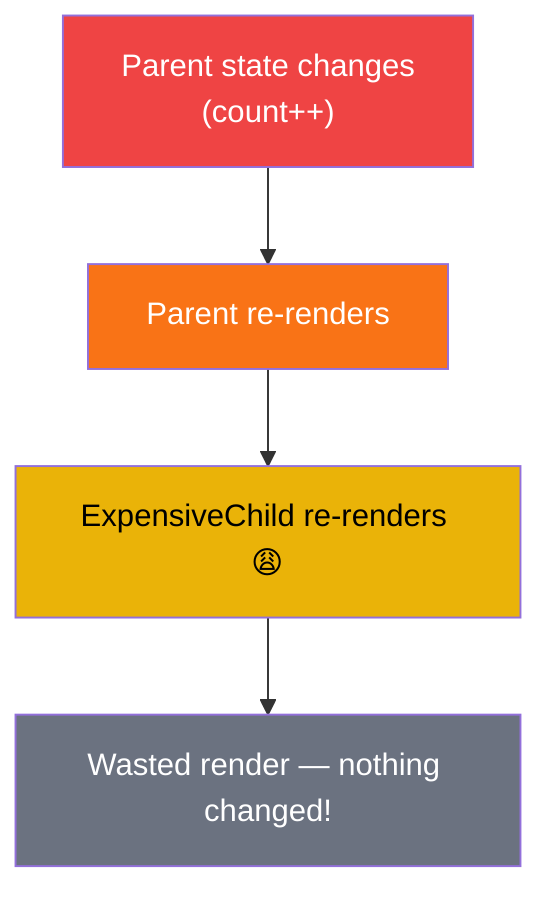
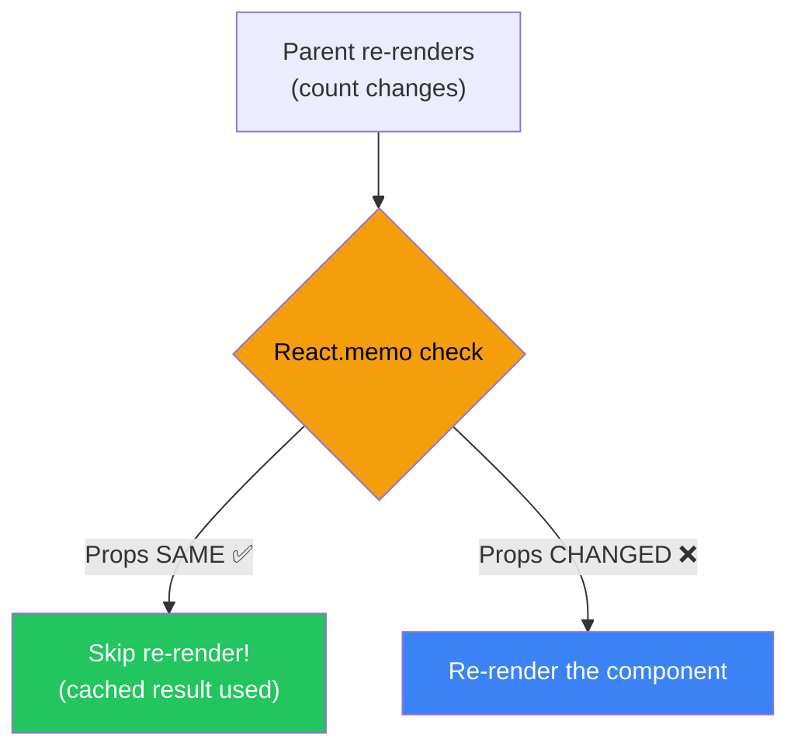
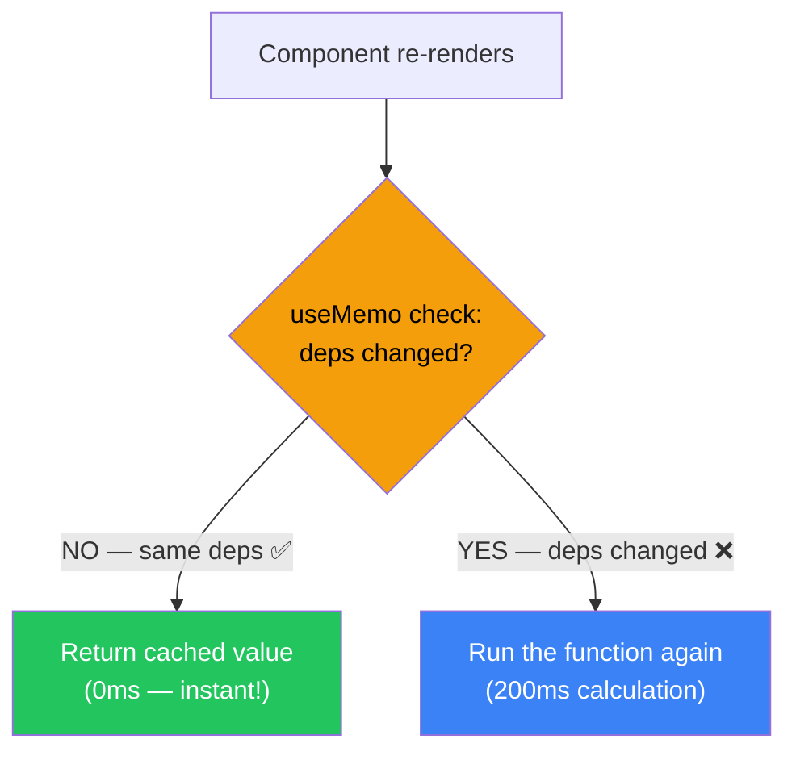
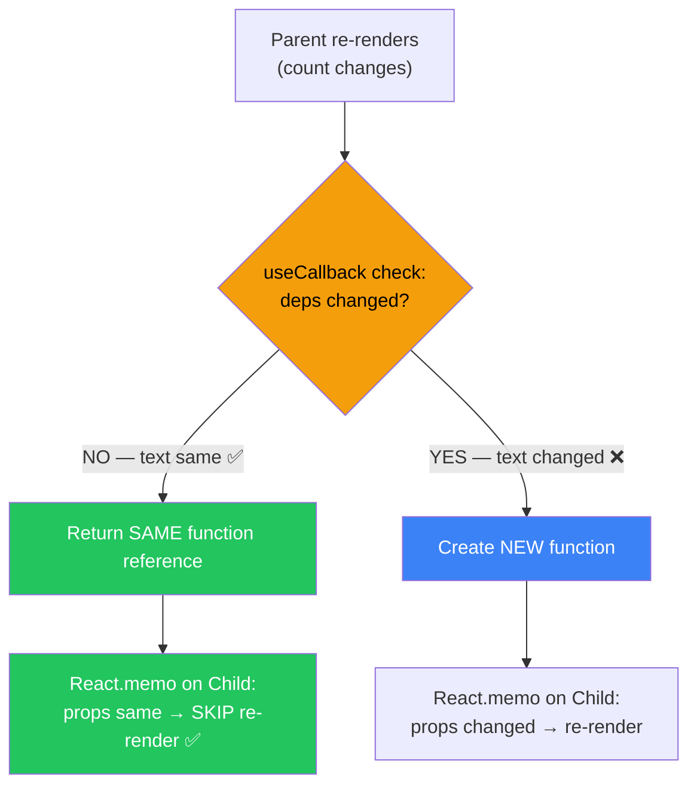
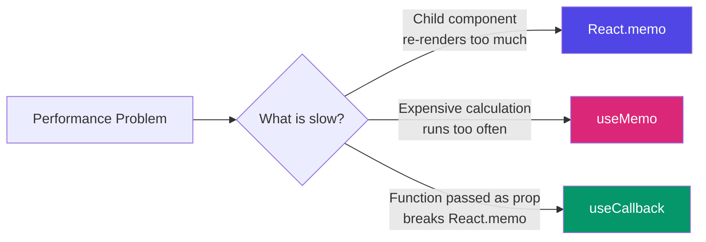
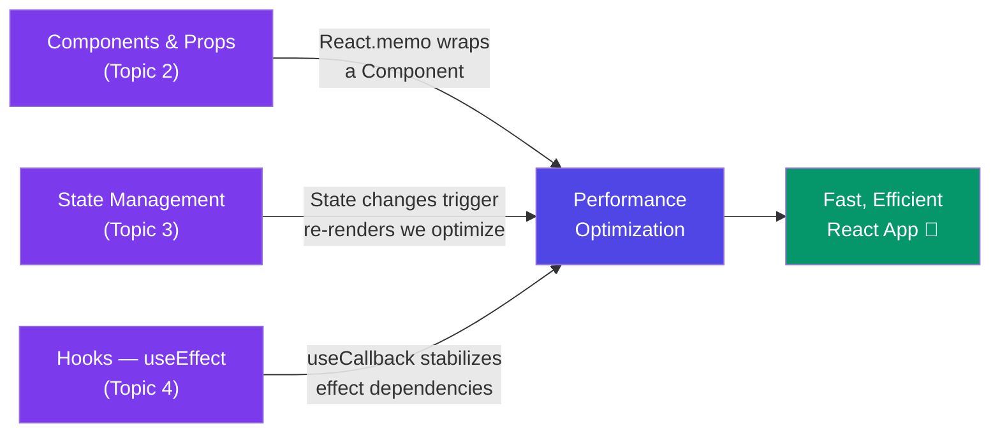

# ⚡ React.memo / useMemo / useCallback — A Deep Dive

> **"Don't optimize prematurely — but when your app slows down, these three are your best friends."**

---

## 📚 Table of Contents

1. [Why Performance Optimization?](#-why-performance-optimization)
2. [How React Re-renders Work](#-how-react-re-renders-work)
3. [React.memo — Skip Re-rendering a Component](#-reactmemo--skip-re-rendering-a-component)
4. [useMemo — Cache an Expensive Calculation](#-usememo--cache-an-expensive-calculation)
5. [useCallback — Cache a Function](#-usecallback--cache-a-function)
6. [React.memo + useCallback Together](#-reactmemo--usecallback-together)
7. [All Three — Side by Side Comparison](#-all-three--side-by-side-comparison)
8. [When to Use vs When NOT to Use](#-when-to-use-vs-when-not-to-use)
9. [Real World Examples](#-real-world-examples)
10. [Common Mistakes](#-common-mistakes)
11. [Cheat Sheet](#-cheat-sheet)

---

## 🤔 Why Performance Optimization?

By default, React re-renders a component **every time its parent re-renders** — even if nothing changed for that child.

For small apps this is fine. But imagine:
- A list of **500 items**, each as a component
- A **heavy calculation** running on every keystroke
- A **child component** re-rendering even though its props didn't change

This is where **React.memo**, **useMemo**, and **useCallback** come in. They all do one thing: **skip unnecessary work**.

---

## 🔄 How React Re-renders Work

Before using these tools, understand **when React re-renders**:

```
A component re-renders when:
  1. Its own state changes
  2. Its parent re-renders  ← this is the problem we're solving
  3. Its context value changes
```

### The Problem — Unnecessary Child Re-renders

```jsx
function Parent() {
  const [count, setCount] = useState(0);

  return (
    <div>
      <button onClick={() => setCount(count + 1)}>
        Count: {count}
      </button>

      <ExpensiveChild />   {/* Re-renders on EVERY button click! */}
                           {/* Even though its props never change! */}
    </div>
  );
}
```



---

## 🧠 React.memo — Skip Re-rendering a Component

### What is it?

`React.memo` is a **Higher Order Component (HOC)** that wraps your component and tells React:

> "Only re-render this component if its **props actually changed**. Otherwise, skip it."

### Syntax

```jsx
const MyComponent = React.memo(function MyComponent({ name, age }) {
  return <div>{name} — {age}</div>;
});

// OR with arrow function:
const MyComponent = React.memo(({ name, age }) => {
  return <div>{name} — {age}</div>;
});
```

### Before vs After React.memo

```jsx
// ❌ WITHOUT React.memo — re-renders every time Parent re-renders
function UserCard({ name }) {
  console.log("UserCard rendered!");
  return <div>Hello, {name}</div>;
}

// ✅ WITH React.memo — only re-renders when 'name' prop changes
const UserCard = React.memo(function UserCard({ name }) {
  console.log("UserCard rendered!");
  return <div>Hello, {name}</div>;
});

function Parent() {
  const [count, setCount] = useState(0);

  return (
    <div>
      <button onClick={() => setCount(count + 1)}>
        Clicked {count} times
      </button>
      <UserCard name="Vaishali" />
      {/* Without memo: re-renders every click */}
      {/* With memo: NEVER re-renders (name never changes!) */}
    </div>
  );
}
```



### Custom Comparison with React.memo

By default, React.memo does a **shallow comparison** of props. You can pass a custom compare function:

```jsx
const UserCard = React.memo(
  function UserCard({ user }) {
    return <div>{user.name} — {user.age}</div>;
  },
  // Custom compare: return true = SKIP re-render, false = RE-render
  (prevProps, nextProps) => {
    return prevProps.user.id === nextProps.user.id;
    // Only re-render if the user ID changes
  }
);
```

### 🏠 Real Life Analogy

React.memo is like a **smart photocopy machine**:
- You give it the same document → it gives you the **cached copy** (no work done)
- You give it a different document → it **makes a new copy**

---

## 🧮 useMemo — Cache an Expensive Calculation

### What is it?

`useMemo` **caches the result of a function** and only recalculates when its dependencies change.

> "I already calculated this — don't do it again unless the inputs changed."

### Syntax

```jsx
const result = useMemo(() => {
  return expensiveCalculation(input);
}, [input]);  // only recalculate when 'input' changes
```

### Without vs With useMemo

```jsx
// ❌ WITHOUT useMemo — recalculates on EVERY render
function ProductList({ products, searchTerm }) {
  // This runs on every render — even when searchTerm didn't change!
  const filteredProducts = products.filter(p =>
    p.name.toLowerCase().includes(searchTerm.toLowerCase())
  );

  return (
    <ul>
      {filteredProducts.map(p => <li key={p.id}>{p.name}</li>)}
    </ul>
  );
}
```

```jsx
// ✅ WITH useMemo — only recalculates when products or searchTerm changes
function ProductList({ products, searchTerm }) {
  const filteredProducts = useMemo(() => {
    console.log("Filtering products...");  // only logs when deps change!
    return products.filter(p =>
      p.name.toLowerCase().includes(searchTerm.toLowerCase())
    );
  }, [products, searchTerm]);  // ← dependencies

  return (
    <ul>
      {filteredProducts.map(p => <li key={p.id}>{p.name}</li>)}
    </ul>
  );
}
```

### Real Example — Expensive Calculation

```jsx
function Dashboard({ data, theme }) {
  // ❌ This heavy calculation runs even when only 'theme' changes
  const stats = calculateComplexStats(data);  // takes 200ms!

  // ✅ Only recalculates when 'data' changes, NOT when 'theme' changes
  const stats = useMemo(() => {
    return calculateComplexStats(data);  // takes 200ms only when data changes
  }, [data]);

  return (
    <div className={theme}>
      <StatsDisplay stats={stats} />
    </div>
  );
}
```



### 🏠 Real Life Analogy

`useMemo` is like a **calculator with memory**:
- Same numbers → press `MR` (Memory Recall) → instant answer
- Different numbers → calculate fresh

---

## 🎣 useCallback — Cache a Function

### What is it?

`useCallback` **caches a function definition** and only creates a new function when its dependencies change.

> "Don't create a new function on every render — reuse the same one."

### Why does this matter?

In JavaScript, **functions are objects**. Every render creates a **brand new function** in memory:

```jsx
// Every render creates a NEW handleClick function
// Even if the code inside is identical!
function Parent() {
  const handleClick = () => {  // NEW function every render!
    console.log("clicked");
  };
  return <Child onClick={handleClick} />;
}
```

This breaks `React.memo` on `Child` — because `onClick` is a "new" prop every render (even though it does the same thing).

### Syntax

```jsx
const handleClick = useCallback(() => {
  doSomething(value);
}, [value]);  // only create new function when 'value' changes
```

### Without vs With useCallback

```jsx
// ❌ WITHOUT useCallback
function Parent() {
  const [count, setCount] = useState(0);
  const [text, setText] = useState('');

  // New function created on EVERY render
  const handleSubmit = () => {
    console.log("Submitting:", text);
  };

  return (
    <div>
      <input onChange={e => setText(e.target.value)} />
      <button onClick={() => setCount(c => c + 1)}>+</button>

      {/* React.memo on Child is USELESS — handleSubmit is always new! */}
      <ExpensiveForm onSubmit={handleSubmit} />
    </div>
  );
}
```

```jsx
// ✅ WITH useCallback
function Parent() {
  const [count, setCount] = useState(0);
  const [text, setText] = useState('');

  // Same function reference — only new when 'text' changes
  const handleSubmit = useCallback(() => {
    console.log("Submitting:", text);
  }, [text]);  // ← dependency

  return (
    <div>
      <input onChange={e => setText(e.target.value)} />
      <button onClick={() => setCount(c => c + 1)}>+</button>

      {/* Now React.memo WORKS — handleSubmit only changes when text changes */}
      <ExpensiveForm onSubmit={handleSubmit} />
    </div>
  );
}

// Child wrapped in React.memo
const ExpensiveForm = React.memo(function ExpensiveForm({ onSubmit }) {
  console.log("ExpensiveForm rendered");
  return <button onClick={onSubmit}>Submit</button>;
});
```



### 🏠 Real Life Analogy

`useCallback` is like a **saved contact on your phone**:
- Without it: Every time you call someone, you type their number fresh
- With it: You saved the number — just tap the contact (same reference every time)

---

## 🤝 React.memo + useCallback Together

These two work as a **team**. One without the other is often useless:

```jsx
// THE PATTERN: Parent uses useCallback, Child uses React.memo

// Parent
function TodoApp() {
  const [todos, setTodos] = useState([]);
  const [filter, setFilter] = useState('all');

  // ✅ useCallback — stable function reference
  const handleDelete = useCallback((id) => {
    setTodos(prev => prev.filter(todo => todo.id !== id));
  }, []);  // no deps — setTodos is stable

  // ✅ useCallback — only changes when filter changes
  const handleFilterChange = useCallback((newFilter) => {
    setFilter(newFilter);
  }, []);

  // ✅ useMemo — only recalculates when todos or filter changes
  const filteredTodos = useMemo(() => {
    if (filter === 'all') return todos;
    if (filter === 'done') return todos.filter(t => t.done);
    return todos.filter(t => !t.done);
  }, [todos, filter]);

  return (
    <div>
      <FilterBar onFilterChange={handleFilterChange} />
      {filteredTodos.map(todo => (
        <TodoItem
          key={todo.id}
          todo={todo}
          onDelete={handleDelete}   {/* stable reference! */}
        />
      ))}
    </div>
  );
}

// Child — React.memo works because onDelete is stable
const TodoItem = React.memo(function TodoItem({ todo, onDelete }) {
  console.log(`Rendering: ${todo.text}`);
  return (
    <div>
      <span>{todo.text}</span>
      <button onClick={() => onDelete(todo.id)}>Delete</button>
    </div>
  );
});
```

---

## 📊 All Three — Side by Side Comparison

| | `React.memo` | `useMemo` | `useCallback` |
|---|---|---|---|
| **What it caches** | A whole component's render | A calculated **value** | A **function** |
| **Type** | HOC (wraps component) | Hook | Hook |
| **Used for** | Skipping child re-renders | Expensive calculations | Stable function references |
| **Returns** | Wrapped component | The cached value | The cached function |
| **Without it** | Component re-renders always | Recalculates every render | New function every render |
| **Works with** | Props comparison | Dependency array | Dependency array |



---

## ✅ When to Use vs When NOT to Use

### ✅ USE React.memo when:
- Component renders often but props rarely change
- Component is **expensive to render** (heavy UI, big lists)
- Component is **pure** (same props = same output)

### ❌ DON'T USE React.memo when:
- Component always gets different props anyway
- Component is very simple/cheap to render
- Premature optimization (adds complexity for no gain)

---

### ✅ USE useMemo when:
- Calculation is **genuinely expensive** (filtering 10,000 items, complex math)
- Result is used in **render output** or as a **dependency** for other hooks
- Input changes **less often** than the component re-renders

### ❌ DON'T USE useMemo when:
- Calculation is simple (adding two numbers, accessing an array index)
- Dependencies change on every render anyway (defeats the purpose)
- Just to "be safe" — useMemo itself has a small cost

---

### ✅ USE useCallback when:
- Function is passed as a **prop to a memoized child** (React.memo)
- Function is a **dependency** in another hook's dependency array
- Function is used in **useEffect** deps

### ❌ DON'T USE useCallback when:
- Function is NOT passed to a child component
- Child is NOT wrapped in React.memo
- Just storing a function for use inside the same component

---

## 🌍 Real World Examples

### Example 1 — Search with useMemo

```jsx
function SearchPage() {
  const [query, setQuery] = useState('');
  const [sortBy, setSortBy] = useState('name');
  const products = useProducts();  // large array from API

  // Only re-filters when products or query changes
  // NOT when sortBy changes
  const filteredProducts = useMemo(() => {
    return products.filter(p =>
      p.name.toLowerCase().includes(query.toLowerCase())
    );
  }, [products, query]);

  // Only re-sorts when filteredProducts or sortBy changes
  const sortedProducts = useMemo(() => {
    return [...filteredProducts].sort((a, b) =>
      a[sortBy].localeCompare(b[sortBy])
    );
  }, [filteredProducts, sortBy]);

  return (
    <>
      <input value={query} onChange={e => setQuery(e.target.value)} />
      <select value={sortBy} onChange={e => setSortBy(e.target.value)}>
        <option value="name">Name</option>
        <option value="price">Price</option>
      </select>
      <ProductList products={sortedProducts} />
    </>
  );
}
```

### Example 2 — Large List with React.memo + useCallback

```jsx
function ContactList() {
  const [contacts, setContacts] = useState(largeContactArray);
  const [selectedId, setSelectedId] = useState(null);

  // ✅ useCallback — stable, no deps needed
  const handleSelect = useCallback((id) => {
    setSelectedId(id);
  }, []);

  // ✅ useCallback — stable
  const handleDelete = useCallback((id) => {
    setContacts(prev => prev.filter(c => c.id !== id));
  }, []);

  return (
    <div>
      {contacts.map(contact => (
        <ContactCard
          key={contact.id}
          contact={contact}
          isSelected={contact.id === selectedId}
          onSelect={handleSelect}
          onDelete={handleDelete}
        />
      ))}
    </div>
  );
}

// ✅ React.memo — only re-renders when contact, isSelected, or handlers change
const ContactCard = React.memo(function ContactCard({
  contact, isSelected, onSelect, onDelete
}) {
  return (
    <div className={isSelected ? 'selected' : ''}>
      <span>{contact.name}</span>
      <button onClick={() => onSelect(contact.id)}>Select</button>
      <button onClick={() => onDelete(contact.id)}>Delete</button>
    </div>
  );
});
```

---

## ⚠️ Common Mistakes

### Mistake 1: useMemo for a simple value

```jsx
// ❌ OVERKILL — this is NOT expensive
const double = useMemo(() => count * 2, [count]);

// ✅ JUST DO THIS
const double = count * 2;
```

### Mistake 2: useCallback without React.memo on child

```jsx
// ❌ POINTLESS — Child is not memoized, so useCallback does nothing here
const handleClick = useCallback(() => {
  console.log("clicked");
}, []);

return <RegularChild onClick={handleClick} />;  // not wrapped in React.memo!

// ✅ Only useful when child IS memoized
return <MemoizedChild onClick={handleClick} />;
```

### Mistake 3: Missing dependencies

```jsx
// ❌ WRONG — 'value' is used but not in deps array
const result = useMemo(() => {
  return value * 2;
}, []);  // stale closure bug! result never updates

// ✅ CORRECT
const result = useMemo(() => {
  return value * 2;
}, [value]);
```

### Mistake 4: Object/Array in deps causing infinite loops

```jsx
// ❌ WRONG — new object created every render = infinite loop!
const config = { theme: 'dark', lang: 'en' };  // new object every render!

useEffect(() => {
  setup(config);
}, [config]);  // config changes every render → infinite loop

// ✅ CORRECT — memoize the object
const config = useMemo(() => ({
  theme: 'dark',
  lang: 'en'
}), []);  // stable object reference
```

### Mistake 5: Overusing all three everywhere

```jsx
// ❌ WRONG — memoizing everything makes code unreadable and adds overhead
const add = useCallback((a, b) => a + b, []);
const result = useMemo(() => add(2, 3), [add]);
const SimpleText = React.memo(() => <p>Hello</p>);

// ✅ CORRECT — only optimize when there's a real, measurable problem
// Profile first → optimize where it matters
```

---

## 📋 Cheat Sheet

```
┌─────────────────────────────────────────────────────────────────┐
│                    QUICK DECISION GUIDE                         │
├─────────────────────────────────────────────────────────────────┤
│                                                                 │
│  Child re-renders too much?                                     │
│  → Wrap child in React.memo                                     │
│                                                                 │
│  Passing functions as props to memoized child?                  │
│  → Wrap those functions in useCallback                          │
│                                                                 │
│  Expensive calculation running too often?                       │
│  → Wrap it in useMemo                                           │
│                                                                 │
│  Object/Array used as a useEffect/useMemo dependency?           │
│  → Wrap that object/array in useMemo                            │
│                                                                 │
└─────────────────────────────────────────────────────────────────┘
```

### One-liner Summary

| Hook | One Line | Analogy |
|---|---|---|
| `React.memo` | Skip re-render if props same | Smart photocopy machine |
| `useMemo` | Cache expensive result | Calculator with memory |
| `useCallback` | Cache function reference | Saved phone contact |

### Dependency Array Rules (Same for useMemo & useCallback)

```jsx
useMemo(() => fn(), []);          // Run once on mount — no deps
useMemo(() => fn(), [a]);         // Run when 'a' changes
useMemo(() => fn(), [a, b]);      // Run when 'a' OR 'b' changes
useMemo(() => fn());              // Run every render (pointless!)
```

---

## 🔗 Connection to Previous Topics



---

## 🎯 Key Takeaways

> 1. **React.memo** — wraps a component, skips re-render if props didn't change.
>
> 2. **useMemo** — caches an expensive calculated **value**, recomputes only when deps change.
>
> 3. **useCallback** — caches a **function reference**, recreates only when deps change.
>
> 4. **React.memo + useCallback = best friends** — memo is useless without stable function refs.
>
> 5. **Don't over-optimize** — profile first, optimize only where there's a real bottleneck.
>
> 6. **Always include correct dependencies** — missing deps = stale data bugs.
>
> 7. **useMemo ≠ useCallback** — one caches a value, the other caches a function.

---

## 📖 Further Reading

- [React Docs — React.memo](https://react.dev/reference/react/memo)
- [React Docs — useMemo](https://react.dev/reference/react/useMemo)
- [React Docs — useCallback](https://react.dev/reference/react/useCallback)
- [React Docs — You Might Not Need an Effect](https://react.dev/learn/you-might-not-need-an-effect)

---

*Made with ❤️ for [React Revision Book](./README.md) | Topic: React.memo / useMemo / useCallback*
