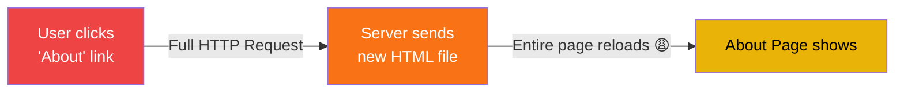
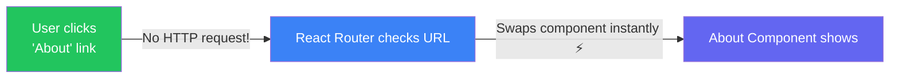
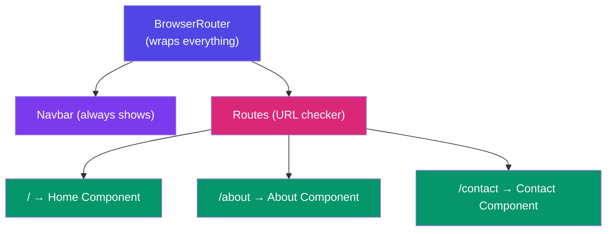
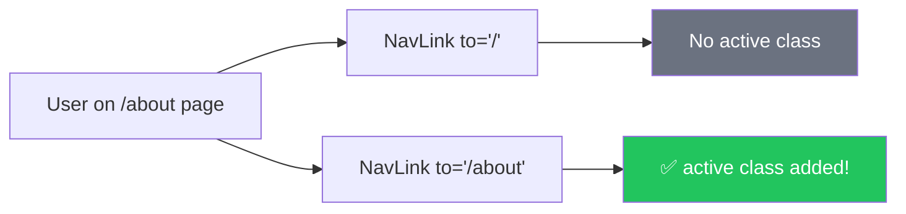
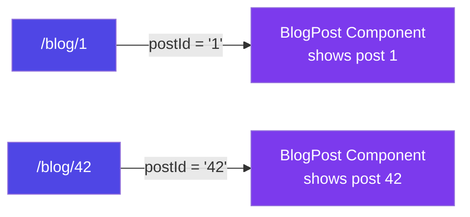
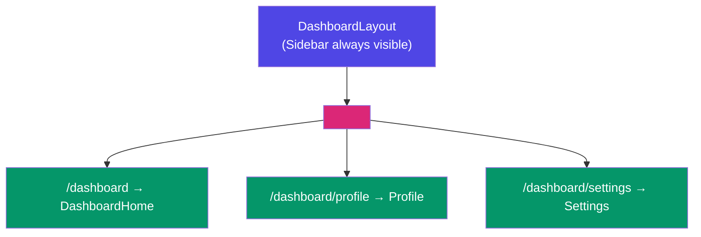
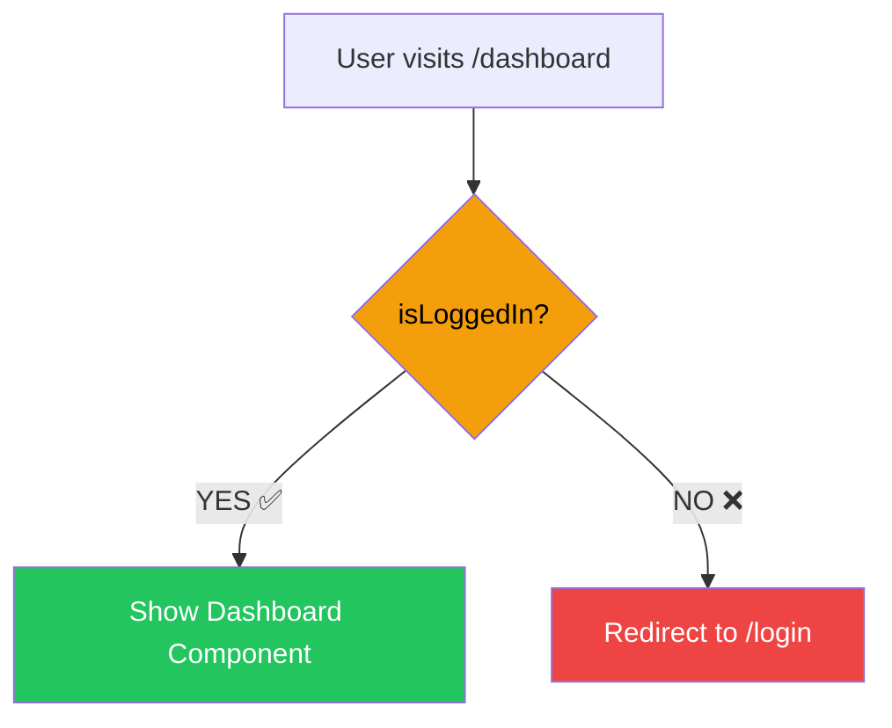
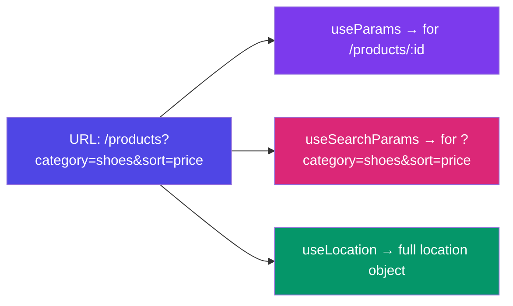
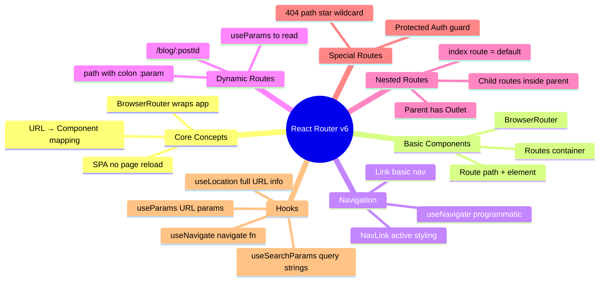
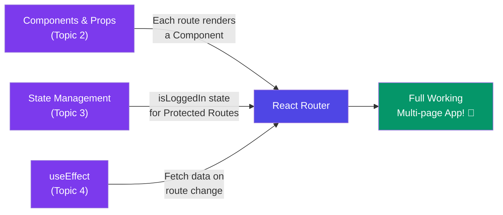

# 🛣️ React Router — A Deep Dive with Real-Life Examples

> **"Routing is like a city's road map — it tells React which component to show when you visit which URL."**

---

## 📚 Table of Contents

1. [What is Routing?](#-what-is-routing)
2. [Real Life Analogy — The Mall Directory](#️-real-life-analogy--the-mall-directory)
3. [SPA vs MPA — Why React Needs a Router](#-spa-vs-mpa--why-react-needs-a-router)
4. [Setup — Installing React Router](#️-setup--installing-react-router)
5. [Basic Routing — BrowserRouter, Routes, Route](#-basic-routing--browserrouter-routes-route)
6. [Navigation — Link vs NavLink vs useNavigate](#-navigation--link-vs-navlink-vs-usenavigate)
7. [Dynamic Routes — URL Parameters](#-dynamic-routes--url-parameters)
8. [Nested Routes](#-nested-routes)
9. [Protected Routes — Auth Guard](#-protected-routes--auth-guard)
10. [404 Page — Not Found Route](#-404-page--not-found-route)
11. [useLocation & useSearchParams](#-uselocation--usesearchparams)
12. [Common Mistakes & Best Practices](#-common-mistakes--best-practices)
13. [Cheat Sheet Summary](#-cheat-sheet-summary)

---

## 🤔 What is Routing? 

**Routing = Look at the URL → Show the right component.**

When you type `/about` in the browser, React decides to show the `About` component. That's routing.

```
User types URL
      ↓
React Router checks the URL   ← "Which path is this?"
      ↓
Renders the matching component ← Shows the right page
      ↓
Page does NOT reload!          ← SPA magic ✨
```

---

## 🏬 Real Life Analogy — The Mall Directory

At the entrance of a mall there's a **directory board**:

```
🏬 MALL DIRECTORY
─────────────────────────────
/             → 🏠 Main Entrance (Home)
/food-court   → 🍕 Food Court (3rd Floor)
/cinema       → 🎬 Cinema (4th Floor)
/parking      → 🚗 Parking (Basement)
/stores/nike  → 👟 Nike Store (2nd Floor)
─────────────────────────────
```

React Router is exactly this — a **directory** for your app.

- You go to `/food-court` → React shows the **Food Court component**
- You go to `/cinema` → React shows the **Cinema component**
- **The mall doesn't rebuild** every time — only the floor changes! (No page reload)

---

## 🆚 SPA vs MPA — Why React Needs a Router

### Traditional Website (MPA — Multi Page Application)



Every click = full page reload = slow, jarring experience.

### React SPA (Single Page Application)



One HTML file loads once. React Router **swaps components** based on URL — no reload, instant navigation!

| | MPA (Traditional) | SPA (React) |
|---|---|---|
| **Page reload** | Every navigation | Never |
| **Speed** | Slow | Instant |
| **Server requests** | Every click | Only for data (APIs) |
| **User experience** | Jarring | Smooth |
| **SEO** | Easy | Needs extra setup |

---

## ⚙️ Setup — Installing React Router

```bash
npm install react-router-dom
```

> ✅ Current version: **React Router v6** (use v6 syntax — it's quite different from v5!)

---

## 🗺️ Basic Routing — BrowserRouter, Routes, Route

### The 3 Main Components

| Component | What it does | Analogy |
|---|---|---|
| `BrowserRouter` | Wraps the whole app, tracks the URL | The mall building itself |
| `Routes` | Container for all routes | The mall directory board |
| `Route` | Maps one specific path → component | One entry in the directory |

### Basic Setup

```jsx
// main.jsx or index.js
import { BrowserRouter } from 'react-router-dom';
import App from './App';

ReactDOM.createRoot(document.getElementById('root')).render(
  <BrowserRouter>
    <App />
  </BrowserRouter>
);
```

```jsx
// App.jsx
import { Routes, Route } from 'react-router-dom';
import Home from './pages/Home';
import About from './pages/About';
import Contact from './pages/Contact';
import Navbar from './components/Navbar';

function App() {
  return (
    <div>
      <Navbar />        {/* Always visible — outside Routes */}

      <Routes>
        <Route path="/"        element={<Home />} />
        <Route path="/about"   element={<About />} />
        <Route path="/contact" element={<Contact />} />
      </Routes>
    </div>
  );
}
```



---

## 🔗 Navigation — Link vs NavLink vs useNavigate

### 3 Ways to Navigate

#### 1. `<Link>` — Basic Navigation

```jsx
import { Link } from 'react-router-dom';

function Navbar() {
  return (
    <nav>
      <Link to="/">Home</Link>
      <Link to="/about">About</Link>
      <Link to="/contact">Contact</Link>
    </nav>
  );
}
```

> ⚠️ **Never use `<a href="">` in React** — it causes a full page reload!
>
> Always use `<Link to="">` instead.

```
// ❌ WRONG — causes full page reload
<a href="/about">About</a>

// ✅ CORRECT — smooth SPA navigation
<Link to="/about">About</Link>
```

#### 2. `<NavLink>` — Active Link Styling

`NavLink` automatically adds an `active` class to the current page's link — perfect for navbars!

```jsx
import { NavLink } from 'react-router-dom';

function Navbar() {
  return (
    <nav>
      <NavLink 
        to="/" 
        style={({ isActive }) => ({ 
          color: isActive ? 'orange' : 'white',
          fontWeight: isActive ? 'bold' : 'normal'
        })}
      >
        Home
      </NavLink>

      <NavLink 
        to="/about"
        className={({ isActive }) => isActive ? "nav-link active" : "nav-link"}
      >
        About
      </NavLink>
    </nav>
  );
}
```



#### 3. `useNavigate` — Programmatic Navigation

Use this when you need to navigate after a button click or form submission:

```jsx
import { useNavigate } from 'react-router-dom';

function LoginForm() {
  const navigate = useNavigate();

  const handleLogin = () => {
    // login logic...
    navigate('/dashboard');        // go to dashboard
    // navigate(-1);               // go back (like browser back button)
    // navigate('/home', { replace: true }); // replace history entry
  };

  return (
    <div>
      <input type="text" placeholder="Username" />
      <input type="password" placeholder="Password" />
      <button onClick={handleLogin}>Login</button>
    </div>
  );
}
```

### Quick Comparison

| | `<Link>` | `<NavLink>` | `useNavigate` |
|---|---|---|---|
| **Use case** | Simple navigation | Navbar with active state | After events (form submit, login) |
| **Where** | JSX | JSX (navbar) | Inside functions |
| **Active styling** | ❌ | ✅ automatic | ❌ |
| **Programmatic** | ❌ | ❌ | ✅ |

---

## 🎯 Dynamic Routes — URL Parameters

When the URL contains variable data — like `/users/123` or `/products/iphone-15`:

```jsx
// App.jsx — define dynamic route with :paramName
<Routes>
  <Route path="/users/:userId" element={<UserProfile />} />
  <Route path="/products/:productId" element={<ProductDetail />} />
</Routes>
```

```jsx
// UserProfile.jsx — read the param with useParams
import { useParams } from 'react-router-dom';

function UserProfile() {
  const { userId } = useParams();  // extract userId from URL

  return (
    <div>
      <h1>User Profile</h1>
      <p>Showing profile for user ID: {userId}</p>
    </div>
  );
}

// Now these URLs all work:
// /users/1         → userId = "1"
// /users/42        → userId = "42"
// /users/vaishali  → userId = "vaishali"
```

### Real Example — Blog Posts

```jsx
// Routes:
<Route path="/blog"          element={<BlogList />} />
<Route path="/blog/:postId"  element={<BlogPost />} />

// BlogList.jsx — list of posts with links
function BlogList() {
  const posts = [
    { id: 1, title: "React Virtual DOM" },
    { id: 2, title: "Components & Props" },
    { id: 3, title: "React Router" },
  ];

  return (
    <div>
      {posts.map(post => (
        <Link key={post.id} to={`/blog/${post.id}`}>
          <h3>{post.title}</h3>
        </Link>
      ))}
    </div>
  );
}

// BlogPost.jsx — individual post
function BlogPost() {
  const { postId } = useParams();
  // Use postId to fetch the right post from API

  return <h1>Reading Post #{postId}</h1>;
}
```



---

## 🪆 Nested Routes

Routes inside another route — like different sections within a dashboard:

```
/dashboard              → Dashboard layout
/dashboard/profile      → Profile section
/dashboard/settings     → Settings section
/dashboard/analytics    → Analytics section
```

```jsx
// App.jsx
<Routes>
  <Route path="/dashboard" element={<DashboardLayout />}>
    <Route index          element={<DashboardHome />} />     {/* /dashboard */}
    <Route path="profile"   element={<Profile />} />          {/* /dashboard/profile */}
    <Route path="settings"  element={<Settings />} />         {/* /dashboard/settings */}
    <Route path="analytics" element={<Analytics />} />        {/* /dashboard/analytics */}
  </Route>
</Routes>
```

```jsx
// DashboardLayout.jsx — parent layout
import { Outlet, Link } from 'react-router-dom';

function DashboardLayout() {
  return (
    <div className="dashboard">
      {/* Sidebar — always visible inside dashboard */}
      <aside>
        <Link to="/dashboard">Home</Link>
        <Link to="/dashboard/profile">Profile</Link>
        <Link to="/dashboard/settings">Settings</Link>
        <Link to="/dashboard/analytics">Analytics</Link>
      </aside>

      {/* Child routes render here — THIS IS KEY */}
      <main>
        <Outlet />   {/* 👈 child component renders here */}
      </main>
    </div>
  );
}
```

> 💡 **`<Outlet />`** is the placeholder where child routes render. Without it, child routes won't show!



---

## 🔐 Protected Routes — Auth Guard

Some pages should only be accessible to logged-in users — like `/dashboard` or `/profile`.

```jsx
// ProtectedRoute.jsx
import { Navigate } from 'react-router-dom';

function ProtectedRoute({ children }) {
  const isLoggedIn = localStorage.getItem('token'); // check auth

  if (!isLoggedIn) {
    return <Navigate to="/login" replace />;  // redirect to login
  }

  return children;  // show the protected page
}
```

```jsx
// App.jsx — wrap protected routes
<Routes>
  <Route path="/"       element={<Home />} />
  <Route path="/login"  element={<Login />} />

  {/* Protected Routes */}
  <Route path="/dashboard" element={
    <ProtectedRoute>
      <Dashboard />
    </ProtectedRoute>
  } />

  <Route path="/profile" element={
    <ProtectedRoute>
      <Profile />
    </ProtectedRoute>
  } />
</Routes>
```



---

## 🚫 404 Page — Not Found Route

If no URL matches, show a 404 page:

```jsx
// App.jsx — add * route at the end
<Routes>
  <Route path="/"        element={<Home />} />
  <Route path="/about"   element={<About />} />
  <Route path="/contact" element={<Contact />} />

  {/* 404 — Must be LAST! */}
  <Route path="*" element={<NotFound />} />
</Routes>
```

```jsx
// NotFound.jsx
import { Link } from 'react-router-dom';

function NotFound() {
  return (
    <div style={{ textAlign: 'center', padding: '50px' }}>
      <h1>404 😵</h1>
      <p>This page does not exist!</p>
      <Link to="/">🏠 Go back home</Link>
    </div>
  );
}
```

> ⚠️ Always write `path="*"` **last** — otherwise everything will show as 404!

---

## 📍 useLocation & useSearchParams

### `useLocation` — Info About the Current URL

```jsx
import { useLocation } from 'react-router-dom';

function CurrentPage() {
  const location = useLocation();

  console.log(location.pathname);  // "/about"
  console.log(location.search);    // "?tab=profile"
  console.log(location.hash);      // "#section2"

  return <p>You are currently at: {location.pathname}</p>;
}
```

### `useSearchParams` — Query Parameters (?key=value)

```jsx
import { useSearchParams } from 'react-router-dom';

// URL: /products?category=shoes&sort=price

function ProductList() {
  const [searchParams, setSearchParams] = useSearchParams();

  const category = searchParams.get('category');  // "shoes"
  const sort = searchParams.get('sort');          // "price"

  return (
    <div>
      <p>Category: {category}</p>
      <p>Sort by: {sort}</p>

      {/* Update query params */}
      <button onClick={() => setSearchParams({ category: 'bags', sort: 'name' })}>
        Show Bags
      </button>
    </div>
  );
}
```



---

## ⚠️ Common Mistakes & Best Practices

### Mistake 1: Using the `<a>` tag

```jsx
// ❌ WRONG — full page reload!
<a href="/about">About</a>

// ✅ CORRECT
<Link to="/about">About</Link>
```

### Mistake 2: Forgetting BrowserRouter

```jsx
// ❌ WRONG — used outside a Router
ReactDOM.render(<App />, document.getElementById('root'));
// Error: useNavigate() may be used only in the context of a <Router>

// ✅ CORRECT — wrap with BrowserRouter
ReactDOM.render(
  <BrowserRouter><App /></BrowserRouter>,
  document.getElementById('root')
);
```

### Mistake 3: Writing the `*` route first

```jsx
// ❌ WRONG — * is first, everything shows as 404
<Routes>
  <Route path="*" element={<NotFound />} />   {/* WRONG POSITION */}
  <Route path="/"  element={<Home />} />
</Routes>

// ✅ CORRECT — * goes last
<Routes>
  <Route path="/"  element={<Home />} />
  <Route path="*" element={<NotFound />} />   {/* CORRECT */}
</Routes>
```

### Mistake 4: Forgetting `<Outlet />` in Nested Routes

```jsx
// ❌ WRONG — child routes won't render
function DashboardLayout() {
  return <div><Sidebar /></div>;  // Outlet missing!
}

// ✅ CORRECT
function DashboardLayout() {
  return (
    <div>
      <Sidebar />
      <Outlet />   {/* Child renders here */}
    </div>
  );
}
```

### Mistake 5: Using v5 syntax in v6

```jsx
// ❌ WRONG — React Router v5 syntax
import { Switch, Route } from 'react-router-dom';
<Switch>
  <Route exact path="/" component={Home} />
</Switch>

// ✅ CORRECT — React Router v6 syntax
import { Routes, Route } from 'react-router-dom';
<Routes>
  <Route path="/" element={<Home />} />
</Routes>
```

---

## 📋 Cheat Sheet Summary



### Quick Reference Table

| Concept | Syntax | Use Case |
|---|---|---|
| **Basic Route** | `<Route path="/about" element={<About />} />` | Page routing |
| **Dynamic Route** | `<Route path="/user/:id" element={<User />} />` | Profile, blog post pages |
| **Nested Route** | Child `<Route>` inside parent | Dashboard with sidebar |
| **Index Route** | `<Route index element={<Home />} />` | Default child route |
| **404 Route** | `<Route path="*" element={<NotFound />} />` | Catch all unknown URLs |
| **Link** | `<Link to="/about">About</Link>` | Navigation in JSX |
| **NavLink** | `<NavLink to="/about">` | Navbar with active state |
| **useNavigate** | `navigate('/dashboard')` | Navigate after events |
| **useParams** | `const { id } = useParams()` | Read URL parameters |
| **useLocation** | `const loc = useLocation()` | Read current URL info |
| **useSearchParams** | `searchParams.get('key')` | Read query strings |
| **Outlet** | `<Outlet />` | Render child routes |
| **Navigate** | `<Navigate to="/login" />` | Redirect in JSX |

---

## 🔗 Connection to Previous Topics



All topics come together to build a **real app**! 🎯

---

## 🎯 Key Takeaways

> 1. **React Router = URL → Component mapping** — show the right component for the right URL.
>
> 2. **Use `<Link>`, not `<a>`** — to avoid page reloads.
>
> 3. **`useParams`** reads dynamic route data — `/user/:id` → `useParams()`.
>
> 4. **`<Outlet />`** is required in nested routes — without it, children won't render.
>
> 5. **Protected Routes** — check auth and redirect unauthorized users.
>
> 6. **`*` route goes last** — always write the 404 page at the end.
>
> 7. **v5 and v6 are different** — `Switch` → `Routes`, `component=` → `element=`.

---

## 📖 Further Reading

- [React Router Docs — Official](https://reactrouter.com/en/main)
- [React Router — Tutorial](https://reactrouter.com/en/main/start/tutorial)
- [React Docs — Adding a Router](https://react.dev/learn/start-a-new-react-project)

---

*Made with ❤️ for [React Revision Book](./README.md) | Topic 3: React Router & Routing*
