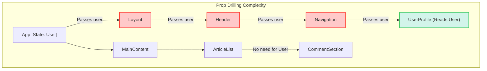
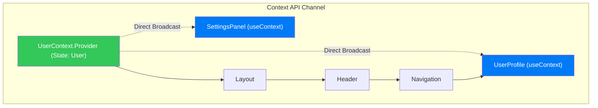
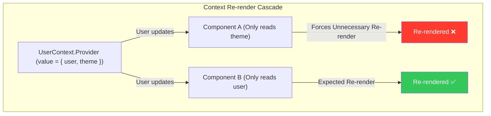
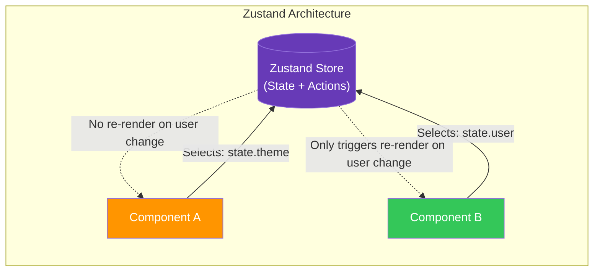
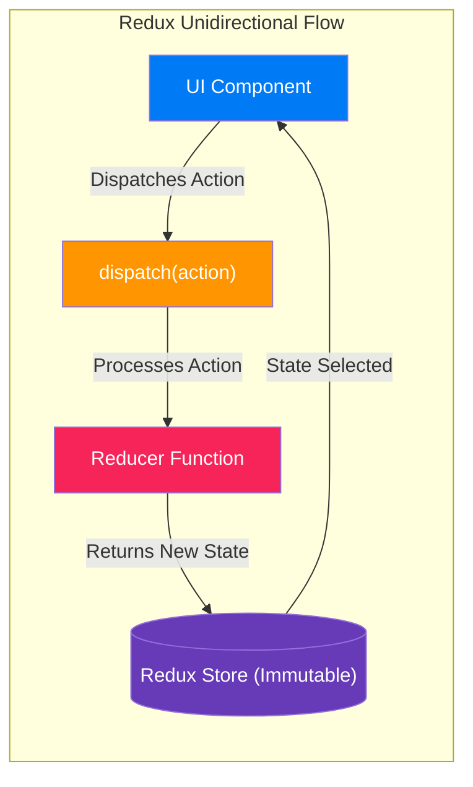
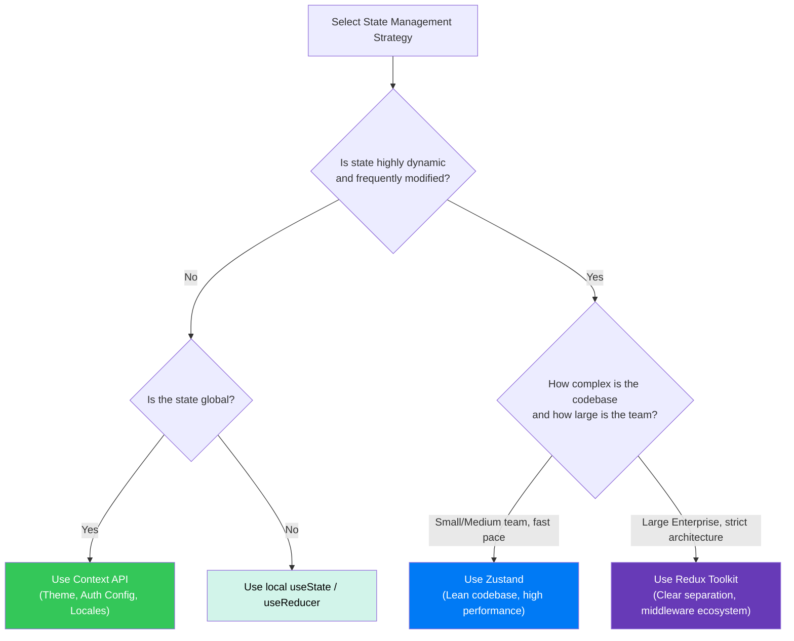

# 🧠 React State Management: Prop Drilling, Context API, Zustand, and Redux

> **"A senior engineer doesn't choose a state management library because of its syntax popularity. They choose it by evaluating its re-render cost, architectural boundaries, and team scalability."**

This document explores the architectural evolution of state management in React, detailing why external libraries are required, how data flows through them, and how to choose the right tool for your application.

---

## 📌 Table of Contents
1. [The State Management Problem: Prop Drilling](#1-the-state-management-problem-prop-drilling)
2. [Context API: React's Native Solution](#2-context-api-reacts-native-solution)
3. [Zustand: The Modern, Selector-Based Store](#3-zustand-the-modern-selector-based-store)
4. [Redux Toolkit (RTK): The Enterprise Standard](#4-redux-toolkit-rtk-the-enterprise-standard)
5. [Deep Dive Code Walkthroughs](#5-deep-dive-code-walkthroughs)
6. [Comparative Decision Matrix](#6-comparative-decision-matrix)

---

## 1. The State Management Problem: Prop Drilling

In React, data flows **unidirectionally** from parent to child via props. When deep child components need access to state owned by a high-level ancestor, we encounter **Prop Drilling**.

### The Complexity Diagram


### Why Prop Drilling is Bad for Production Code:
1. **Tight Coupling**: Intermediate components (`Layout`, `Header`, `Navigation`) become dependent on the shape of data they do not use, making refactoring difficult.
2. **Maintenance Overhead**: Adding or renaming a prop requires manual changes in every intermediate component.
3. **Boilerplate**: Code becomes cluttered with pass-through properties, reducing readability.

---

## 2. Context API: React's Native Solution

React introduces the Context API to bypass prop drilling, establishing a direct channel from a provider to a consumer.

### Data Flow Diagram


### Code Example
```jsx
// 1. Create Context
import { createContext, useState, useContext } from 'react';
const UserContext = createContext(null);

// 2. Provide State
export function UserProvider({ children }) {
  const [user, setUser] = useState({ name: "Alice", role: "Admin" });
  return (
    <UserContext.Provider value={{ user, setUser }}>
      {children}
    </UserContext.Provider>
  );
}

// 3. Consume State
function UserProfile() {
  const { user } = useContext(UserContext);
  return <p>User: {user.name} ({user.role})</p>;
}
```

### The Re-Render Problem (Context's Achilles' Heel)
When a Context value changes, **every component that consumes that context re-renders**, regardless of which portion of the state it needs.



---

## 3. Zustand: The Modern, Selector-Based Store

Zustand is a lightweight, zero-boilerplate state management library. It uses a **selector-based subscription model** to ensure components only re-render when the exact state they subscribe to changes.

### Data Flow Diagram


### Code Example
```javascript
import { create } from 'zustand';

// 1. Define Store with Actions inside
const useUserStore = create((set) => ({
  user: { name: "Alice", role: "Admin" },
  theme: "dark",
  setUser: (newUser) => set({ user: newUser }),
  toggleTheme: () => set((state) => ({ theme: state.theme === "dark" ? "light" : "dark" })),
}));

// 2. Component consumption with selectors
function UserProfile() {
  const user = useUserStore((state) => state.user); // Only re-renders if 'user' changes
  return <p>User: {user.name}</p>;
}

function ThemeToggle() {
  const toggleTheme = useUserStore((state) => state.toggleTheme);
  const theme = useUserStore((state) => state.theme);
  return <button onClick={toggleTheme}>Mode: {theme}</button>;
}
```

### Why Zustand is Effective:
- **No Providers**: You do not need to wrap your component tree in nested providers.
- **Micro-Updates**: Only components subscribing to the modified slice of state re-render.
- **Ultra-Simple API**: Store and actions are co-located in a single initialization call.

---

## 4. Redux Toolkit (RTK): The Enterprise Standard

Redux enforces a strict, unidirectional data flow utilizing an immutable state tree. Redux Toolkit (RTK) is the modern configuration utility for Redux that eliminates legacy boilerplate.

### Data Flow Diagram


### Code Example
```javascript
// 1. Slice (Logic & Reducers)
import { createSlice, configureStore } from '@reduxjs/toolkit';

const userSlice = createSlice({
  name: 'user',
  initialState: { name: "Alice", role: "Admin" },
  reducers: {
    setUser(state, action) {
      // Immer library under the hood allows direct draft mutation safely
      state.name = action.payload.name;
      state.role = action.payload.role;
    }
  }
});

export const { setUser } = userSlice.actions;

// 2. Store Configuration
export const store = configureStore({
  reducer: {
    user: userSlice.reducer
  }
});

// 3. UI Component Integration
import { useSelector, useDispatch } from 'react-redux';

function UserProfile() {
  const user = useSelector((state) => state.user);
  const dispatch = useDispatch();

  const handleUpdate = () => {
    dispatch(setUser({ name: "Bob", role: "User" }));
  };

  return (
    <div>
      <p>User: {user.name}</p>
      <button onClick={handleUpdate}>Change User</button>
    </div>
  );
}
```

### Why Redux Toolkit is the Enterprise Standard:
- **Strict Architecture**: Separation of concerns between UI (Dispatching Actions) and business logic (Reducers).
- **Time-Travel Debugging**: Exceptional developer experience via Redux DevTools, showing exact state change timelines.
- **Middleware Ecosystem**: Built-in support for asynchronous handling (Thunk / Saga) and caching layers (RTK Query).

---

## 5. Deep Dive Code Walkthroughs

### Context API Code Analysis
```javascript
// Creating Context
export const ThemeContext = createContext(); 
```
- **Analysis**: `createContext()` creates a wrapper object containing a `Provider` component and a `Consumer` component. It acts as an empty container for the state.

```javascript
// Providing State
<ThemeContext.Provider value={{ theme, setTheme }}>
```
- **Analysis**: The `Provider` wraps the subtree. The `value` prop is evaluated on every render. If you pass an inline object like `value={{ theme, setTheme }}`, a new object reference is created on every render, triggering updates in downstream consumers even if the values inside haven't changed.

```javascript
// Consuming State
const { theme } = useContext(ThemeContext);
```
- **Analysis**: The `useContext` hook subscribes the component to the closest matching `Provider` upward in the tree. Whenever that provider's value changes, this component immediately schedules a re-render.

---

### Zustand Code Analysis
```javascript
const useUserStore = create((set) => ({
  isLoggedIn: false,
  login: (user) => set({ isLoggedIn: true, profile: user }),
}));
```
- **Analysis**: The `create` function takes a callback that receives a `set` updater.
- `set` handles merging state updates shallowly. This means we do not need to manually clone unchanged sibling state properties (e.g., `theme` is untouched if we update `user`).
- The returned `useUserStore` is a React Hook.

```javascript
const { isLoggedIn, login } = useUserStore();
```
- **Analysis**: If structured this way, the hook returns the entire store object. This behaves like Context, causing the component to re-render on **any** state change inside the store.
- **Correct Pattern**: To optimize, write explicit selectors:
```javascript
const isLoggedIn = useUserStore((state) => state.isLoggedIn);
const login = useUserStore((state) => state.login);
```
- This guarantees the component only re-renders when `isLoggedIn` changes. Changes to `profile` or other properties are ignored.

---

### Redux Toolkit Code Analysis
```javascript
const userSlice = createSlice({
  name: 'user',
  initialState: { isLoggedIn: false },
  reducers: {
    login(state, action) {
      state.isLoggedIn = true; // Safe mutation
    }
  }
});
```
- **Analysis**: `createSlice` combines action creator generation and reducer definitions.
- The `reducers` parameter defines how actions modify the store. Under the hood, RTK wraps reducers inside the **Immer** library. While it looks like we are directly mutating state (`state.isLoggedIn = true`), Immer intercepts this and outputs a new, immutable copy of the state tree.

```javascript
const dispatch = useDispatch();
const isLoggedIn = useSelector((state) => state.user.isLoggedIn);
```
- **Analysis**: 
  - `useDispatch` acts as the transmitter. It submits action payloads containing type signatures to the Redux engine.
  - `useSelector` acts as the receiver. It runs the selector function and compares the returned value with the previous one. If they are reference-equal, the component skips rendering.

---

## 6. Comparative Decision Matrix

| Dimension | Context API | Zustand | Redux Toolkit |
|---|---|---|---|
| **Bundle Impact** | 0 KB (Native React) | ~1.5 KB (Micro-library) | ~30 KB (Heavyweight) |
| **Setup Cost** | Extremely low | Very low | Moderate to high |
| **State Update Mechanics** | React State (`useState`) | Direct hook-based store | Dispatch -> Action -> Reducer |
| **Re-render Scope** | All subscribing consumers | Selected state changes only | Selected state changes only |
| **DevTools Support** | Basic React DevTools | Middleware extensions | Premium Time-Travel DevTools |
| **Best fit for** | Low-frequency configurations | High-velocity, agile systems | Multi-team enterprise structures |

### Decision Flowchart


---

*Part of the [React Revision Book](./README.md)*
