# ⚛️ React Virtual DOM — A Deep Dive with Real-Life Examples

> **"Understanding the Virtual DOM is like understanding how a city plans construction — plan smart, batch the work, only break what you must."**

---

## 📚 Table of Contents

1. [What is the Virtual DOM? (The Simple Truth)](#-what-is-the-virtual-dom-the-simple-truth)
2. [Real Life Analogy — The Architect's Blueprint](#-real-life-analogy--the-architects-blueprint)
3. [What is the Real DOM, and Why is it Slow?](#-what-is-the-real-dom-and-why-is-it-slow)
4. [VDOM Structure — React Elements](#-vdom-structure--react-elements)
5. [The VDOM Lifecycle (3 Simple Steps)](#-the-vdom-lifecycle-3-simple-steps)
6. [Reconciliation — The Diffing Algorithm](#-reconciliation--the-diffing-algorithm)
   - [Assumption 1: Different Types = Tear Down](#assumption-1-different-types--tear-down--rebuild)
   - [Assumption 2: Same Types = Just Patch](#assumption-2-same-types--just-patch-it)
   - [The List Problem & the `key` Prop](#-the-list-problem--the-key-prop)
7. [Why is VDOM Faster? — Batching Updates](#-why-is-vdom-faster--batching-updates)
8. [Cross-Platform — One Description, Many Renderers](#-cross-platform--one-description-many-renderers)
9. [React Fiber — The Next Evolution](#-react-fiber--the-next-evolution)
10. [VDOM Pitfalls — When is it NOT the best?](#-vdom-pitfalls--when-is-it-not-the-best)
11. [Cheat Sheet Summary](#-cheat-sheet-summary)

---

## 🤔 What is the Virtual DOM? The Simple Truth

Forget the jargon for a second.

**The Virtual DOM (VDOM) is simply a JavaScript object — a *copy* of your real webpage, kept in memory.**

Think of it as a **draft copy** of your HTML. React works on the draft, figures out what changed, and *only then* touches the real page.

```
Your State Change
      ↓
React updates the DRAFT (VDOM)  ← cheap, fast, in memory
      ↓
React compares DRAFT vs REAL    ← finds minimal changes
      ↓
Real DOM gets ONLY the changes  ← expensive, but minimal
```

That's it. That's the whole idea. 🎯

---

## 🏗️ Real Life Analogy — The Architect's Blueprint

Imagine you want to renovate your house. You have **two choices**:

### ❌ Bad Approach — No Blueprint (Direct DOM Manipulation)
- You call a construction worker every time you change your mind
- Want to move the sofa? Worker comes. Moves sofa.
- Change your mind about paint color? Worker comes again. Repaints.
- Decide you also want a new window? Worker comes **again**.
- The worker has to pack up tools, drive over, set up scaffolding... **every. single. time.**

### ✅ Smart Approach — Blueprint First (Virtual DOM)
- You make **changes on paper** (your blueprint / VDOM)
- You finalize ALL changes at once
- You call the construction worker **once** with the complete list of changes
- Worker shows up **once**, does everything, done!

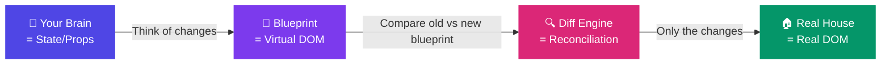

---

## 🐢 What is the Real DOM, and Why is it Slow?

The **Real DOM** (Document Object Model) is the actual HTML structure the browser renders. It's a tree of nodes — every `<div>`, `<p>`, `<button>` is a node.

**The problem?** Every time you change the Real DOM, the browser has to:

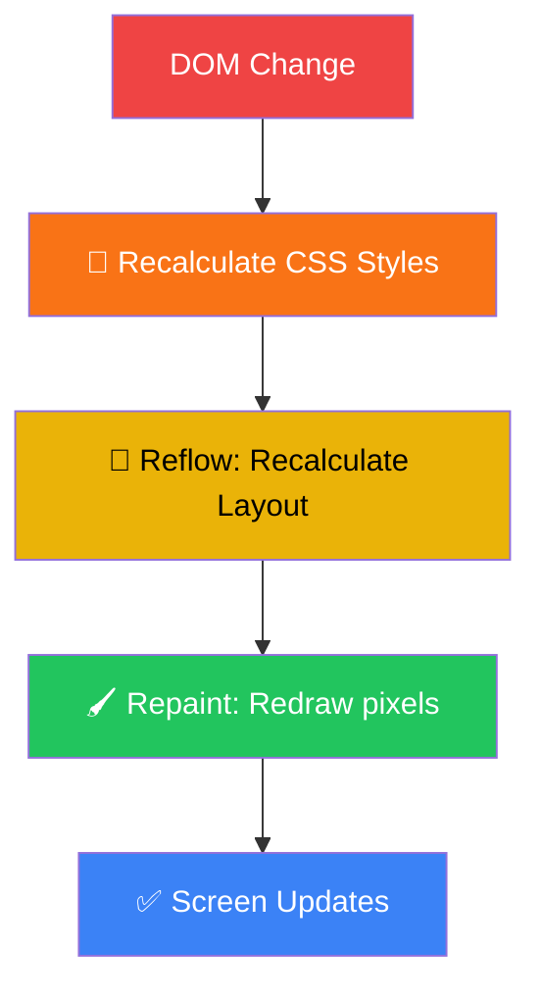

This **entire pipeline** runs on every DOM change. It's like re-printing an entire book just because you fixed a single typo.

### 🍕 Real-World Analogy: The Restaurant Order

Imagine a waiter at a restaurant:

| Approach | What happens |
|---|---|
| **Direct DOM** | Customer changes order → Waiter runs to kitchen after EVERY single change |
| **Virtual DOM** | Customer finalizes entire order → Waiter goes to kitchen **once** with the final order |

The Virtual DOM is the **notepad** the waiter uses before going to the kitchen. 🗒️

---

## 🧱 VDOM Structure — React Elements

When you write JSX, React transforms it into a **plain JavaScript object** called a **React Element**. These objects make up the Virtual DOM tree.

```jsx
// You write this JSX:
const App = () => (
  <div className="card">
    <h1>Hello World</h1>
    <p>Welcome to React</p>
  </div>
);
```

```js
// React sees this plain object (VDOM Node):
{
  type: 'div',
  props: {
    className: 'card',
    children: [
      {
        type: 'h1',
        props: { children: 'Hello World' }
      },
      {
        type: 'p',
        props: { children: 'Welcome to React' }
      }
    ]
  }
}
```

### 🌳 The VDOM Tree (Visualized)

```mermaid
graph TD
    A["div.card"] --> B["h1"]
    A --> C["p"]
    B --> D['"Hello World"']
    C --> E['"Welcome to React"']

    style A fill:#6366f1,color:#fff
    style B fill:#8b5cf6,color:#fff
    style C fill:#8b5cf6,color:#fff
    style D fill:#a78bfa,color:#fff
    style E fill:#a78bfa,color:#fff
```

### Key Properties of VDOM Nodes

| Property | Meaning | Real-Life Analogy |
|---|---|---|
| **Immutable** | Once created, cannot change | A printed photograph — you can't edit it |
| **Lightweight** | Just a plain JS object, no browser APIs | A sticky note vs. a full legal document |
| **Declarative** | Describes *what* to show, not *how* | A recipe vs. cooking instructions |

---

## 🔄 The VDOM Lifecycle (3 Simple Steps)

Every time state or props change, React follows this exact 3-step process:

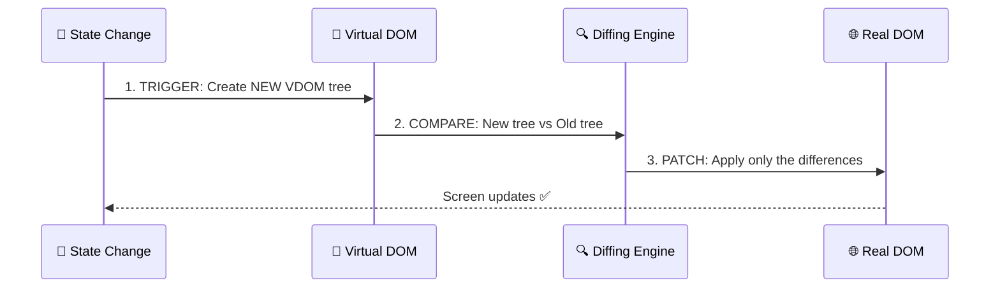

### 🍔 Real-Life Analogy: Updating a Menu Board

Think of a restaurant's digital menu board:

1. **Trigger** — Chef decides to change the price of Burger from ₹150 to ₹200
2. **Create** — Manager writes the new menu on paper (new VDOM)
3. **Compare** — Manager compares new paper with old paper → spots only the price changed
4. **Patch** — Only the price on the board gets updated (not the entire menu reprinted!)

---

## ⚔️ Reconciliation — The Diffing Algorithm

Reconciliation is the **smart comparison engine** React uses. Instead of comparing every element (which would be `O(n³)` — super slow), React uses two clever assumptions to achieve `O(n)` speed.

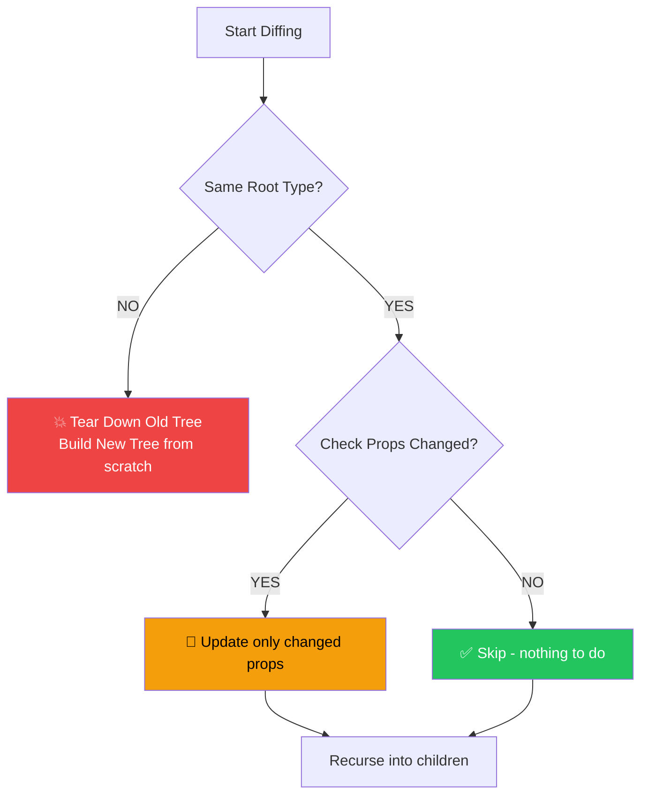

---

### Assumption 1: Different Types → Tear Down & Rebuild

If the **element type changes**, React **destroys everything** and rebuilds from scratch.

```jsx
// BEFORE:
<article className="post">
  <h1>My Blog</h1>
</article>

// AFTER (type changed from article → div):
<div className="post">
  <h1>My Blog</h1>
</div>
```

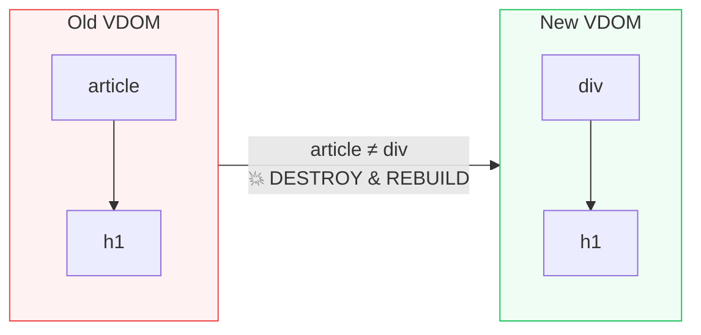

**Real-Life Example:** It's like changing the foundation of a house from wood to concrete. You can't patch — you have to tear down and rebuild everything above it. All furniture (state) inside is LOST.

> ⚠️ **Important:** All component state is **destroyed** when element type changes!

---

### Assumption 2: Same Types → Just Patch It

If the **element type is the same**, React just updates the changed props.

```jsx
// BEFORE:
<div className="box old-theme" style={{ color: 'red' }} />

// AFTER:
<div className="box new-theme" style={{ color: 'blue' }} />
```

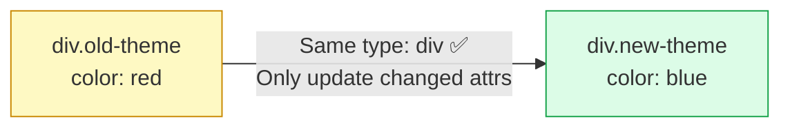

**Real-Life Example:** You're repainting your house. The walls (structure) stay the same — you only apply new paint. Fast and efficient! 🎨

---

## 🔑 The List Problem & the `key` Prop

This is where most developers get confused. Let's break it down.

### The Problem 😰

Imagine a shopping cart with 3 items:

```jsx
// Original list:
<ul>
  <li>🍎 Apple</li>   {/* position 0 */}
  <li>🍌 Banana</li>  {/* position 1 */}
  <li>🍇 Grapes</li>  {/* position 2 */}
</ul>
```

Now you **add 🍓 Strawberry at the TOP**:

```jsx
// New list:
<ul>
  <li>🍓 Strawberry</li> {/* position 0 */}
  <li>🍎 Apple</li>      {/* position 1 */}
  <li>🍌 Banana</li>     {/* position 2 */}
  <li>🍇 Grapes</li>     {/* position 3 */}
</ul>
```

Without `key`, React compares by **position**:

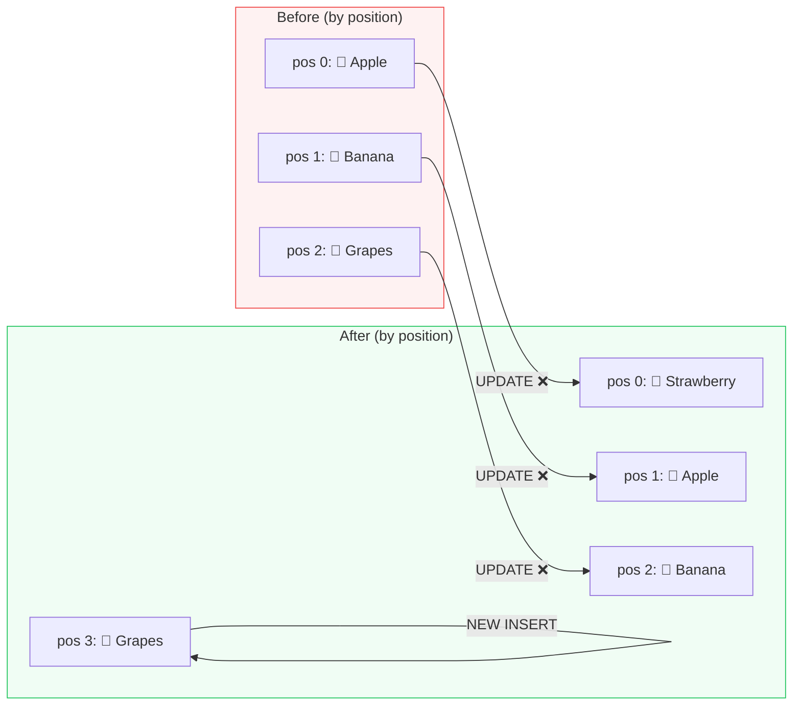

**Result:** 3 unnecessary updates + 1 insert = 4 operations 😱

### The Solution — `key` Prop ✅

```jsx
<ul>
  <li key="strawberry">🍓 Strawberry</li>
  <li key="apple">🍎 Apple</li>
  <li key="banana">🍌 Banana</li>
  <li key="grapes">🍇 Grapes</li>
</ul>
```

Now React tracks by **identity (key)**, not position:

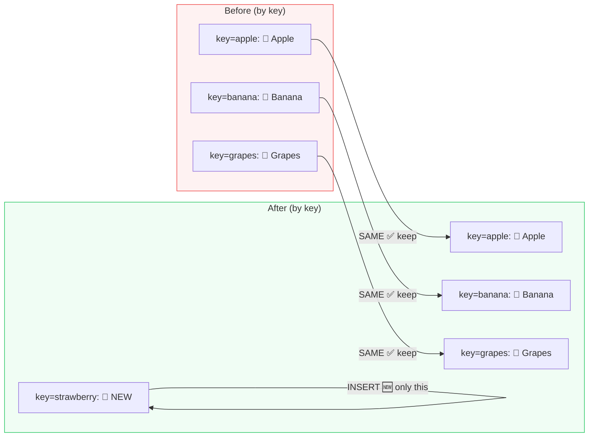

**Result:** Just 1 insert operation 🚀

### 🏫 Real-Life Analogy: School Roll Call

Imagine a teacher doing roll call in a classroom.

| Without `key` | With `key` |
|---|---|
| Teacher checks seats by position. If new student sits in seat 1, teacher thinks seat 1 has a "new" student, seat 2 changed, etc. | Teacher checks by student's **name/roll number**. New student arrives → only they are "new". Everyone else stays the same. |

### ⚠️ Rules of Keys

```jsx
// ❌ BAD — using index as key (breaks when list order changes)
items.map((item, index) => <li key={index}>{item.name}</li>)

// ✅ GOOD — using unique, stable ID
items.map((item) => <li key={item.id}>{item.name}</li>)
```

---

## 🏎️ Why is VDOM Faster? — Batching Updates

React **groups** (batches) all state updates and applies them in **one go**.

### The Problem Without Batching

```jsx
function handleClick() {
  setFirstName('Alex');   // → DOM update? 😰
  setLastName('Jones');   // → DOM update again? 😰
  setAge(30);             // → DOM update again?? 😰
}
```

Without batching, this would trigger 3 separate renders = 3× browser reflows + repaints.

### React's Batching Solution

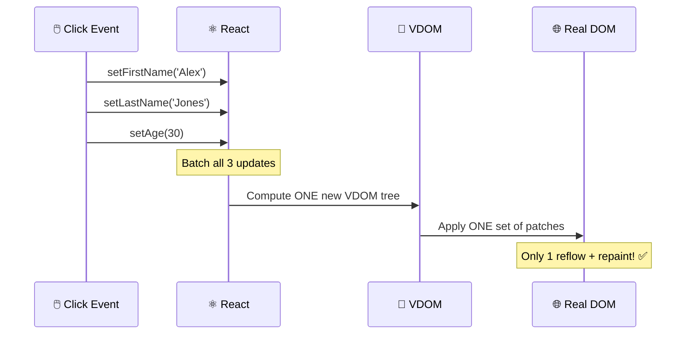

### 🏭 Real-Life Analogy: Amazon Warehouse

Imagine placing 3 separate orders vs. 1 combined order:

| Separate Orders (No Batching) | Combined Order (Batching) |
|---|---|
| 3 delivery trucks sent separately | 1 truck with all items |
| 3× delivery cost | 1× delivery cost |
| 3× your time to answer the door | Answer door once |

React's VDOM is the "combined order" approach. 📦

---

## 🌍 Cross-Platform — One Description, Many Renderers

The VDOM (React Elements) is just a **description** of the UI — it has no idea what platform it's on. This means different **renderers** can interpret the same elements differently!

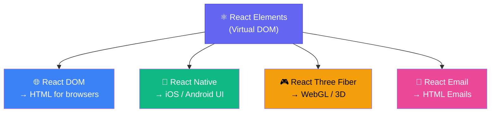

### 🎭 Real-Life Analogy: A Movie Script

A movie script describes *what happens* — it doesn't care if it's:
- Played in a **cinema** (React DOM → web)
- Adapted for **TV** (React Native → mobile)
- Turned into a **video game** (React Three Fiber → 3D/WebGL)

The script (VDOM) is the same. The renderer (director + crew) decides how to bring it to life. 🎬

---

## 💡 React Fiber — The Next Evolution

### The Old Problem: Stack Reconciliation

Imagine React is doing a huge diff of a complex app. In the old days, once it started, it **could not stop**. It was like a bulldozer that runs non-stop until the entire field is leveled — even if someone needed to cross the road!

**Result:** For deep component trees, the browser's main thread was **blocked** for hundreds of milliseconds → jank, dropped frames, frozen UI.

### The Fiber Solution

React Fiber is a **complete rewrite** of the reconciliation engine. It splits work into tiny units called **Fibers** that can be paused, resumed, or prioritized.

```mermaid
flowchart TD
    subgraph OLD["❌ Old Stack Reconciliation"]
        A1[Start] -->|Cannot stop!| B1[Process node 1]
        B1 --> C1[Process node 2]
        C1 --> D1[Process node ...n]
        D1 --> E1[Done — maybe 200ms later 😩]
    end

    subgraph NEW["✅ Fiber Reconciliation"]
        A2[Start] --> B2[Process Fiber 1]
        B2 -->|Check: browser needs to paint?| X{Urgent?}
        X -->|YES| Y[⏸️ Pause. Let browser work.]
        X -->|NO| C2[Process Fiber 2]
        Y --> C2
        C2 --> D2[Process Fiber ...n]
        D2 --> E2[Done — smooth & interruptible ✅]
    end

    style OLD fill:#fef2f2,stroke:#ef4444
    style NEW fill:#f0fdf4,stroke:#22c55e
```

### 🦺 Real-Life Analogy: Road Construction

| Old React (Stack) | React Fiber |
|---|---|
| Road crew closes entire highway, works non-stop until done | Road crew works in sections, opens lanes temporarily when ambulance needs to pass |
| Users stuck waiting | Emergency tasks (user input) get through immediately |
| = Jank | = Smooth UI |

### Fiber Features

| Feature | What it enables |
|---|---|
| **Interruptible work** | High-priority updates (user input) can interrupt low-priority renders |
| **Concurrent Mode** | Prepare new UI in background while user interacts with old UI |
| `useTransition` | Mark some updates as "non-urgent" |
| `useDeferredValue` | Defer expensive re-renders until browser is idle |
| `Suspense` | Show fallback UI while async data loads |

---

## ❌ VDOM Pitfalls — When is it NOT the Best?

### Pitfall 1: The Overhead of Abstraction

VDOM is not magic — creating and comparing JavaScript object trees **costs CPU cycles too**.

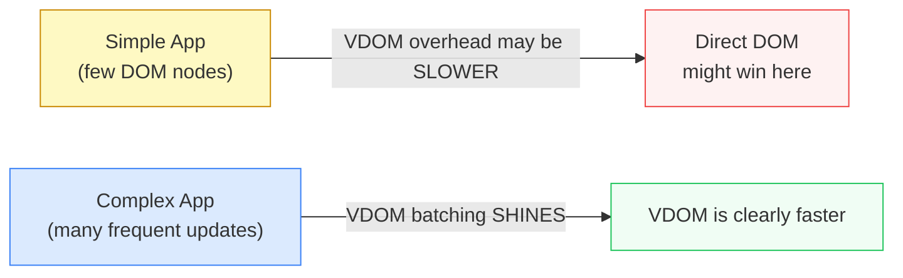

### Pitfall 2: Children Re-render by Default

If a **parent re-renders**, ALL children re-render by default — even if their props didn't change!

```jsx
function Parent() {
  const [count, setCount] = useState(0);

  return (
    <div>
      <button onClick={() => setCount(c => c + 1)}>Click</button>
      <ExpensiveChild />  {/* Re-renders every time parent does! 😱 */}
    </div>
  );
}
```

### The Fix: Memoization Tools

```jsx
// React.memo → skips re-render if props didn't change
const ExpensiveChild = React.memo(() => {
  return <div>I only re-render when my props change ✅</div>;
});

// useMemo → memoize expensive computed values
const expensiveValue = useMemo(() => computeHeavyStuff(a, b), [a, b]);

// useCallback → memoize function references
const handleClick = useCallback(() => doSomething(id), [id]);
```

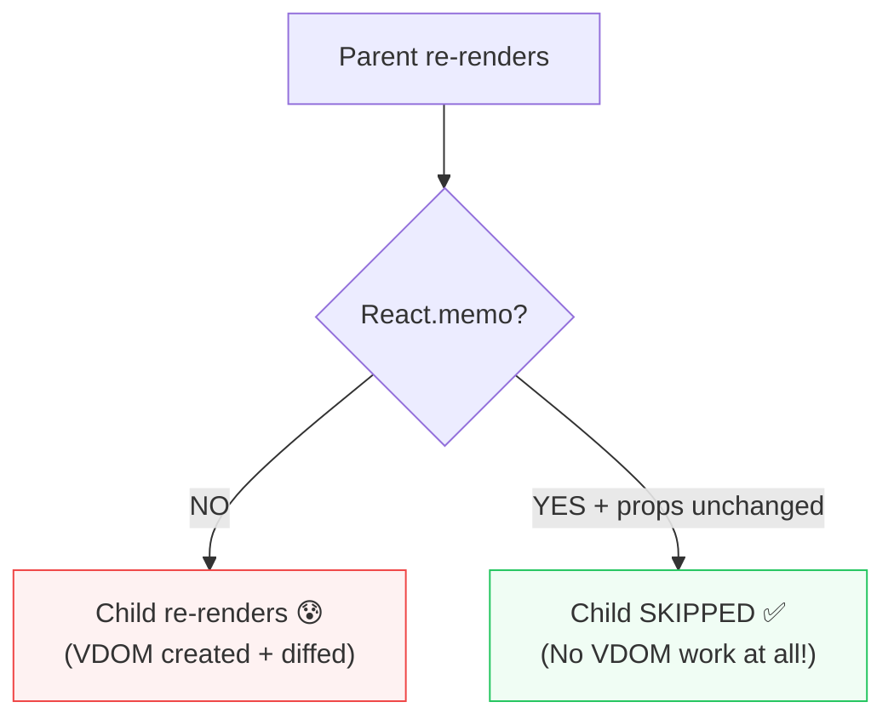

---

## 📋 Cheat Sheet Summary

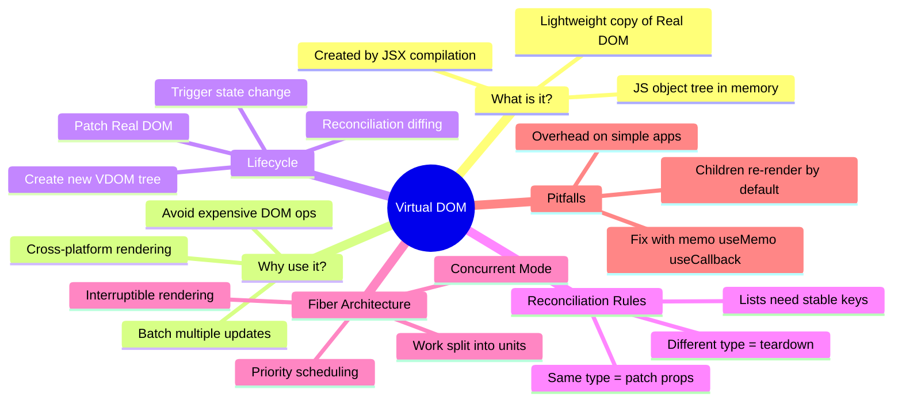

### Quick Reference Table

| Concept | Simple Explanation | Real-Life Analogy |
|---|---|---|
| **Virtual DOM** | In-memory copy of real page | Blueprint / Draft copy |
| **React Element** | Plain JS object describing a node | Sticky note describing a room |
| **Reconciliation** | Comparing old vs new VDOM | Proofreading two drafts |
| **Diffing** | Finding what changed | Spotting differences in 2 photos |
| **`key` prop** | Unique ID for list items | Student roll number |
| **Batching** | Grouping all updates into one render | Combining all Amazon orders |
| **Fiber** | Interruptible unit of work | Road crew that yields for ambulances |
| **React.memo** | Skip re-render if props unchanged | "Do Not Disturb" sign |

---

## 🎯 Key Takeaways

> 1. **VDOM is a smart draft** — React works on a copy, then applies minimal changes to the real page.
>
> 2. **Reconciliation is O(n)** — Thanks to two smart assumptions about element types.
>
> 3. **Always use `key` for lists** — Use stable, unique IDs, not array indices.
>
> 4. **Batching = speed** — React groups updates to minimize browser reflows.
>
> 5. **Fiber = smooth UI** — Reconciliation can be paused for urgent tasks.
>
> 6. **Memoize when needed** — `React.memo`, `useMemo`, `useCallback` prevent unnecessary VDOM work.

---

## 📖 Further Reading

- [React Docs — Reconciliation](https://react.dev/learn/preserving-and-resetting-state)
- [React Docs — Rendering Lists](https://react.dev/learn/rendering-lists)
- [React Docs — useMemo](https://react.dev/reference/react/useMemo)
- [React Fiber Architecture (acdlite)](https://github.com/acdlite/react-fiber-architecture)

---

*Made with ❤️ for the React Revision Book | Branch: `feature/virtual-dom-deep-dive`*
